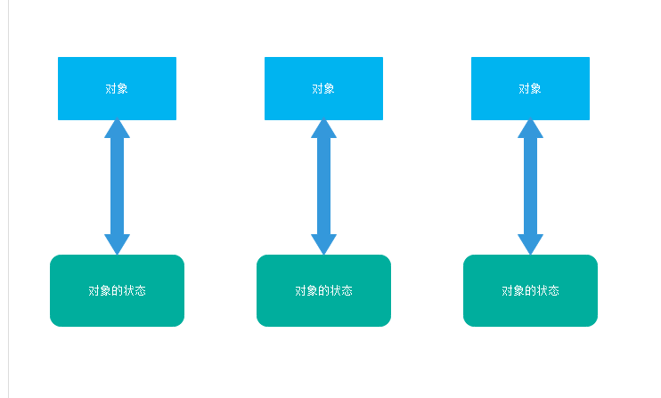
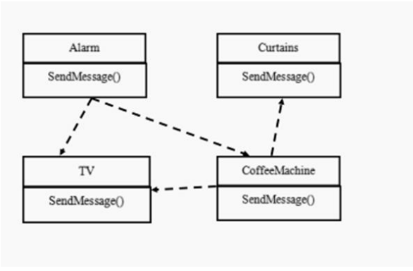
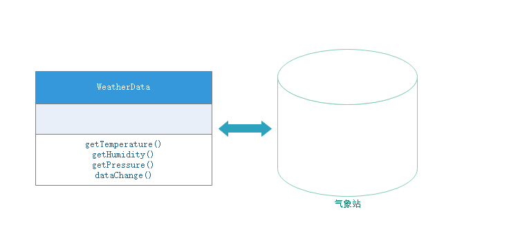
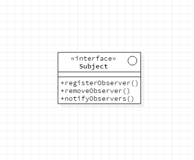
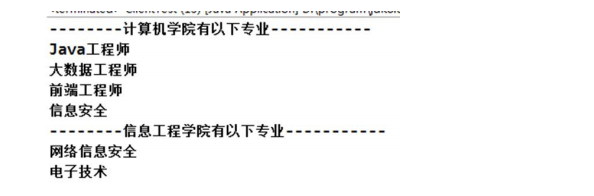
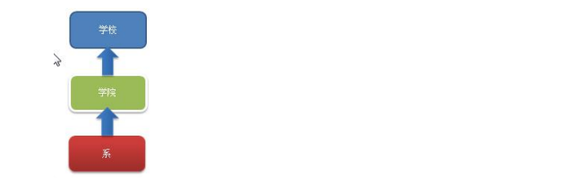
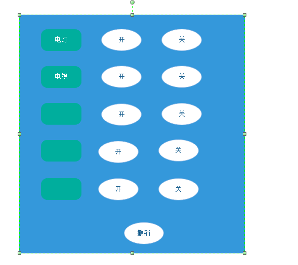
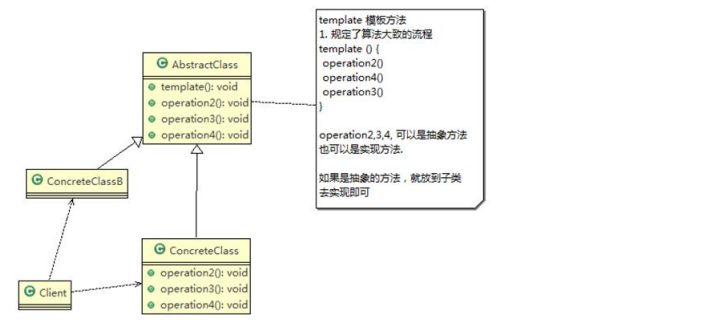

# 设计模式详解之一

## 设计模式分类

设计模式分为**三种类型，共23种**

1）**创建型**模式：单例模式、抽象工厂模式、原型模式、建造者模式、工厂模式

2）**结构型**模式：适配器模式、命令模式、装饰模式、组合模式、外观模式、享元模式、代理模式

3）**行为型**模式：模板方法模式、命令模式、访问者模式、迭代器模式、观察者模式、中介者模式、备忘录模式、解释器模式、状态模式、策略模式、职责链模式


## 单例模式

所谓单例设计模式，就是采取一定的方法保证在整个的软件系统中，对某个类只能存在一个对象实例，并且该类只提供一个取得其对象实例的方法（静态方法），一般单例模式有以下四种模式实现：

### 懒汉式

```java
package cn.ljtnono.learn.singleton;

public class LhsDemo {

    private volatile static LhsDemo instance = null;
    
    private LhsDemo() {}
    
    public static LhsDemo getInstance() {
        if (instance == null) {
            synchronized (LhsDemo.class) {
                if (instance == null) {
                    // 这里的 new LhsDemo() 可以分为三步
                    // 1. 分配空间
                    // 2. 初始化对象
                    // 3. 将instance指向这个对象
                    // 如果这里由于重排序导致另外的线程以为instance不为null，进而执行了多次new操作，所以instance对象用volatile修饰
                    instance = new LhsDemo();
                }
            }
        }
        return instance;
    }
}
```

### 饿汉式

```java
package cn.ljtnono.learn.singleton;

public class EhsDemo {
    
    private static EhsDemo instance = new EhsDemo();
    
    private EhsDemo() {}
    
    public static EhsDemo getInstance() {
        return instance;
    }
}
```

### 私有内部类方式（推荐）

```java
package cn.ljtnono.learn.singleton;

public class SingletonHolder {
    
    private SingletonHolder() {}
    
    private static class Holder {
        private static SingletonHolder instance = new SingletonHolder();
    }
    
    public static SingletonHolder getInstance() {
        return Holder.instance;
    }    
}

```

### 枚举方式（推荐）

```java
package cn.ljtnono.learn.singleton;

public class SingletonEnum {

    private SingletonEnum() {}

    private enum Singleton {
        INSTANCE;

        private final SingletonEnum instance;

        Singleton() {
            instance = new SingletonEnum();
        }
        
        public SingletonEnum getInstance() {
            return instance;
        }
    }
    
    public static SingletonEnum getInstance() {
        return Singleton.INSTANCE.getInstance();
    }
}
```


单例模式注意事项和细节说明

1）单例模式保证了系统内存中该类只存在一个对象，节省了系统资源，对于一些需要频繁创建销毁对象，使用单例模式可以提高系统性能

2）当想实例化一个单例类的时候，必须要记住使用响应的获取对象的方法，而不是使用new

3）单例模式使用的场景：**需要频繁的进行创建和销毁的对象**、创建对象时耗时过多或耗费资源过多（即：重量级对象），但又经常用到的对象、**工具类对象**、频繁访问数据库或文件的对象（比如数据源、**session工厂**等）


## 责任链模式

案例：OA系统采购审批需求

学习OA系统的采购审批项目：需求是

1）采购员采购教学器材

2）如果金额小于等于5000，由教学主任审批（0<=x<=5000)

3）如果金额小于等于10000，由院长审批（5000<x<=10000)

4）如果金额小于等于30000，由副校长审批（10000<x<=30000)

5）如果超过30000以上，由校长审批（30000<x)

传统方案解决OA系统审批类图


传统方案解决OA系统

```java
// Client.java
package cn.ljtnono.dm.responsibility.tra;

public class Client {

    public static void main(String[] args) {
        PurchaseRequest request = new PurchaseRequest(1, 200.0f, 1);
        if (request.getPrice() <= 5000) {
            new DepartmentApprover("张主任").processRequest(request);
        } else if (request.getPrice() <= 10000) {
            new CollegeApprover("李院长").processRequest(request);
        } else if (request.getPrice() <= 30000) {
            new ViceSchoolMasterApprover("王副校").processRequest(request);
        } else {
            new SchoolMasterApprover("佟校长").processRequest(request);
        }
    }

}
// CollegeApprover.java
package cn.ljtnono.dm.responsibility.tra;

import lombok.Data;

@Data
public class CollegeApprover {

    private String name;

    public CollegeApprover(String name) {
        this.name = name;
    }

    public void processRequest(PurchaseRequest request) {
        System.out.println(" 请求编号id=" + request.getId() + " 被" + this.getName() + " 处理");
    }
}

// DepartmentApprover.java
package cn.ljtnono.dm.responsibility.tra;

import lombok.Data;

@Data
public class DepartmentApprover {

    private String name;

    public DepartmentApprover(String name) {
        this.name = name;
    }

    public void processRequest(PurchaseRequest request) {
        System.out.println(" 请求编号id=" + request.getId() + " 被" + this.getName() + " 处理");
    }
}

// PurchaseRequest.java
package cn.ljtnono.dm.responsibility.tra;

import lombok.Getter;

@Getter
public class PurchaseRequest {

    /** 请求类型 */
    private int type;

    /** 请求金额 */
    private float price = 0.0f;

    private int id = 0;

    public PurchaseRequest(int type, float price, int id) {
        this.type = type;
        this.price = price;
        this.id = id;
    }
}
// SchoolMasterApprover.java
package cn.ljtnono.dm.responsibility.tra;

import lombok.Data;


@Data
public class SchoolMasterApprover {

    private String name;

    public SchoolMasterApprover(String name) {
        this.name = name;
    }

    public void processRequest(PurchaseRequest request) {
        System.out.println(" 请求编号id=" + request.getId() + " 被" + this.getName() + " 处理");
    }
}
// ViceSchoolMasterApprover.java
package cn.ljtnono.dm.responsibility.tra;

import lombok.Data;


@Data
public class ViceSchoolMasterApprover {

    private String name;

    public ViceSchoolMasterApprover(String name) {
        this.name = name;
    }

    public void processRequest(PurchaseRequest request) {
        System.out.println(" 请求编号id=" + request.getId() + " 被" + this.getName() + " 处理");
    }
}

```

传统方案解决OA系统审批问题分析

1）传统方式是：接收到一个采购请求后，根据采购金额来调用对应的Approver（审批人）完成审批。

2）传统方式的问题分析：客户端这里会使用到分支判断（比如switch）来对不同的采购请求处理，这样就存在如下问题（1）如果各个级别的人员审批金额发生变化，在客户端的也需要变化（2）客户端必须明确的知道有多少个审批级别和访问

3）这样对一个采购请求进行处理和Aprover（审批人）就存在强耦合关系，不利于代码的扩展和维护

4）解决方案=》责任链模式


责任链模式基本介绍

1）责任链模式（职责链模式）（Chain of Responsibility Pattern），为请求创建了一个接收者对象的链。这种模式对请求的发送者和接收者进行解耦。

2）责任链模式通常每个接收者都包含对另一个接收者的引用。如果一个对象不能处理该请求，那么它会把相同的请求传给下一个接收者，依次类推。

3）这种类型的设计模式属于行为型模式

责任链模式类图


使多个对象都有机会处理请求，从而避免请求的发送者和接收者之间的耦合关系。将这个对象连成一条链，并沿着这条链传递该请求，直到有一个对象处理它为止。

 对原理图的说明-即（职责链模式的角色及职责）

1）Handler：抽象的处理者，定义了一个处理请求的接口，同时含有另外一个Handler对象

2）ConcreteHandlerA：具体的处理者，处理它自己负责的请求，可以访问它的后继处理者（即下一个处理者），如果可以处理当前请求，则处理，否则就将该请求交给后继者去处理，从而形成一个职责链

3）Request，含有很多属性，表示一个请求


责任链模式解决OA审批类图


责任链模式解决OA审批

```java
//Approver.java
package cn.ljtnono.dm.responsibility;

import lombok.Data;

/**
 * 处理者 (Handler)
 */
@Data
public abstract class Approver {

    /** 下一个处理者 */
    private Approver nextApprover;

    /** 名字 */
    private String name;

    /**
     * 处理操作
     * @param request 要处理的请求
     */
    public abstract void processRequest(PurchaseRequest request);

    public Approver(String name) {
        this.name = name;
    }

}
// Client.java
package cn.ljtnono.dm.responsibility;

public class Client {

    public static void main(String[] args) {
        PurchaseRequest request = new PurchaseRequest(1, 50000, 1);

        // 创建相关处理器
        Approver departmentApprover = new DepartmentApprover("张主任");
        Approver collegeApprover = new CollegeApprover("李院长");
        Approver viceSchoolMasterApprover = new ViceSchoolMasterApprover("王副校");
        Approver schoolMasterApprover = new SchoolMasterApprover("佟校长");

        //设置各级别处理器的下一个处理器
        departmentApprover.setNextApprover(collegeApprover);
        collegeApprover.setNextApprover(viceSchoolMasterApprover);
        viceSchoolMasterApprover.setNextApprover(schoolMasterApprover);
        schoolMasterApprover.setNextApprover(departmentApprover);

        departmentApprover.processRequest(request);

    }
}
// CollegeApprover.java
package cn.ljtnono.dm.responsibility;

public class CollegeApprover extends Approver{

    public CollegeApprover(String name) {
        super(name);
    }

    @Override
    public void processRequest(PurchaseRequest request) {
        if (request.getPrice() <= 10000 && request.getPrice() > 5000) {
            System.out.println(" 请求编号id=" + request.getId() + " 被" + this.getName() + " 处理");
        } else {
            this.getNextApprover().processRequest(request);
        }
    }
}

//DepartmentApprover.java
package cn.ljtnono.dm.responsibility;

public class DepartmentApprover extends Approver{

    public DepartmentApprover(String name) {
        super(name);
    }

    @Override
    public void processRequest(PurchaseRequest request) {
        if (request.getPrice() <= 5000) {
            System.out.println(" 请求编号id=" + request.getId() + " 被" + this.getName() + " 处理");
        } else {
            this.getNextApprover().processRequest(request);
        }
    }
}

//PurchaseRequest.java
package cn.ljtnono.dm.responsibility;

import lombok.Getter;

/**
 * 请求类
 */
@Getter
public class PurchaseRequest {

    /** 请求类型 */
    private int type;

    /** 请求金额 */
    private float price = 0.0f;

    private int id = 0;

    public PurchaseRequest(int type, float price, int id) {
        this.type = type;
        this.price = price;
        this.id = id;
    }
}

// SchoolMasterApprover.java
package cn.ljtnono.dm.responsibility;

public class SchoolMasterApprover extends Approver{

    public SchoolMasterApprover(String name) {
        super(name);
    }

    @Override
    public void processRequest(PurchaseRequest request) {
        if (request.getPrice() > 30000) {
            System.out.println(" 请求编号id=" + request.getId() + " 被" + this.getName() + " 处理");
        } else {
            this.getNextApprover().processRequest(request);
        }
    }
}

// ViceSchoolMasterApprover.java
package cn.ljtnono.dm.responsibility;


public class ViceSchoolMasterApprover extends Approver{

    public ViceSchoolMasterApprover(String name) {
        super(name);
    }

    @Override
    public void processRequest(PurchaseRequest request) {
        if (request.getPrice() <= 30000 && request.getPrice() > 10000) {
            System.out.println(" 请求编号id=" + request.getId() + " 被" + this.getName() + " 处理");
        } else {
            this.getNextApprover().processRequest(request);
        }
    }
}

```


职责链模式的注意事项和细节

1）将请求和处理分开，实现解耦，提高系统的灵活性

2）简化了对象，使对象不需要知道链的结构

3）性能会受到影响，**特别是在链比较长的时候**，因此需控制链的最大节点数量，一般通过在Handler中设置一个最大节点数量，在setNext()方法中判断是否已经超过阈值，超过则不允许该链建立，避免出现超长链无意识破坏系统性能

4）调试不方便。采用了类似递归的方式，调试时逻辑可能比较复杂

5）最佳应用场景，有多个对象可以处理同一个请求时，比如：多级请求、请假/加薪等审批流程、Java Web中Tomcat对Encoding的处理、拦截器

 

## 策略模式

案例：鸭子问题

编写鸭子项目，具体要求如下：

1）有各种鸭子（比如 野鸭、北京鸭、水鸭等，鸭子有各种行为，比如 叫、飞行等）

2）显示鸭子的信息


传统方案解决鸭子问题

传统方案解决鸭子问题的分析和代码实现

1）传统的设计方案类图


2）代码实现

```java
// 	Duck.java
package cn.ljtnono.dm.strategy.tra;

public abstract class Duck {

    public Duck() {}

    public void quack() {
        System.out.println("鸭子嘎嘎叫~~");
    }

    public abstract void display();

    public void swim() {
        System.out.println("鸭子会游泳~~");
    }

    public void fly() {
        System.out.println("鸭子会飞翔~~");
    }

}
// PekingDuck.java
package cn.ljtnono.dm.strategy.tra;

public class PekingDuck extends Duck{

    @Override
    public void display() {
        System.out.println(" 这是北京鸭 ");
    }

    @Override
    public void fly() {
        System.out.println(" 北京鸭不能飞翔 ");
    }
}
// ToyDuck.java
package cn.ljtnono.dm.strategy.tra;

public class ToyDuck extends Duck{
    @Override
    public void display() {
        System.out.println("这是玩具鸭");
    }

    @Override
    public void quack() {
        System.out.println("玩具鸭不能叫");
    }

    @Override
    public void swim() {
        System.out.println("玩具鸭不会游泳");
    }

    @Override
    public void fly() {
        System.out.println("玩具鸭不会飞翔");
    }
}
// WildDuck.java
package cn.ljtnono.dm.strategy.tra;

public class WildDuck extends Duck {

    @Override
    public void display() {
        System.out.println(" 这是野鸭 ");
    }
}

//Client.java
package cn.ljtnono.dm.strategy.tra;

public class Client {

    public static void main(String[] args) {
        Duck wildDuck = new WildDuck();
        wildDuck.display();
        wildDuck.fly();
        wildDuck.quack();
        wildDuck.swim();
    }
}

```

传统方式实现的问题分析和解决方案

1）其他鸭子，都继承了Duck类，所以fly让所有之类都会飞，这是不正确的

2）上面说的1的问题，其实是继承带来的问题；对类的局部改动，尤其超类的局部改动，会影响其他部分。会有溢出效应

3）为了改进1问题，我们可以通过覆盖fly 方法来解决 => 覆盖解决

4）问题又来了，如果我们有一个玩具鸭子ToyDuck，这样就需要ToyDuck去覆盖Duck的所有实现的方法=>解决思路 **策略模式（strategy)**，策略模式核心思想是将继承转换成组合


策略模式基本介绍

1）策略模式中，定义算法族，分别封装起来，让他们之间可以互相替换，此模式让算法的变化独立于使用算法的客户

2）这算法体现了几个设计原则，第一、把变化的代码从不变的代买中分离出来；第二、针对接口编程而不是具体类（定义了策略接口）；第三、多用组合/聚合，少用继承（客户通过组合方式使用策略）


策略模式原理图


说明：从上图可以看到，客户context有成员变量strategy或者其他策略的接口，至于需要使用到哪个策略，我们可以在构造器中指定


使用策略模式解决鸭子问题

1）应用实例要求

编写程序完成前面的鸭子项目，要求使用策略模式

2）思路分析

**策略模式**：分别封装行为接口，实现算法族，超类里放行为接口对象，在子类里具体设定行为对象。原则就是：分离变化部分，封装接口，基于接口编程各种功能。此模式让行为的变化独立于算法的使用者

3）类图


4）代码实现

```java
// FlyBehavoir.java
package cn.ljtnono.dm.strategy;

public interface FlyBehavior {
    void fly();
}
// SwimBehavior.java
package cn.ljtnono.dm.strategy;

public interface SwimBehavior {
    void swim();
}

// QuackBehavior.java
package cn.ljtnono.dm.strategy;

public interface QuackBehavior {
    void quack();
}

// 每个接口都有GoodXXX、BadXXX、NoXXX实现类，这里只给出FlyBehavior接口的实现类
// GoodFlyBehavior.java
package cn.ljtnono.dm.strategy;

public class GoodFlyBehavior implements FlyBehavior{

    @Override
    public void fly() {
        System.out.println("飞翔技术很好");
    }
}
// BadFlyBehavior.java
package cn.ljtnono.dm.strategy;

public class BadFlyBehavior implements FlyBehavior{
    @Override
    public void fly() {
        System.out.println("飞翔技术差");
    }
}

// NoFlyBehavior.java
package cn.ljtnono.dm.strategy;

public class NoFlyBehavior implements FlyBehavior{
    @Override
    public void fly() {
        System.out.println("不会飞");
    }
}
// Duck.java
package cn.ljtnono.dm.strategy;


import lombok.Data;

@Data
public abstract class Duck {

    private FlyBehavior flyBehavior;

    private SwimBehavior swimBehavior;

    private QuackBehavior quackBehavior;

    public void quack() {
        if (quackBehavior != null) {
            quackBehavior.quack();
        }
    }

    public void swim() {
        if (swimBehavior != null) {
            swimBehavior.swim();
        }
    }

    public void fly() {
        if (flyBehavior != null) {
            flyBehavior.fly();
        }
    }
}

// WildDuck.java
package cn.ljtnono.dm.strategy;

public class WildDuck extends Duck{

    public WildDuck() {
        setFlyBehavior(new GoodFlyBehavior());
        setQuackBehavior(new GeGeQuackBehavior());
        setSwimBehavior(new GoodSwimBehavior());
    }

}
// ToyDuck.java
package cn.ljtnono.dm.strategy;

public class ToyDuck extends Duck{

    public ToyDuck() {
        setFlyBehavior(new NoFlyBehavior());
        setSwimBehavior(new NoSwimBehavior());
        setQuackBehavior(new NoQuackBehavior());
    }

}
// PekingDuck.java
package cn.ljtnono.dm.strategy;

public class PekingDuck extends Duck{

    public PekingDuck() {
        setFlyBehavior(new NoFlyBehavior());
        setSwimBehavior(new GoodSwimBehavior());
        setQuackBehavior(new GaGaQuackBehavior());
    }

}
// Client.java
package cn.ljtnono.dm.strategy;

public class Client {

    public static void main(String[] args) {
        WildDuck duck = new WildDuck();
        duck.fly();
        duck.swim();
        duck.quack();

        ToyDuck toyDuck = new ToyDuck();
        toyDuck.swim();
        toyDuck.fly();
        toyDuck.quack();

        PekingDuck pekingDuck = new PekingDuck();
        pekingDuck.swim();
        pekingDuck.fly();
        pekingDuck.quack();
    }
}

```


策略模式的注意事项和细节：

1）策略模式的关键是：分析项目中变化与不变的部分

2）策略模式的核心思想是：多用组合/聚合，少用继承；用行为类组合，而不是行为的继承。更有弹性

3）体现了“对修改关闭，对扩展开放”原则，客户端增加行为不用修改原有代码，只要提供一种策略（或者行为）即可，避免了使用多重转移语句（if...else, if...else)

4）提供了可以替换继承关系的办法：策略模式将算法封装在独立的Strategy类中使得你可以独立于其Context改变它，使它易于切换、易于理解、易于扩展

5）需要注意的是：每添加一个策略就要增加一个类，当策略过多时会导致类的数目庞大


## 备忘录模式

案例：游戏角色状态恢复问题

游戏角色有攻击力和防御力，在大战Boss前保存自身的状态（攻击力和防御力），当大战Boss后攻击力和防御力下降，从备忘录对象恢复到大战前的状态

传统设计方案解决游戏角色恢复



传统的方式的问题分析

1）一个对象，就对应一个保存对象状态的对象，这样当我们游戏的对象很多时，不利于管理，开销也很大

2）传统的方式是简单地做备份，new出另外一个对象出来，再把需要备份的数据放到这个新对象，但这就暴露了对象内部的细节

3）解决方案：=>备忘录模式


备忘录模式基本介绍

1）备忘录模式（Memento Pattern)在不破坏封装性的前提下，捕获一个对象的内部状态，并在该对象之外保存这个状态。这样以后就可以将该对象恢复到原来保存的状态

2）可以这样理解备忘录模式：现实生活中的备忘录是用来记录某些要去做的事情，或者是记录已经达成的共同意见的事情，以防忘记了。而在软件层面，备忘录模式有着相同的含义，备忘录对象主要用来记录一个对象的某种状态，或者某些数据，当要做回退时，可以从备忘录对象里获取原来的数据进行恢复操作

3）备忘录模式属于行为型模式


备忘录模式原理类图


对原理类图的说明

1）Originator：对象（需要保存状态的对象）

2）Memento：备忘录对象，负责保存好记录，即Originator内部状态

3）Caretaker：守护者对象，负责保存多个备忘录对象，使用集合管理，提高效率

4）说明：如果希望保存多个Originator对象的不同时间的状态，也可以，只需要用HashMap来扩展就行了


使用备忘录实现游戏角色恢复原理图


备忘录模式解决游戏状态问题代码

```java
// Caretaker.java
package cn.ljtnono.dm.memento;

import lombok.Data;

import java.util.ArrayList;
import java.util.List;

@Data
public class Caretaker {

    // 对GameRole 保存多次状态
    private List<Memento> mementoList;

    public Caretaker() {
        this.mementoList = new ArrayList<>();
    }
}
// GameRole.java
package cn.ljtnono.dm.memento;

import lombok.Data;
import lombok.ToString;

@Data
@ToString
public class GameRole {

    private int vit;

    private int def;

    // 创建Memento, 即根据当前的状态得到Memento
    public Memento createMemento() {
        return new Memento(vit, def);
    }

    // 从备忘录对象，恢复GameRole的状态
    public void recoverGameRole(Memento memento) {
        this.vit = memento.getVit();
        this.def = memento.getDef();
    }

    // 显示当前游戏角色的状态
    public void display() {
        System.out.println("游戏角色攻击力：" + this.getVit() + "防御力：" + this.getDef());
    }

}
// Memento.java
package cn.ljtnono.dm.memento;

import lombok.Data;

@Data
public class Memento {

    /** 攻击力 */
    private int vit;

    /** 防御力 */
    private int def;

    public Memento(int vit, int def) {
        this.vit = vit;
        this.def = def;
    }

}
// Client.java
package cn.ljtnono.dm.memento;

public class Client {

    public static void main(String[] args) {
        GameRole gameRole = new GameRole();
        gameRole.setVit(100);
        gameRole.setDef(100);

        System.out.println("和Boss大战前的状态:");
        gameRole.display();

        // 把当前状态保存caretaker
        Caretaker caretaker = new Caretaker();

        caretaker.getMementoList().add(gameRole.createMemento());


        System.out.println("和Boss大战");
        gameRole.setDef(30);
        gameRole.setDef(30);
        gameRole.display();

        System.out.println("大战后使用备忘录对象恢复元气");
        gameRole.recoverGameRole(caretaker.getMementoList().get(0));

        gameRole.display();
    }
}

```


备忘录模式的注意事项和细节

1）给用户提供了一种可以恢复状态的机制，可以使用户能够比较方便地回到某个历史的状态

2）实现了信息的封装，使得用户不需要关系状态的保存细节

3）如果类的成员变量过多，势必会占用比较大的资源，而且每一次保存都会消耗一定的内存，这个需要注意

4）使用的应用场景：1、后悔药。2、打游戏时的存档。3、Windows里的ctrl + z。4、浏览器中的后腿。5、数据库的事务管理

5）为了节约内存，备忘录模式可以和原型模式配合使用


## 中介者模式

案例：智能家庭管理问题

智能家庭项目：

1）智能家庭包括各种设备，闹钟、咖啡机、电视机、窗帘等

2）主人要看电视时，各个设备可以协同工作，自动完成看电视的准备工作，比如流程为：闹铃响起-->咖啡机开始做咖啡

-->窗帘自动落下-->电视开始播放


传统方式解决智能家庭管理问题类图



传统方式的问题分析

1）当各电器对象有多种状态改变时，相互之间的调用关系会比较复杂

2）各个**电器对象彼此联系，你中有我，我中有你，不利于松耦合**

3）各个电器对象之间所传递的消息（参数），容易混乱

4）当系统增加一个新的电器对象时，或者执行流程改变时，代码的可维护性、扩展性都不理想

5）考虑使用中介者模式


中介者模式基本介绍

1）中介者模式（Mediator Pattern），**用一个中介对象来封装一系列的对象交互**。中介者使各个对象不需要显示地相互引用，从而使其**耦合松散**，而且可以独立地改变它们之间的交互

2）中介者模式属于行为型模式，使代码易于维护

3）比如MVC模式，C（Controller控制器）是M（Model模型）和V（View视图）的中介者，在前后端交互时起到了中间人的作用


中介者模式原理类图


中介者模式类图说明

1）Mediator就是抽象中介者，定义了同事对象到中介者对象的接口

2）Colleague是抽象同事类

3）ConcreteMediator具体的中介者对象，实现抽象方法，他需要知道所有的具体的同事类，即以一个集合来管理HashMap，并接受某个同事对象消息，完成相应的任务

4）ConcreteColleague具体的同事类，会有很多，每个同事只知道自己的行为，而并不了解其他同事类的行为（方法），但是他们都依赖中介者对象


使用中介者模式解决智能家庭管理类图


使用中介者模式解决智能家庭管理代码

```java
// Furniture.java
package cn.ljtnono.dm.mediator;


import lombok.Data;

@Data
public abstract class Furniture {

    private String name;

    private Mediator mediator;

    public Furniture(String name) {
        this.name = name;
    }

    public abstract void run();

}
// CafeMachine.java
package cn.ljtnono.dm.mediator;

public class CafeMachine extends Furniture{

    public CafeMachine() {
        super("咖啡机");
    }

    @Override
    public void run() {
        System.out.println("咖啡机开始做咖啡");
    }
}
// Curtain.java
package cn.ljtnono.dm.mediator;

public class Curtain extends Furniture{

    public Curtain() {
        super("窗帘");
    }

    @Override
    public void run() {
        System.out.println("窗帘落下");
    }
}

//Television.java
package cn.ljtnono.dm.mediator;

public class Television extends Furniture{

    public Television() {
        super("电视机");
    }

    @Override
    public void run() {
        System.out.println("电视开始播放");
    }
}
// AlarmClock.java
package cn.ljtnono.dm.mediator;

public class AlarmClock extends Furniture{

    public AlarmClock() {
        super("闹钟");
    }

    @Override
    public void run() {
        System.out.println("闹钟响了~~~~");
    }
}

// Mediator.java
package cn.ljtnono.dm.mediator;

import lombok.Data;

import java.util.LinkedHashMap;
import java.util.Map;

@Data
public class Mediator {

    private Map<String, Furniture> furnitureMap;

    public Mediator() {
        this.furnitureMap = new LinkedHashMap<>();
        AlarmClock alarmClock = new AlarmClock();
        Curtain curtain = new Curtain();
        Television television = new Television();
        CafeMachine cafeMachine = new CafeMachine();
        getFurnitureMap().put(alarmClock.getName(), alarmClock);
        getFurnitureMap().put(cafeMachine.getName(), cafeMachine);
        getFurnitureMap().put(curtain.getName(), curtain);
        getFurnitureMap().put(television.getName(), television);
    }

    public void run() {
        furnitureMap.forEach((k ,v) -> {
            v.run();
        });
    }

}
// Client.java
package cn.ljtnono.dm.mediator;

public class Client {

    public static void main(String[] args) {
        Mediator mediator = new Mediator();
        mediator.run();
    }
}

```


中介者模式的注意事项和细节

1）多个类相互耦合会形成网状结构，使用中介者模式将网状结构分离为星形结构，进行解耦

2）减少类间的依赖，降低了耦合，符合迪米特原则

3）中介者承担了较多的责任，一旦中介者出现了问题，整个系统就会受到影响

4）如果设计不当，中介者对象本身变得过于复杂，这点在实际使用时，要特别注意


## 观察者模式

案例：天气预报项目需求，具体要求如下：

1）气象站可以将每天测量到的温度，湿度，气压等等以公告的形式发布出去（比如发布到自己的网站或第三方）

2）需要**设计开放型API**，便于**其他第三方也能接入气象站获取数据**

3）提供温度、气压和湿度的接口

4）测量数据更新时，要能实时的通知给第三方


天气预报普通设计方案

通过对气象站项目的分析，可以初步设计出一个**WeatherData**类



说明：

1）通过getXxx方法，可以让第三方介入，并获得相关信息

2）当数据有更新时，气象站通过调用dataChange()去更新数据，当第三方再次获取时，就能得到最新数据，当然也可以推送

普通方案解决气象站问题(类图)


普通方案解决气象站问题代码

```java
// WeatherData.java
package cn.ljtnono.dm.observer.tra;

import lombok.Data;

@Data
public class WeatherData {

    private float temperature;

    private float pressure;

    private float humidity;

    private CurrentConditions currentConditions;

    public WeatherData(CurrentConditions currentConditions) {
        this.currentConditions = currentConditions;
    }

    public void dataChange() {
        currentConditions.update(temperature, pressure, humidity);
    }

    public void setData(float temperature, float pressure, float humidity) {
        this.temperature = temperature;
        this.pressure = pressure;
        this.humidity = humidity;
        dataChange();
    }
}
// CurrentConditions.java
package cn.ljtnono.dm.observer.tra;

import lombok.Data;

@Data
public class CurrentConditions {

    private float temperature;

    private float pressure;

    private float humidity;

    public void update(float temperature, float pressure, float humidity) {
        this.temperature = temperature;
        this.humidity = humidity;
        this.pressure = pressure;
        display();
    }

    public void display() {
        System.out.println("***Today mTemperature:" + temperature + "***");
        System.out.println("***Today mPressure:" + pressure + "***");
        System.out.println("***Today mHumidity:" + humidity + "***");
    }
}
// Baidu.java
package cn.ljtnono.dm.observer.tra;

public class Baidu extends CurrentConditions{

    @Override
    public void display() {
        System.out.println("***baidu Today mTemperature:" + getTemperature() + "***");
        System.out.println("***baidu Today mPressure:" + getPressure() + "***");
        System.out.println("***baidu Today mHumidity:" + getHumidity() + "***");
    }
}
// Client.java
package cn.ljtnono.dm.observer.tra;

public class Client {

    public static void main(String[] args) {
        // 创建接入方currentConditions
        CurrentConditions currentConditions = new CurrentConditions();
        WeatherData weatherData = new WeatherData(currentConditions);
        weatherData.setData(30, 150, 40);

        // 天气情况变化
        System.out.println("=============天气情况变化===============");
        weatherData.setData(40, 160, 20);

        // 新站点接入API
        CurrentConditions baidu = new Baidu();
        WeatherData weatherData1 = new WeatherData(baidu);
        weatherData1.setCurrentConditions(baidu);

        System.out.println("=============百度天气情况变化===============");
        weatherData1.setData(40, 160, 20);


    }
}

```


普通方案解决气象站问题分析

1）其他第三方介入气象站获取数据的问题

2）无法在运行时动态的添加第三方（新浪网站）

3）违反了OCP原则


观察者模式的基本原理（Observer）

* 观察者模式类似于订牛奶业务

  1）奶站/气象局：Subject

  2）用户/第三方网站：Observer

* Subject：登记注册、移除和通知

  1）registerObserver 注册

  2）removeObserver 移除

  3）notifyObservers() 通知所有的注册用户，根据不同需求，可以是更新数据，让用户来取，也可能是实时推送，看具体需求



* Observer：接收输入


观察者模式定义：对象之间多对一依赖的一种设计方案，被依赖的对象为Subject，依赖的对象时Observer，Subject通知Observer变化，比如这里的奶站是Subject，是1的一方。用户是Observer，是多的一方。


观察者模式解决天气问题类图


观察者模式解决天气问题代码

```java
// Subject.java
package cn.ljtnono.dm.observer;

public interface Subject {

    void registerObserver(Observer o);

    void removeObserver(Observer o);

    void notifyObservers();

}
// Observer.java
package cn.ljtnono.dm.observer;

public interface Observer {

    void update(float temperature, float pressure, float humidity);
}

// CurrentConditions.java
package cn.ljtnono.dm.observer;

import lombok.Data;

@Data
public class CurrentConditions implements Observer {

    private float temperature;

    private float pressure;

    private float humidity;

    @Override
    public void update(float temperature, float pressure, float humidity) {
        this.temperature = temperature;
        this.pressure = pressure;
        this.humidity = humidity;
        display();
    }

    private void display() {
        System.out.println("***Today mTemperature:" + temperature + "***");
        System.out.println("***Today mPressure:" + pressure + "***");
        System.out.println("***Today mHumidity:" + humidity + "***");
    }


}
// WeatherData.java
package cn.ljtnono.dm.observer;

import lombok.Data;

import java.util.ArrayList;
import java.util.List;

/**
 * 包含观察者集合，使用ArrayList管理
 */
@Data
public class WeatherData implements Subject{

    private float temperature;

    private float pressure;

    private float humidity;

    private List<Observer> observerList;

    public WeatherData() {
        observerList = new ArrayList<>();
    }

    @Override
    public void registerObserver(Observer o) {
        observerList.add(o);
    }

    @Override
    public void removeObserver(Observer o) {
        observerList.remove(o);

    }

    @Override
    public void notifyObservers() {
        observerList.forEach(o -> {
            o.update(temperature, pressure, humidity);
        });
    }

    public void setData(float temperature, float pressure, float humidity) {
        this.temperature = temperature;
        this.pressure = pressure;
        this.humidity = humidity;
        notifyObservers();
    }
}
// Baidu.java
package cn.ljtnono.dm.observer;

public class BaiduSite implements Observer{

    private float temperature;

    private float pressure;

    private float humidity;

    @Override
    public void update(float temperature, float pressure, float humidity) {
        this.temperature = temperature;
        this.pressure = pressure;
        this.humidity = humidity;
        display();
    }

    private void display() {
        System.out.println("***百度网站 气温:" + temperature + "***");
        System.out.println("***百度网站 气压:" + pressure + "***");
        System.out.println("***百度网站 湿度:" + humidity + "***");
    }

}
// 类太多，这里只用Baidu作为例子，其他的也是一样的，只需要实现Observer接口就行
// Client.java
package cn.ljtnono.dm.observer;

public class Client {

    public static void main(String[] args) {
        // 创建一个Weather
        WeatherData weatherData = new WeatherData();
        // 创建观察者
        CurrentConditions currentConditions = new CurrentConditions();
        // 注册到weatherData
        weatherData.registerObserver(currentConditions);
        System.out.println("通知各个注册的观察者，看看信息");

        weatherData.setData(10f, 100f, 30.0f);
        
        Observer baiduSite = new BaiduSite();
        weatherData.registerObserver(baiduSite);
        weatherData.setData(20f, 200f, 30.0f);
        weatherData.removeObserver(baiduSite);
    }
}
```


观察者设计模式的好处

1）观察者设计模式后，会以集合的方式来管理用户（Observer），包括注册，移除和通知

2）这样，我们增加观察者（这里可以理解成一个新的公告板），就不需要去修改核心类WeatherData不会修改代码，遵守了OCP原则


观察者模式在JDK中应用的源码分析

在JDK中有一个Observable类，这个类是jdk提供给开发者用来实现观察者模式的工具类

Obserable类的分析：

* Observable 的作用和地位等价于前面讲过的Subject
* Observable是类，不是接口，类中已经实现了核心的方法，即管理Observer的方法add... delete... notify...
* Observable的作用和地位等价于我们前面讲过的Observer，有update
* Observable和Observer的使用方法和前面讲过的一样，只是Observable是类，通过继承来实现观察者模式                                                                                                                                                                                                                                                                                                                                                                                                                                                                                                                                                                                                                                                                                                                                                                                                                                                                                                                                                                                                                                                                                                                        


## 迭代器模式

编写程序展示一个学校院系结构：

需求是这样，要在一个页面中展示出学校的院系组成，一个学校有多个学院，一个学院有多个系，如图：




传统设计方案类图



传统设计方案问题分析

1）将学院看做是学校的子类，系是学院的子类，这样实际上是站在组织大小来进行分层次的

2）实际上我们的要求是：在一个页面中展示出学校的院系组成，一个学校有多个学院，一个学院有多个系，因此这种方案，不能很好实现遍历操作

3）使用**迭代器模式**


迭代器模式基本介绍

1）迭代器模式（Iterator Pattern）是常用的设计模式，属于行为型模式

2）如果我们的集合元素是用不同的方式实现的，有数组，还有java的集合类，或者还有其他方式，当客户端要遍历这些集合元素的时候就要使用多种遍历方式，而且还会暴露元素的内部结构，可以考虑使用迭代器模式解决

3）迭代器模式，提供一种遍历结合元素的统一接口，**用一致的方法遍历集合元素，不需要知道集合对象的底层表示，即：不暴露其内部的结构。**


迭代器模式的原理类图


说明：

1）**Iterator：迭代器接口，是系统提供，含有hasNext，next，remove**

2）concreteIterator：具体的迭代器类，管理迭代

3）Aggregate：一个统一的聚合接口，将客户端和具体聚合解耦

4）ConcreteAggregate：具体的聚合，持有对象集合，并提供方法可以返回迭代器


迭代器解决学校院系问题类图


代码实现

```java
// College.java
package cn.ljtnono.dm.iterator;

import java.util.Iterator;

public interface College {

    String getName();

    void addDepartment(String name, String desc);

    Iterator crateIterator();

}
// Iterator.java 这个类是jdk自带的类，这里就不贴代码了

// Department.java
package cn.ljtnono.dm.iterator;

import lombok.Data;

@Data
public class Department {

    private String name;

    private String desc;

    public Department(String name, String desc) {
        this.name = name;
        this.desc = desc;
    }
}

// ComputerCollege.java
package cn.ljtnono.dm.iterator;

import java.util.Iterator;

public class ComputerCollege implements College{

    Department[] departments;

    int numOfDepartment = 0;

    public ComputerCollege() {
        this.departments = new Department[5];
        addDepartment("Java专业", "Java专业");
        addDepartment("PHP专业", "PHP专业");
        addDepartment("Python专业", "Python专业");
        addDepartment("大数据专业", "大数据专业");
    }

    @Override
    public String getName() {
        return "计算机学院";
    }

    @Override
    public void addDepartment(String name, String desc) {
        Department department = new Department(name, desc);
        departments[numOfDepartment] = department;
        numOfDepartment++;
    }

    @Override
    public Iterator crateIterator() {
        return new ComputerColleageIterator(this.departments);
    }
}

// ComputerCollegeIterator.java
package cn.ljtnono.dm.iterator;

import java.util.Iterator;

public class ComputerColleageIterator implements Iterator {

    // 这里我们需要知道department是以怎样的方式存放
    Department[] departments;
    // 遍历的位置
    int position = 0;

    public ComputerColleageIterator(Department[] departments) {
        this.departments = departments;
    }

    @Override
    public boolean hasNext() {
        if (position >= departments.length || departments[position] == null) {
            return false;
        }
        return true;
    }

    @Override
    public Object next() {
        Department department = departments[position];
        position++;
        return department;
    }

    @Override
    public void remove() {
        //TODO nothing todo
    }
}

// InfoCollege.java
package cn.ljtnono.dm.iterator;

import java.util.ArrayList;
import java.util.Iterator;
import java.util.List;

public class InfoCollege implements College {

    List<Department> departmentList;

    public InfoCollege() {
        this.departmentList = new ArrayList<>(5);
        departmentList.add(new Department("信息安全专业", "信息安全专业描述"));
        departmentList.add(new Department("网络安全专业", "网络安全专业描述"));
        departmentList.add(new Department("服务器安全专业", "服务器安全专业描述"));
    }

    @Override
    public String getName() {
        return "信息工程学院";
    }

    @Override
    public void addDepartment(String name, String desc) {
        departmentList.add(new Department(name, desc));
    }

    @Override
    public Iterator crateIterator() {
        return new InfoColleageIterator(departmentList);
    }
}

// InfoCollegeIterator.java
package cn.ljtnono.dm.iterator;

import java.util.Iterator;
import java.util.List;

public class InfoColleageIterator implements Iterator {

    List<Department> departmentList;

    int index = -1;

    public InfoColleageIterator(List<Department> departmentList) {
        this.departmentList = departmentList;
    }

    @Override
    public boolean hasNext() {
        if (index >= departmentList.size() -1) {
            return false;
        } else {
            index++;
            return true;
        }
    }

    @Override
    public Object next() {
        return departmentList.get(index);
    }

    @Override
    public void remove() {
        //TODO noting impl
    }
}
// OutputImpl.java
package cn.ljtnono.dm.iterator;

import java.util.Iterator;
import java.util.List;

public class OutputImpl {

    // 把学院的集合拿到
    List<College> collegeList;

    public OutputImpl(List<College> collegeList) {
        this.collegeList = collegeList;
    }

    public void printCollege() {
        Iterator<College> iterator = collegeList.iterator();
        while (iterator.hasNext()) {
            College college = iterator.next();
            System.out.println("===" + college.getName());
            printDepartment(college.crateIterator());
        }
    }


    // 输出系
    public void printDepartment(Iterator iterator) {
        while (iterator.hasNext()) {
            Department next = (Department) iterator.next();
            System.out.println(next.getName());
        }
    }
}
// Client.java
package cn.ljtnono.dm.iterator;

import java.util.ArrayList;
import java.util.List;

public class Client {

    public static void main(String[] args) {
        // 创建学院
        List<College> colleges = new ArrayList<>();
        ComputerCollege computerCollege = new ComputerCollege();
        colleges.add(computerCollege);
        InfoCollege infoCollege = new InfoCollege();
        colleges.add(infoCollege);
        OutputImpl output = new OutputImpl(colleges);
        output.printCollege();
    }
}

```


迭代器模式的注意事项和细节

优点：

1）提供一个统一的方法遍历对象，客户不用再考虑聚合的类型，使用一种方法就可以遍历对象了。

2）隐藏了聚合的内部结构，客户端要遍历聚合的时候只能取到迭代器，而不会知道聚合的具体组成。

3）提供了一种**设计思想**，就是一个类应该只有一个引起变化的原因（叫做单一职责原则）。在聚合类中，我们把迭代器分开，就是要把**管理对象集合**和**遍历对象集合**的责任分开，这样一来集合改变的话，只影响到聚合对象。而如果遍历方式改变的话，只影响到了迭代器。

4）当要展示一组相似对象，或者遍历一组相同对象时使用，适合使用迭代器模式。

缺点：

**每个聚合对象都要一个迭代器，会生成多个迭代器不好管理类**


## 访问者模式

案例：完成测评系统需求

1）将观众分为男人和女人，对歌手进行测评，当看完某个歌手表演后，得到他们对该歌手不同的评价（评价 有不同的种类，比如成功、失败等）

2）传统方案


传统方式的问题分析

1）如果系统比较小，还是ok的，但是考虑系统增加越来越多新的功能时，对代码改动较大，违反了ocp原则，不利于维护

2）扩展性不好，比如增加了新的人员类型，或者管理方法，都不好做

3）引出新的设计模式---访问者模式


访问者设计模式基本介绍

1）访问者模式（Visitor Pattern），封装一些作用于某种数据结构的各元素的操作，它可以在不改变数据结构的前提下定义作用于这些元素的新操作。

2）主要将数据结构与数据操作分离，解决**数据结构**和**操作耦合性**问题

3）访问者模式的基本工作原理是：在访问的类里面加一个对外提供接待访问者的接口

4）访问者模式的主要应用场景是：需要对一个对象结构中的对象进行很多不同的操作（这些操作彼此没有关联），同时需要避免让这些操作“污染”这些对象的类，可以选用访问者模式解决


访问者模式原理类图


说明：

1）Visitor是抽象访问者，为该对象结构中的ConcreteElement的每一个类声明一个visit操作

2）ConcreteVisitor是一个具体的访问者，实现每一个Visitor声明的操作，是每个操作实现的部分

3）ObjectStructure，能枚举它的元素，可以提供一个高层的接口，用来允许访问者访问元素

4）Element定义了一个accept方法，可以接受一个访问者对象

5）ConcreateElement为具体元素，实现了accept方法


访问者模式解决歌手评分问题代码

```java
// Action.java
package cn.ljtnono.dm.visitor;

public abstract class Action {
    
    public abstract void getManResult(Man man);
    
    public abstract void getWomanResult(Woman woman);
    
}
// Fail.java
package cn.ljtnono.dm.visitor;

public class Fail extends Action {
    @Override
    public void getManResult(Man man) {
        System.out.println("男人给的评价是失败~~~~");
    }

    @Override
    public void getWomanResult(Woman woman) {
        System.out.println("女人给的评价是失败~~~~");
    }
}
// Success.java
package cn.ljtnono.dm.visitor;

public class Success extends Action {
    
    @Override
    public void getManResult(Man man) {
        System.out.println("男人给的评价是该歌手很成功~~~~");
    }

    @Override
    public void getWomanResult(Woman woman) {
        System.out.println("女人给的评价是也是很成功~~~~");
    }
}
// Wait.java
package cn.ljtnono.dm.visitor;

public class Wait extends Action{
    @Override
    public void getManResult(Man man) {
        System.out.println("男人给的评价是该歌手待定");
    }

    @Override
    public void getWomanResult(Woman woman) {
        System.out.println("女人给的评价是该歌手待定");
    }
}

// Person.java
package cn.ljtnono.dm.visitor;

public abstract class Person {

    public abstract void accept(Action action);
}
// Man.java
package cn.ljtnono.dm.visitor;

public class Man extends Person{

    @Override
    public void accept(Action action) {
        action.getManResult(this);
    }
}
// Woman.java
package cn.ljtnono.dm.visitor;

// 1. 这里使用了双分派，即首先在客户端程序中，将具体状态作为参数传递到Woman中
// 2.Woman 类调用作为参数的具体方法中的方法，同时将自己的this作为参数
public class Woman extends Person {

    @Override
    public void accept(Action action) {
        action.getWomanResult(this);
    }
}
// ObjectStructure.java
package cn.ljtnono.dm.visitor;

import java.util.LinkedList;
import java.util.List;

public class ObjectStructure {

    // 维护了一个集合
    private List<Person> persons = new LinkedList<>();

    // 增加到list
    public void attach(Person person) {
        persons.add(person);
    }

    // 移除
    public void detach(Person person) {
        persons.remove(person);
    }

    public void display(Action action) {
        for (Person p : persons) {
            p.accept(action);
        }
    }

}
// Client.java
package cn.ljtnono.dm.visitor;

public class Client {

    public static void main(String[] args) {
        // 创建ObjectStructure
        ObjectStructure objectStructure = new ObjectStructure();
        objectStructure.attach(new Man());
        objectStructure.attach(new Woman());
        // 成功
        Success success = new Success();

        objectStructure.display(success);

        System.out.println("==================");
        Fail fail = new Fail();
        objectStructure.display(fail);

        System.out.println("==================");
        Wait wait = new Wait();
        objectStructure.display(wait);
    }
}

```


访问者模式的注意事项和细节

优点：

1）访问者模式符合单一职责原则、让程序具有优秀的扩展性、灵活性非常高

2）访问者模式可以对功能进行统一，可以做报表、UI、拦截器与过滤器，适用于数据结构相对稳定的系统


缺点

1）具体元素对访问者公布细节，也就是说访问者关注了其他类的内部细节，这是迪米特法则所不建议的，这样造成了具体元素变更比较困难

2）违背了依赖倒置原则。访问者依赖的是具体元素，而不是抽象元素

3）因此，如果一个系统有比较稳定的数据结构，又有经常变化的功能需求，那么访问者模式就是比较合适的


## 命令模式

案例：智能生活项目需求


1）我们买了一套智能家电，有照明灯、风扇、冰箱、洗衣机，我们只要在手机上安装app就可以控制这些家电正常工作

2）这些智能家电来自不同的厂家，我们不想针对每一种家电都安装一个App，分别控制，我们希望只要一个app就可以控制全部智能家电

3）要实现一个app控制所有智能家电的需要，则每个智能家电厂家都要提供一个统一的接口给app调用，这时就可以考虑使用命令模式

4）命令模式可将“动作的请求者”从“动作的执行者”对象中解耦出来

5）在我们的例子中，动作的请求者是手机app，动作的执行者是每个厂商的一个家电产品


命令模式基本介绍

1）命令模式（Command Pattern)，在软件设计中，我们经常需要向某些对象发送请求，但是并不知道请求的接受者是谁，也不知道被请求的操作是哪个，我们只需在程序运行时指定具体的请求接受者即可，此时，可以使用命令模式来进行设计

2）命令模式

**命令模式使得请求发送者与请求接收者消除彼此之间的耦合，让对象之间的调用关系更加灵活，实现解耦。**

3）在命令模式中，会将一个请求封装为一个对象，以便使用不同参数来表示不同的请求（即命名），同时命令模式也支持可撤销的操作

4）通俗易懂的理解：将军发布命令，士兵去执行。其中有几个角色：将军（命令发布者）、士兵（命令的具体执行者）、命令（连接将军和士兵）

Invoker是调用者（将军），Receiver是被调用者（士兵），MyCommand是命令，实现了Command接口，持有接收对象


命令模式原理类图


说明：

1）Invoker 是调用者角色

2）Command：是命令角色，需要执行的所有命令都在这里，可以是接口或者抽象类

3）Receiver：接受者角色，知道如何实施和执行一个请求相关的操作

4）ConcreteCommand：将一个接受者对象与一个动作，调用接受者相应的操作，是按execute


使用命令模式解决智能生活项目

1）应用实例要求：编写程序，使用命令模式，完成前面的智能家电项目

2）思路和图解



3）实现类图


4）实现代码

```java
// Command.java
package cn.ljtnono.dm.command;

public interface Command {

    void execute();

    void undo();

}
// LightOffCommand.java
package cn.ljtnono.dm.command;

public class LightOffCommand implements Command{

    private LightReceiver lightReceiver;

    public LightOffCommand(LightReceiver lightReceiver) {
        this.lightReceiver = lightReceiver;
    }

    @Override
    public void execute() {
        lightReceiver.off();
    }

    @Override
    public void undo() {
        lightReceiver.on();
    }
}
// LightOnCommand.java
package cn.ljtnono.dm.command;

import lombok.Data;

@Data
public class LightOnCommand implements Command{

    private LightReceiver lightReceiver;

    public LightOnCommand(LightReceiver lightReceiver) {
        this.lightReceiver = lightReceiver;
    }

    @Override
    public void execute() {
        // 调用接受者的方法
        lightReceiver.on();
    }

    @Override
    public void undo() {
        lightReceiver.off();
    }
}
// NoCommand.java
package cn.ljtnono.dm.command;

/**
 * 空命令用于初始化每个按钮，当调用空命令时，对象什么都不做
 * 这也是一种设计模式，可以省掉对空的判断
 */
public class NoCommand implements Command {
    @Override
    public void execute() {

    }

    @Override
    public void undo() {

    }
}
// LightReceiver.java
package cn.ljtnono.dm.command;

public class LightReceiver {

    public void on() {
        System.out.println("电灯打开了！");
    }

    public void off() {
        System.out.println("电灯关闭了！");
    }

}
// TVOffCommand.java
package cn.ljtnono.dm.command;

public class TVOffCommand implements Command{

    private TvReceiver tvReceiver;

    public TVOffCommand(TvReceiver tvReceiver) {
        this.tvReceiver = tvReceiver;
    }

    @Override
    public void execute() {
        tvReceiver.off();
    }

    @Override
    public void undo() {
        tvReceiver.on();
    }
}
// TVOnCommand.java
package cn.ljtnono.dm.command;

import lombok.Data;

@Data
public class TVOnCommand implements Command{

    private TvReceiver tvReceiver;

    public TVOnCommand(TvReceiver tvReceiver) {
        this.tvReceiver = tvReceiver;
    }

    @Override
    public void execute() {
        // 调用接受者的方法
        tvReceiver.on();
    }

    @Override
    public void undo() {
        tvReceiver.off();
    }
}
// TvReceiver.java
package cn.ljtnono.dm.command;

public class TvReceiver {

    public void on() {
        System.out.println("电视机打开了！");
    }

    public void off() {
        System.out.println("电视机关闭了！");
    }
}
// RemoteController.java
package cn.ljtnono.dm.command;

import lombok.Data;

/**
 * 遥控器
 */
@Data
public class RemoteController {

    private Command[] onCommands;

    private Command[] offCommands;

    private Command undoCommand;

    public RemoteController() {
        onCommands = new Command[5];
        offCommands = new Command[5];

        for (int i = 0; i < 5; i++) {
            onCommands[i] = new NoCommand();
            offCommands[i] = new NoCommand();
        }
    }
    // 给按钮设置需要的命令
    public void setCommand(int no, Command onCommand, Command offCommand) {
        offCommands[no] = offCommand;
        onCommands[no] = onCommand;
    }

    // 按下开的按钮
    public void onButtonWasPushed(int no) {
        // 找到你按下的开的按钮，并调用对应的方法
        onCommands[no].execute();
        // 记录这次的操作，用于撤销
        undoCommand = onCommands[no];
    }

    // 按下关的按钮
    public void offButtonWasPushed(int no) {
        // 找到你按下的开的按钮，并调用对应的方法
        offCommands[no].execute();
        // 记录这次的操作，用于撤销
        undoCommand = offCommands[no];
    }

    // 按下撤销的按钮
    public void undoButtonWasPushed(int no) {
        undoCommand.undo();
    }
}
// Client.java
package cn.ljtnono.dm.command;

public class Client {

    public static void main(String[] args) {
        // 使用命令设计模式完成通过遥控器对电灯的操作
        LightReceiver lightReceiver = new LightReceiver();
        Command onCommand = new LightOnCommand(lightReceiver);
        Command offCommand = new LightOffCommand(lightReceiver);

        RemoteController remoteController = new RemoteController();

        // 给遥控器设置相关的命令 no = 0 是电灯的开和关的操作
        remoteController.setCommand(0, onCommand, offCommand);

        System.out.println("============按下灯开按钮============");
        remoteController.onButtonWasPushed(0);


        System.out.println("============按下灯关按钮============");
        remoteController.offButtonWasPushed(0);


        System.out.println("============按下撤销按钮============");
        remoteController.undoButtonWasPushed(0);

        System.out.println("============使用遥控机控制电视===========");

        TvReceiver tvReceiver = new TvReceiver();
        Command onCommand1 = new TVOffCommand(tvReceiver);
        Command offCommand1 = new TVOffCommand(tvReceiver);
        remoteController.setCommand(1, onCommand1, offCommand1);

        System.out.println("============打开电视机===============");
        remoteController.onButtonWasPushed(1);

        System.out.println("============关闭电视机===============");
        remoteController.offButtonWasPushed(1);

        System.out.println("===============撤销===============");
        remoteController.undoButtonWasPushed(1);
    }
}

```


命令模式的注意事项和细节

1）将发起请求的对象与执行请求的对象解耦。发起请求的对象是调用者，调用者只要调用命令对象execute()方法就可以让接收者工作，而不必知道具体的接收者对象是谁、是如何实现的，命令对象会负责让接收者执行请求的动作，也就是说：“请求发起者”和“请求执行者”之间的耦合是用过命令对象实现的，命令对象起到了纽带桥梁的作用

2）容易设计一个命令队列。只要把命令对象放到队列，就可以多线程的执行命令

3）容易实现对请求的撤销和崇左

4）**命令模式不足：可能导致某些系统有过多的具体命令类，增加了系统的复杂度，这点在使用的时候要注意**

5）**空命令也是一种设计模式**，它为我们**省去了判空的操作**。在上面的实例中，如果没有用空命令，我们每按下一个按键都要判空，这给我们编码带来一定的麻烦

6）命令模式经典的应用场景：界面的一个按钮都是一条命令、模拟CMD（DOS命令）订单的撤销/恢复、触发-反馈机制


## 模板模式

案例：豆浆制作问题

1）制作豆浆的流程 选材-->添加配料--->浸泡--->放到豆浆机打碎

2）通过添加不同的配料，可以制作出不同口味的豆浆

3）选材、浸泡和放到豆浆机打碎这几个步骤对于制作每种口味的豆浆都是一样的

4）请使用模板方法模式完成（说明：因为模板方法模式，比较简单，很容易就想到这个方案，因此就直接使用，不再使用传统的方案来引出模板方法模式）


模板方法模式介绍

1）模板方法模式（Template Method Pattern),又叫模板模式（Template Pattern），在一个抽象类公开定义了执行它的方法的模板。它的子类可以按需求重写方法实现，但是调用将以抽象类中定义的方式进行

2）简单说，模板方法模式定义一个操作中的算法的骨架，而将一些步骤延迟到子类中，使得子类可以不改变一个算法的结构，就可以定义该算法的某些特定步骤

3）这种类型的设计模式属于行为型模式


模板方法模式原理类图




说明：

1）AbstractClass 抽象类，类中实现了模板方法，定义了算法的骨架，具体子类需要去实现其他的抽象方法operation2,3,4

2）ConcreateClass 实现抽象方法operation2,3,4以完成算法中子类的步骤


用模板方法模式实现制作豆浆问题说明

* 制作豆浆的流程 选材--->添加配料--->浸泡--->放到豆浆机打碎
* 通过添加不同的配料，可以制作出不同口味的豆浆
* 选材、浸泡和放到豆浆机打碎这几个步骤对于制作每种口味的豆浆都是一样的（红豆、花生豆浆）

原理类图


代码

```java
// SoyaMilk.java
package cn.ljtnono.dm.template;

public abstract class SoyaMilk {

    // 模板方法可以做成final类型的，防止进行修改
    final public void make() {
        select();
        addCondiments();
        soak();
        beat();
    }

    public void select() {
        System.out.println("第一步：选择好的新鲜黄豆");
    }

    public abstract void addCondiments();


    public void soak() {
        System.out.println("第三步：黄豆和配料开始浸泡, 需要三个小时");
    }

    public void beat() {
        System.out.println("第四步：黄豆和配料放到豆浆机去打碎");
    }

    // 钩子方法，决定是否需要添加配料
    public abstract boolean customerWantCondiments();

}
// PeanutSoyaMilk.java
package cn.ljtnono.dm.template;

public class PeanutSoyaMilk extends SoyaMilk{
    @Override
    public void addCondiments() {
        System.out.println("加入上好的花生");
    }

    @Override
    public boolean customerWantCondiments() {
        return true;
    }
}
// PureSoyaMilk.java
package cn.ljtnono.dm.template;

public class PureSoyaMilk extends SoyaMilk{
    @Override
    public void addCondiments() {

    }

    @Override
    public boolean customerWantCondiments() {
        return false;
    }
}
// RedBeanSoyaMilk.java
package cn.ljtnono.dm.template;

public class RedBeanSoyaMilk extends SoyaMilk{
    @Override
    public void addCondiments() {
        System.out.println("配料是加入上好的红豆");
    }

    @Override
    public boolean customerWantCondiments() {
        return true;
    }
}
// Client.java
package cn.ljtnono.dm.template;

public class Client {

    public static void main(String[] args) {
        // 制作红豆豆浆
        System.out.println("========制作红豆豆浆=========");
        SoyaMilk redBeanSoyaMilk = new RedBeanSoyaMilk();
        redBeanSoyaMilk.make();

        System.out.println("========制作花生豆浆=========");

        SoyaMilk peanutSoyaMilk = new PeanutSoyaMilk();
        peanutSoyaMilk.make();

        System.out.println("========制作纯豆浆=========");

        SoyaMilk pureSoyaMilk = new PureSoyaMilk();
        pureSoyaMilk.make();

    }
}

```


模板方法模式的钩子方法

1）模板方法模式的**父类**中，我们可以**定义一个方法**，它**默认不做任何事**，子类可以视情况要不要覆盖它，该方法称为“钩子”

2）还是用上面做豆浆的例子来讲解，比如，我们还希望**制作纯豆浆**，**不添加任何的配料**，请使用钩子方法对前面的模板方法进行改造


模板方法细节

1）基本思想是：算法只存在于一个地方，也就是父类中，容易修改。需要修改算法时，只要修改父类的模板方法或者已经实现的某些步骤，子类就会继承这些修改

2）实现了最大化代码复用。父类的模板方法和已实现的某些步骤会被子类继承而直接使用

3）既统一了算法，也提供了很大的灵活性。父类的模板方法确保了算法的结构保持不变，同时由子类提供部分步骤的实现

4）该模式的不足之处：每一个不同的实现都需要一个子类实现，导致类的个数增加，使得系统更加庞大

5）一般模板方法都加上final关键字，防止子类重写模板方法

6）模板方法使用场景：当要完成某个过程，该过程要执行一系列步骤，这一系列的步骤基本相同，但其个别在实现时可能不同，通常考虑模板方法模式来处理


## 代理模式

代理模式基本介绍

1）代理模式：为一个对象提供一个替身，以控制对这个对象的访问。即通过代理对象访问目标对象，这样做的好处是：可以在目标对象实现的基础上，增强额外的功能操作，即扩展目标对象的功能

2）被代理的对象可以是远程对象、创建开销大的对象或者需要安全控制的对象

3）代理模式有不同的形式，主要两种 **静态代理**、**动态代理**，其中动态代理又分**JDK动态代理**和**cglib代理**

4）代理模式类图


### 静态代理

静态代理基本介绍

静态代理在使用时，需要定义接口或者父类，被代理对象（即目标对象）与代理对象一起实现相同的接口或者是继承相同父类

应用实例

1）定义一个接口：ITeacherDao

2）目标对象TeacherDAO实现接口ITeacherDAO

3）使用静态代理方式，就需要在代理对象TeacherDAOProxy中也实现ITeacherDAO

4）调用的时候通过调用代理对象的方法来调用目标对象

5）特别提醒：代理对象与目标对象要实现相同的接口，然后通过调用相同的方法来调用目标对象的方法


静态代理实例类图


静态代理实例代码

```java
// ITeacherDao.java
package cn.ljtnono.dm.proxy.staticproxy;

public interface ITeacherDao {
    void teach();
}
// TeacherDao.java
package cn.ljtnono.dm.proxy.staticproxy;

public class TeacherDao implements ITeacherDao{
    @Override
    public void teach() {
        System.out.println("老师授课中~~~");
    }
}
// TeacherDaoProxy.java
package cn.ljtnono.dm.proxy.staticproxy;

import lombok.Data;

@Data
public class TeacherDaoProxy implements ITeacherDao{

    private ITeacherDao target;

    public TeacherDaoProxy(ITeacherDao target) {
        this.target = target;
    }

    @Override
    public void teach() {
        System.out.println("开始代理");
        target.teach();
        System.out.println("结束代理");
    }
}
// Client.java
package cn.ljtnono.dm.proxy.staticproxy;

public class Client {

    public static void main(String[] args) {
        ITeacherDao iTeacherDao = new TeacherDao();
        ITeacherDao teacherDaoProxy = new TeacherDaoProxy(iTeacherDao);
        teacherDaoProxy.teach();
    }
}

```


静态代理优缺点

1）优点：在不修改目标对象的功能前提下，能通过代理对象对目标功能扩展

2）缺点：因为代理对象需要与目标对象实现一样的接口，所以会有很多代理类

3）一旦接口增加方法，目标对象与代理对象都要维护


### 动态代理（JDK）

动态代理模式的基本介绍

1）代理对象，不需要实现接口，但是目标对象要实现接口，否则不能使用动态代理

2）代理对象的生成，是利用JDK的API，动态的在内存中构建代理对象

3）动态代理也叫做：JDK代理、接口代理


JDK中生成代理对象的API

1）代理类所在包：java.lang.reflect.Proxy

2）JDK实现代理只需要使用**newProxyInstance**方法，但是该方法需要接收三个参数，完整的写法是：
static Object new ProxyInstace(ClassLoader loader, Class<?>[] interfaces, InvocationHandler h)


JDK动态代理应用实例类图


代码

```java
// ITeacherDao.java
package cn.ljtnono.dm.proxy.dynamic;

public interface ITeacherDao {
    void teach();

    void sayHello(String name);
}
// TeacherDao.java
package cn.ljtnono.dm.proxy.dynamic;

public class TeacherDao implements ITeacherDao{
    @Override
    public void teach() {
        System.out.println("老师授课中~~~");
    }

    @Override
    public void sayHello(String name) {
        System.out.println("hello" + name);
    }
}
// Client.java
package cn.ljtnono.dm.proxy.dynamic;

import java.lang.reflect.InvocationHandler;
import java.lang.reflect.Method;
import java.lang.reflect.Proxy;

public class Client {

    public static void main(String[] args) {
        ITeacherDao iTeacherDao = new TeacherDao();
        ITeacherDao o = (ITeacherDao) Proxy.newProxyInstance(TeacherDao.class.getClassLoader(), TeacherDao.class.getInterfaces(), new InvocationHandler() {
            @Override
            public Object invoke(Object proxy, Method method, Object[] args) throws Throwable {
                return method.invoke(iTeacherDao, args);
            }
        });
        System.out.println(o.getClass());
        o.teach();
        o.sayHello("wotaonihouzi");
    }
}

```


### 动态代理（Cglib）

1）静态代理和JDK动态代理模式都要求目标对象是实现一个接口，但是有时候目标对象只是一个**单独的对象**，**并没有实现任何的接口**，这个时候可使用目标对象子类来实现代理-这就是**Cglib代理**

2）Cglib代理也叫做**子类代理**，它是在内存中构建一个子类对象从而实现对目标对象功能扩展，有些书也将Cglib代理归属到动态代理

3）Cglib是一个强大的高性能的代码生成包，它可以在运行期扩展java类与实现java接口，它广泛的被应用许多AOP的框架中，例如Spring AOP，实现方法拦截

4）在AOP编程中如何选择代理模式：
	1.目标对象需要实现接口，用JDK代理
	2.目标对象不需要实现接口，用Cglib代理

5）Cglib包的底层是用过字节码处理框架ASM来转换字节码并生成新的类


使用Cglib代理实现前面案例类图


代码：

```java
// TeacherDao.java
package cn.ljtnono.dm.proxy.cglib;

public class TeacherDao {

    public void teach() {
        System.out.println(" 老师授课中 cglib代理 不需要实现接口");
    }
}
// ProxyFactory.java
package cn.ljtnono.dm.proxy.cglib;

import net.sf.cglib.proxy.Enhancer;
import net.sf.cglib.proxy.MethodInterceptor;
import net.sf.cglib.proxy.MethodProxy;

import java.lang.reflect.Method;

public class ProxyFactory implements MethodInterceptor {

    private Object target;

    // 传入一个被代理的对象
    public ProxyFactory(Object target) {
        this.target = target;
    }

    public Object getProxyInstance() {
        // 1.创建一个工具类
        Enhancer enhancer = new Enhancer();
        // 2.设置父类
        enhancer.setSuperclass(target.getClass());
        // 3.设置回调函数
        enhancer.setCallback(this);
        // 4.创建子类对象，即代理对象
        return enhancer.create();
    }

    // 重写intercept方法，会调用目标对象的相关方法
    @Override
    public Object intercept(Object o, Method method, Object[] objects, MethodProxy methodProxy) throws Throwable {
        System.out.println("Cglib 代理模式 ~~ 开始");
        Object invoke = method.invoke(target, objects);
        System.out.println("Cglib 代理模式 ~~ 结束");
        return invoke;
    }
}
// Client.java
package cn.ljtnono.dm.proxy.cglib;

public class Client {

    public static void main(String[] args) {
        // 创建目标对象
        TeacherDao teacherDao = new TeacherDao();

        ProxyFactory proxyFactory = new ProxyFactory(teacherDao);

        TeacherDao proxyInstance = (TeacherDao) proxyFactory.getProxyInstance();
        proxyInstance.teach();
    }
}

```


### 代理模式（proxy）的变体

1）防火墙代理

内网通过代理穿透防火墙，实现对公网的访问

2）缓存代理

比如：当请求图片文件等资源时，先到缓存代理取，如果取到资源则ok，如果取不到资源，再到公网或者数据库取，然后缓存

3）远程代理

远程对象的本地代理，通过它可以把远程对象当做本地对象来调用。远程代理通过网络和真正的远程对象沟通信息

4）同步代理

主要使用在多线程编程中，完成多线程间同步工作


