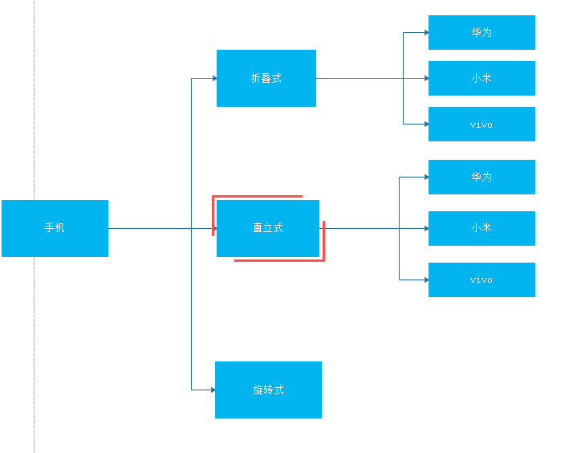
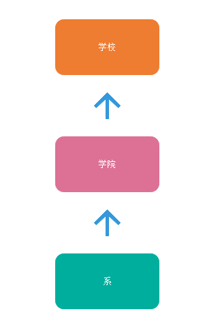
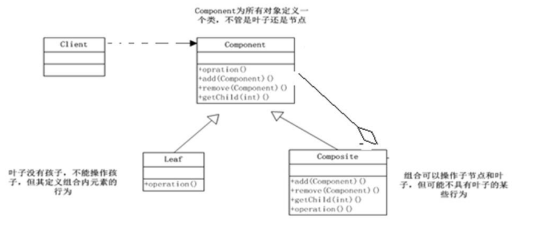
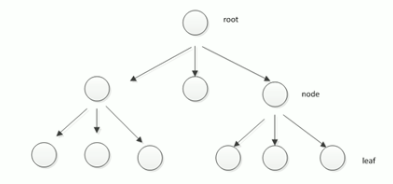
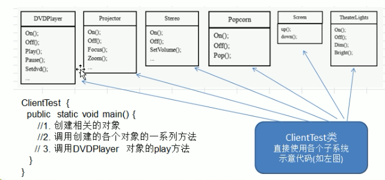
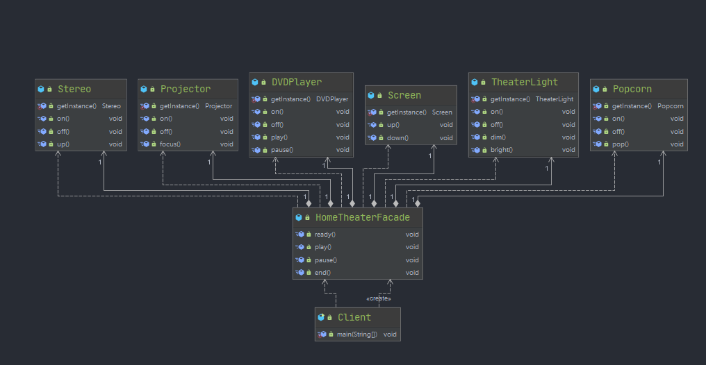
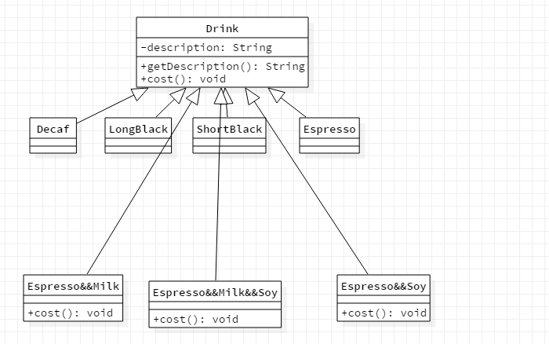
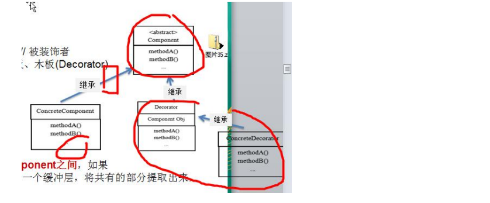
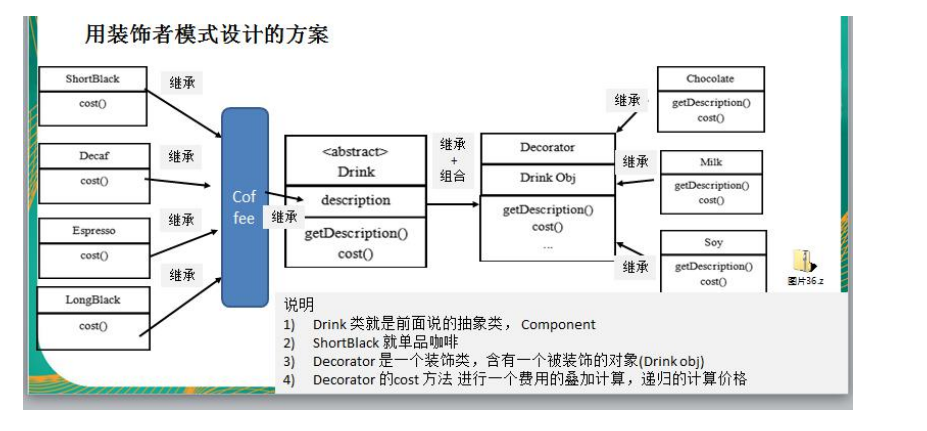

# 设计模式详解之二

## 工厂设计模式

### 简单工厂

披萨案例：

1）披萨的种类很多（比如 GeekPizz、CheesePizz等）

2）披萨的制作有prepare，bake，cut，box

3）完成披萨店订购功能


使用传统方式解决披萨订购问题类图


代码：

```java
// Pizza.java
package cn.ljtnono.dm.factory.tra;

import lombok.Data;

@Data
public abstract class Pizza {

    protected String name;

    public abstract void prepare();

    public void bake() {
        System.out.println(name + " baking;");
    }

    public void cut() {
        System.out.println(name + " cutting;");
    }

    public void box() {
        System.out.println(name + " boxing;");
    }
}
// CheessPizza.java
package cn.ljtnono.dm.factory.tra;

public class CheessPizza extends Pizza{

    public CheessPizza() {
        setName("cheess");
    }

    @Override
    public void prepare() {
        System.out.println("给制作奶酪披萨准备原材料~~");
    }
}
// GreekPizza.java
package cn.ljtnono.dm.factory.tra;

public class GreekPizza extends Pizza{

    public GreekPizza() {
        setName("greek");
    }

    @Override
    public void prepare() {
        System.out.println("给制作希腊披萨准备原材料~~");
    }
}
// OrderPizza.java
package cn.ljtnono.dm.factory.tra;

import java.io.BufferedReader;
import java.io.IOException;
import java.io.InputStreamReader;

public class OrderPizza {

    public OrderPizza() {
        Pizza pizza = null;
        String orderType;
        do {
            orderType = getType();
            if (orderType.equals("greek")) {
                pizza = new GreekPizza();
            } else if (orderType.equals("cheess")) {
                pizza = new CheessPizza();
            } else {
                break;
            }
            pizza.prepare();
            pizza.bake();
            pizza.cut();
            pizza.box();
        } while (true);
    }

    private String getType() {
        try {
            BufferedReader in = new BufferedReader(new InputStreamReader(System.in));
            System.out.println("input pizza type:");
            String s = in.readLine();
            return s;
        } catch (IOException e) {
            e.printStackTrace();
            return "";
        }
    }
}
// PizzaStore.java
package cn.ljtnono.dm.factory.tra;

public class PizzaStore {

    public static void main(String[] args) {
        OrderPizza orderPizza = new OrderPizza();
    }
}

```


传统方式的优缺点

1）优点是比较好理解，简单易操作。

2）缺点是违反了设计模式的ocp原则，即对扩展开放，对修改关闭。即当我们给类增加新功能的时候，尽量不修改代码，或者尽可能少修改代码

3）比如我们这时要增加一个Pizza的种类（PepperPizza披萨），我们需要修改OrderPizza中的代码

4）改进的思路分析

分析：修改代码可以接受，但是如果我们在其他的地方也有创建Pizza的代码，就意味着，也需要修改，而创建Pizza的代码，往往有多处

思路：**把创建Pizza对象封装到一个类中，这样我们有新的Pizza种类时，只需要修改该类就可**，其他有创建到Pizza对象的代码就不需要修改了 ---> **简单工厂模式**


简单工厂模式基本介绍

1）简单工厂模式是属于**创建型模式**，是工厂模式的一种。简单工厂模式是由一个工厂对象决定创建出哪一种产品类的实例。简单工厂模式是**工厂模式家族中最简单实用的模式**

2）简单工厂模式：定义了一个创建对象的类，由这个类来封装实例化对象的行为

3）在软件开发中，当我们会用到大量的创建某种、某类或者某批对象时，就会使用到工厂模式


简单工厂模式解决披萨订购问题类图


代码

```java
// Pizza.java
package cn.ljtnono.dm.factory.simplefactory;

import lombok.Data;

@Data
public abstract class Pizza {

    protected String name;

    public abstract void prepare();

    public void bake() {
        System.out.println(name + " baking;");
    }

    public void cut() {
        System.out.println(name + " cutting;");
    }

    public void box() {
        System.out.println(name + " boxing;");
    }

}
// GreekPizza.java
package cn.ljtnono.dm.factory.simplefactory;

public class GreekPizza extends Pizza {

    public GreekPizza() {
        setName("greek");
    }

    @Override
    public void prepare() {
        System.out.println("给制作希腊披萨准备材料~~");
    }
}
// CheesePizza.java
package cn.ljtnono.dm.factory.simplefactory;

public class CheesePizza extends Pizza {

    public CheesePizza() {
        setName("cheese");
    }

    @Override
    public void prepare() {
        System.out.println("给制作奶酪披萨准备原材料~~");
    }
}
// PepperPizza.java
package cn.ljtnono.dm.factory.simplefactory;

public class PepperPizza extends Pizza {
    public PepperPizza() {
        setName("pepper");
    }

    @Override
    public void prepare() {
        System.out.println("给制作胡椒披萨准备材料~~");
    }
}
// SimpleFactory.java
package cn.ljtnono.dm.factory.simplefactory;

public class SimpleFactory {

    public Pizza craetePizza(String orderType) {
        Pizza p = null;
        System.out.println("使用简单工厂模式");
        switch (orderType) {
            case "greek":
                p = new GreekPizza();
                break;
            case "cheese":
                p = new CheesePizza();
                break;
            case "pepper":
                p = new PepperPizza();
                break;
            default:
                System.out.println("没有这种披萨，订购失败");
                break;
        }
        return p;
    }
}
// OrderPizza.java
package cn.ljtnono.dm.factory.simplefactory;

import lombok.Data;

import java.io.BufferedReader;
import java.io.IOException;
import java.io.InputStreamReader;

@Data
public class OrderPizza {

    public OrderPizza(SimpleFactory simpleFactory) {
        String orderType;
        do {
            orderType = getType();
            Pizza pizza = simpleFactory.craetePizza(orderType);
            pizza.prepare();
            pizza.bake();
            pizza.cut();
            pizza.box();
        } while (true);
    }

    private String getType() {
        try {
            BufferedReader in = new BufferedReader(new InputStreamReader(System.in));
            System.out.println("input pizza type:");
            String s = in.readLine();
            return s;
        } catch (IOException e) {
            e.printStackTrace();
            return "";
        }
    }
}
// PizzaStore.java
package cn.ljtnono.dm.factory.simplefactory;

public class PizzaStore {

    public static void main(String[] args) {
        SimpleFactory simpleFactory = new SimpleFactory();
        OrderPizza orderPizza = new OrderPizza(simpleFactory);
    }
}

```


### 工厂方法模式

新的需求：客户在点披萨时，可以点**不同口味的披萨**，比如北京的奶酪pizza、北京的胡椒pizza或者是伦敦的奶酪pizza、伦敦的胡椒pizza

思路1：

使用**简单工厂模式**，创建**不同的简单工厂类**，比如BJPizzaSimpleFactpry、LDPizzaSimpleFactory等等。从当前这个案例来说，也是可行的，但是考虑到项目的规模，以及软件的可维护性、可扩展性并不是特别好

思路2：

使用工厂方法模式


工厂方法模式介绍

设计方案：将披萨项目的实例化功能抽象成抽象方法，在不同的口味点餐子类中具体实现

工厂方法模式的定义：**定义了一个创建对象的抽象方法，由子类决定要实例化的类。工厂方法模式将对象的实例化推迟到子类**


工厂方法模式应用案例

披萨项目新需求：客户在点披萨时，可以点**不同口味的披萨**，比如 北京的奶酪pizza、北京的胡椒pizza 或者是伦敦的奶酪pizza、伦敦的胡椒pizza

用工厂方法模式解决披萨案例类图


代码：

```java
// Pizza.java
package cn.ljtnono.dm.factory.method;

import lombok.Data;

@Data
public abstract class Pizza {

    protected String name;

    public abstract void prepare();

    public void bake() {
        System.out.println(name + " baking;");
    }

    public void cut() {
        System.out.println(name + " cutting;");
    }

    public void box() {
        System.out.println(name + " boxing;");
    }

}
// BJCheesePizza.java
package cn.ljtnono.dm.factory.method;

public class BJCheesePizza extends Pizza{

    public BJCheesePizza() {
        setName("北京奶酪披萨");
    }

    @Override
    public void prepare() {
        System.out.println("为制作北京奶酪披萨准备材料~~");
    }
}
// BJPepperPizza.java
package cn.ljtnono.dm.factory.method;

public class BJPepperPizza extends Pizza{

    public BJPepperPizza() {
        setName("北京胡椒披萨");
    }

    @Override
    public void prepare() {
        System.out.println("为制作北京胡椒披萨准备材料~~");
    }
}
// BJOrderPizza.java
package cn.ljtnono.dm.factory.method;

public class BJOrderPizza extends OrderPizza{

    @Override
    public Pizza createPizza(String orderType) {
        Pizza pizza = null;
        if (orderType.equals("cheese")) {
            pizza = new BJCheesePizza();
        } else if (orderType.equals("pepper")) {
            pizza = new BJPepperPizza();
        }
        return pizza;
    }
}
// LDCheesePizza.java
package cn.ljtnono.dm.factory.method;

public class LDCheesePizza extends Pizza{

    public LDCheesePizza() {
        setName("伦敦奶酪披萨");
    }

    @Override
    public void prepare() {
        System.out.println("为制作伦敦奶酪披萨准备材料~~");
    }
}
// LDPepperPizza.java
package cn.ljtnono.dm.factory.method;

public class LDPepperPizza extends Pizza{

    public LDPepperPizza() {
        setName("伦敦胡椒披萨");
    }

    @Override
    public void prepare() {
        System.out.println("为制作伦敦胡椒披萨准备材料~~");
    }
}
// LDOrderPizza.java
package cn.ljtnono.dm.factory.method;

public class LDOrderPizza extends OrderPizza{

    @Override
    public Pizza createPizza(String orderType) {
        Pizza pizza = null;
        if (orderType.equals("cheese")) {
            pizza = new LDCheesePizza();
        } else if (orderType.equals("pepper")) {
            pizza = new LDPepperPizza();
        }
        return pizza;
    }
}
// OrderPizza.java
package cn.ljtnono.dm.factory.method;

import java.io.BufferedReader;
import java.io.IOException;
import java.io.InputStreamReader;

public abstract class OrderPizza {


    public abstract Pizza createPizza(String orderType);

    public OrderPizza() {
        Pizza pizza = null;
        String orderType;
        do {
            orderType = getType();
            // 由工厂子类完成
            pizza = createPizza(orderType);
            pizza.prepare();
            pizza.bake();
            pizza.cut();
            pizza.box();
        } while (true);
    }

    private String getType() {
        try {
            BufferedReader in = new BufferedReader(new InputStreamReader(System.in));
            System.out.println("input pizza type:");
            String s = in.readLine();
            return s;
        } catch (IOException e) {
            e.printStackTrace();
            return "";
        }
    }
}
// PizzaStore.java
package cn.ljtnono.dm.factory.method;

public class PizzaStore {

    public static void main(String[] args) {
        // 创建北京口味的各种pizza
//        BJOrderPizza bjOrderPizza = new BJOrderPizza();
        LDOrderPizza ldOrderPizza = new LDOrderPizza();
    }
}

```


### 抽象工厂模式

抽象工厂模式基本介绍

1）抽象工厂模式：定义了一个**interface用于创建相关或有依赖关系的对象簇，而无需指明具体的类**

2）抽象工厂模式可以将**简单工厂模式**和**工厂方法模式**进行整合

3）从设计层面看，抽象工厂模式就是对简单工厂模式的改进（或者称为进一步的抽象）

4）将工厂抽象成两层，Abstract（抽象工厂）和具体实现的工厂子类。程序员可以根据创建对象类型使用对应的工厂子类。这样将单个的简单工厂类变成了工厂簇，更利于代码的维护和扩展。

5）类图


代码：

```java
// Pizza.java
package cn.ljtnono.dm.factory.absfactory;

import lombok.Data;

@Data
public abstract class Pizza {

    protected String name;

    public abstract void prepare();

    public void bake() {
        System.out.println(name + " baking;");
    }

    public void cut() {
        System.out.println(name + " cutting;");
    }

    public void box() {
        System.out.println(name + " boxing;");
    }

}
// AbsFactory.java
package cn.ljtnono.dm.factory.absfactory;

public interface AbsFactory {

    Pizza createPizza(String orderType);

}
// BJFactory.java
package cn.ljtnono.dm.factory.absfactory;

public class BJFactory implements AbsFactory{

    @Override
    public Pizza createPizza(String orderType) {
        Pizza pizza = null;
        if (orderType.equals("cheese")) {
            pizza = new BJCheesePizza();
        } else if (orderType.equals("pepper")) {
            pizza = new BJPepperPizza();
        } else {
            System.exit(-1);
        }
        return pizza;
    }
}
// LDFactory.java
package cn.ljtnono.dm.factory.absfactory;

public class LDFactory implements AbsFactory{

    @Override
    public Pizza createPizza(String orderType) {
        Pizza pizza = null;
        if (orderType.equals("cheese")) {
            pizza = new LDCheesePizza();
        } else if (orderType.equals("pepper")) {
            pizza = new LDPepperPizza();
        } else {
            System.exit(-1);
        }
        return pizza;
    }
}
// BJCheesePizza.java
package cn.ljtnono.dm.factory.absfactory;

public class BJCheesePizza extends Pizza {

    public BJCheesePizza() {
        setName("北京奶酪披萨");
    }

    @Override
    public void prepare() {
        System.out.println("为制作北京奶酪披萨准备材料~~");
    }
}
// BJPepperPizza.java
package cn.ljtnono.dm.factory.absfactory;

public class BJPepperPizza extends Pizza {

    public BJPepperPizza() {
        setName("北京胡椒披萨");
    }

    @Override
    public void prepare() {
        System.out.println("为制作北京胡椒披萨准备材料~~");
    }
}
// LDCheesePizza.java
package cn.ljtnono.dm.factory.absfactory;

public class LDCheesePizza extends Pizza {

    public LDCheesePizza() {
        setName("伦敦奶酪披萨");
    }

    @Override
    public void prepare() {
        System.out.println("为制作伦敦奶酪披萨准备材料~~");
    }
}
// LDPepperPizza.java
package cn.ljtnono.dm.factory.absfactory;

public class LDPepperPizza extends Pizza {

    public LDPepperPizza() {
        setName("伦敦胡椒披萨");
    }

    @Override
    public void prepare() {
        System.out.println("为制作伦敦胡椒披萨准备材料~~");
    }
}

// OrderPizza.java
package cn.ljtnono.dm.factory.absfactory;

import java.io.BufferedReader;
import java.io.IOException;
import java.io.InputStreamReader;

public class OrderPizza {

    private AbsFactory absFactory;

    public void setAbsFactory(AbsFactory absFactory) {
        this.absFactory = absFactory;
        Pizza pizza = null;
        String orderType = "";
        do {
            orderType = getType();
            // 由工厂子类完成
            pizza = absFactory.createPizza(orderType);
            pizza.prepare();
            pizza.bake();
            pizza.cut();
            pizza.box();
        } while (true);
    }
    private String getType() {
        try {
            BufferedReader in = new BufferedReader(new InputStreamReader(System.in));
            System.out.println("input pizza type:");
            String s = in.readLine();
            return s;
        } catch (IOException e) {
            e.printStackTrace();
            return "";
        }
    }
}
// PizzaStore.java
package cn.ljtnono.dm.factory.absfactory;

public class PizzaStore {

    public static void main(String[] args) {
        BJFactory bjFactory = new BJFactory();
        OrderPizza orderPizza = new OrderPizza();
        orderPizza.setAbsFactory(bjFactory);
    }
}

```


工厂模式小结

1）工厂模式的意义

将实例化对象的代码提取出来，放到一个类中统一管理和维护，达到和主项目的依赖关系的解耦。从而提高项目的扩展和维护性。

2）三种工厂模式

简单工厂模式，工厂方法模式，抽象工厂模式

3）设计模式的依赖抽象原则

* 创建对象实例时，不要直接new类，而是把这个new类的动作放在一个工厂的方法中，并返回。有的书上说，变量不要直接持有具体类的引用。
* 不要让类继承具体类，而是继承抽象类或者实现interface接口
* 不要覆盖基类中已经实现的方法


## 原型模式

案例：克隆羊问题

现在有一只羊tom，姓名为：tom，年龄为：1，颜色为：白色，请编写程序创建和tom羊属性完全相同的10只羊。


传统方式解决克隆羊问题类图


代码：

```java
// Sheep.java
package cn.ljtnono.dm.prototype.tra;

import lombok.Data;
import lombok.ToString;

@Data
@ToString
public class Sheep {

    private String name;

    private int age;

    private String color;

    public Sheep(String name, int age, String color) {
        this.name = name;
        this.age = age;
        this.color = color;
    }

}
// Client.java
package cn.ljtnono.dm.prototype.tra;

public class Client {

    public static void main(String[] args) {
        Sheep sheep = new Sheep("tom", 1, "white");

        Sheep sheep1 = new Sheep(sheep.getName(), sheep.getAge(), sheep.getColor());
        Sheep sheep2 = new Sheep(sheep.getName(), sheep.getAge(), sheep.getColor());
        Sheep sheep3 = new Sheep(sheep.getName(), sheep.getAge(), sheep.getColor());
        Sheep sheep4 = new Sheep(sheep.getName(), sheep.getAge(), sheep.getColor());
        Sheep sheep5 = new Sheep(sheep.getName(), sheep.getAge(), sheep.getColor());
        Sheep sheep6 = new Sheep(sheep.getName(), sheep.getAge(), sheep.getColor());

        System.out.println(sheep);
        System.out.println(sheep1);
        System.out.println(sheep2);
        System.out.println(sheep3);
        System.out.println(sheep4);
        System.out.println(sheep5);
        System.out.println(sheep6);

    }
}

```


传统方式的优缺点

1）优点是比较好理解，简单易操作。

2）在创建新的对象时，总是需要重新获取原始对象的属性，如果创建的对象比较复杂时，效率较低

3）总是需要重新初始化对象，而不是动态地获得对象运行时的状态，不够灵活

4）改进的思路分析

思路：Java中Object类是所有类的根类，Object类提供了一个clone()方法，该方法可以将一个Java对象复制一份，但是需要实现clone的Java类必须要实现一个接口Cloneable，该接口表示该类能够复制且具有复制的能力=>原型模式


原型模式基本介绍

1）原型模式（Prototype模式）是指：**用原型实例指定创建对象的种类，并且通过拷贝这些原型，创建新的对象**

2）原型模式是一种创建型设计模式，允许一个对象再创建另一个可定制的对象，无需知道如何创建的细节

3）工作原理是：通过将一个原型对象传给那个要发动创建的对象，这个要发动创建的对象通过请求原型对象拷贝它们自己来实施创建，即**对象.clone()**


原型模式原理类图


说明：

1）Prototype：原型类，声明一个克隆自己的接口

2）ConcretePrototype：具体的原型类，实现一个克隆自己的操作

3）Client：让一个原型对象克隆自己从而创建一个新的对象，属性一样


使用原型模式解决克隆羊问题代码：

```java
// Sheep.java
package cn.ljtnono.dm.prototype;

import lombok.Data;
import lombok.ToString;

@Data
@ToString
public class Sheep implements Cloneable{

    private String name;

    private int age;

    private String color;

    public Sheep(String name, int age, String color) {
        this.name = name;
        this.age = age;
        this.color = color;
    }

    @Override
    protected Object clone()  {
        Sheep sheep = null;
        try {
            sheep = (Sheep) super.clone();
        } catch (CloneNotSupportedException e) {
            e.printStackTrace();
        }
        return sheep;
    }
}
// Client.java
package cn.ljtnono.dm.prototype;

public class Client {

    public static void main(String[] args) {
        Sheep sheep = new Sheep("tom", 1, "white");

        Sheep sheep1 = (Sheep) sheep.clone();
        Sheep sheep2 = (Sheep) sheep.clone();
        Sheep sheep3 = (Sheep) sheep.clone();
        Sheep sheep4 = (Sheep) sheep.clone();
        Sheep sheep5 = (Sheep) sheep.clone();
        Sheep sheep6 = (Sheep) sheep.clone();

        System.out.println(sheep);
        System.out.println(sheep1);
        System.out.println(sheep2);
        System.out.println(sheep3);
        System.out.println(sheep4);
        System.out.println(sheep5);
        System.out.println(sheep6);

    }
}

```


浅拷贝

1）对于数据类型是基本数据类型的成员变量，浅拷贝会直接进行值传递，也就是将该属性值复制一份给新的对象。

2）对于数据类型是引用类型的成员变量，比如说成员变量是某个数组、某个类的对象等，那么浅拷贝会进行引用传递，也就是只是将该成员变量的引用值（内存地址）复制一份给新的对象。因为实际上两个对象的该成员变量都指向同一个实例。在这种情况下，在一个对象中修改该成员变量会影响到另一个对象的该成员变量值

3）前面默认Object的clone方法就是浅拷贝


浅拷贝验证代码

```java
// Sheep.java
package cn.ljtnono.dm.prototype.shallowclone;

import lombok.Data;
import lombok.ToString;

@Data
@ToString
public class Sheep implements Cloneable{

    private String name;

    private int age;

    private String color;

    private Sheep friend;

    public Sheep(String name, int age, String color) {
        this.name = name;
        this.age = age;
        this.color = color;
    }

    @Override
    protected Object clone() {
        Sheep sheep = null;
        try {
            sheep = (Sheep) super.clone();
        } catch (CloneNotSupportedException e) {
            e.printStackTrace();
        }
        return sheep;
    }
}
// Client.java
package cn.ljtnono.dm.prototype.shallowclone;

public class Client {

    public static void main(String[] args) {
        Sheep sheep = new Sheep("tom", 1, "white");
        sheep.setFriend(new Sheep("jack", 2, "黑色"));

        Sheep clone1 = (Sheep) sheep.clone();
        Sheep clone2 = (Sheep) sheep.clone();
        Sheep clone3 = (Sheep) sheep.clone();
        Sheep clone4 = (Sheep) sheep.clone();
        Sheep clone5 = (Sheep) sheep.clone();
        Sheep clone6 = (Sheep) sheep.clone();

        System.out.println(clone1.getFriend());
        System.out.println(clone2.getFriend());
        System.out.println(clone1.getFriend() == clone2.getFriend());

    }
}

```

深拷贝

1）复制对象的所有基本数据类型的成员变量值

2）为所有引用数据类型的成员变量申请存储空间，并复制每个引用数据类型成员变量所引用的对象，直到该对象可达的所有对象。也就是说，**对象进行深拷贝要对整个对象进行拷贝**

3）深拷贝实现方式1：重写**clone**方法来实现深拷贝

4）深拷贝实现方式2：通过**对象序列化**实现深拷贝(推荐)


深拷贝代码：

```java
//DeepCloneableTarget.java
package cn.ljtnono.dm.prototype.deepclone;

import java.io.Serializable;

public class DeepCloneableTarget implements Serializable, Cloneable {

    private static final long serialVersionUID = -3392573844753610367L;

    private String cloneName;

    private String cloneClass;

    public DeepCloneableTarget(String cloneName, String cloneClass) {
        this.cloneName = cloneName;
        this.cloneClass = cloneClass;
    }

    public DeepCloneableTarget() {
    }

    @Override
    protected Object clone() throws CloneNotSupportedException {
        return super.clone();
    }
}
//DeepProtoType.java
package cn.ljtnono.dm.prototype.deepclone;

import java.io.*;

public class DeepProtoType implements Serializable, Cloneable {

    public String name;

    public DeepCloneableTarget deepCloneableTarget;

    public DeepProtoType(String name, DeepCloneableTarget deepCloneableTarget) {
        this.name = name;
        this.deepCloneableTarget = deepCloneableTarget;
    }

    // 完成深拷贝实现 深拷贝 -- 方式1 使用clone方法

    @Override
    protected Object clone() throws CloneNotSupportedException {
        DeepProtoType clone = (DeepProtoType) super.clone();
        // 对引用类型
        clone.deepCloneableTarget = (DeepCloneableTarget) deepCloneableTarget.clone();
        return clone;
    }

    // 方式2 通过对象的序列化实现（推荐）
    public Object deepClone() {
        ByteArrayOutputStream bos = null;
        ObjectOutputStream oos = null;
        ByteArrayInputStream bis = null;
        ObjectInputStream ois = null;
        DeepProtoType copy = null;
        try {
            // 序列化操作
            bos = new ByteArrayOutputStream();
            oos = new ObjectOutputStream(bos);
            // 当前这个对象以对象流的方式输出
            oos.writeObject(this);

            // 反序列化
            bis = new ByteArrayInputStream(bos.toByteArray());
            ois = new ObjectInputStream(bis);

            copy = (DeepProtoType) ois.readObject();

        } catch (Exception e) {
            e.printStackTrace();
        } finally {
            try {
                bos.close();
                oos.close();
                bis.close();
                ois.close();

            } catch (Exception e1) {
                e1.printStackTrace();
            }
        }
        return copy;
    }
}
// Client.java
package cn.ljtnono.dm.prototype.deepclone;

public class Client {

    public static void main(String[] args) throws CloneNotSupportedException {
        DeepProtoType deepProtoType = new DeepProtoType("宋江", new DeepCloneableTarget("大牛", "大牛类"));

        DeepProtoType cl = (DeepProtoType) deepProtoType.clone();
        DeepProtoType cl1 = (DeepProtoType) deepProtoType.clone();

        System.out.println(cl.deepCloneableTarget == cl1.deepCloneableTarget);

        DeepProtoType cl2 = (DeepProtoType) deepProtoType.deepClone();
        DeepProtoType cl3 = (DeepProtoType) deepProtoType.deepClone();

        System.out.println(cl2.deepCloneableTarget == cl3.deepCloneableTarget);

    }
}

```

原型模式的注意事项和细节

1）创建新的对象比较复杂时，可以利用原型模式**简化对象的创建过程，同时也能够提高效率**

2）不用重新初始化对象，而是**动态地获得对象运行时的状态**

3）如果原始对象发生变化（增加或者减少属性），其他克隆对象的也会发生相应的变化，无需修改代码

4）在实现深拷贝的时候可能需要比较复杂的代码

5）**缺点**：需要为每一个类配备一个克隆方法，这对全新的类来说不是很难，但对已有的类进行改造时，需要修改其源代码，违背了ocp原则


## 建造者模式

案例：盖房子

1）需要建房子：这一过程为打桩、砌墙、封顶。不管是普通房子也好，别墅也好都需要经历这些过程

2）建造者模式类图


3）建造者模式解决房子问题类图


3）代码实现

```java
// House.java
package cn.ljtnono.dm.builder;

import lombok.Data;

@Data
public class House {

    private String basic;

    private String wall;

    private String roofed;

}
// HouseBuilder.java
package cn.ljtnono.dm.builder;

// 抽象建造者
public abstract class HouseBuilder {

    protected House house = new House();

    public abstract void buildBasic();

    public abstract void buildWalls();

    public abstract void roofed();

    public House buildHouse() {
        return house;
    }

}
//CommonHouse.java
package cn.ljtnono.dm.builder;

public class CommonHouse extends HouseBuilder{
    @Override
    public void buildBasic() {
        System.out.println("普通房子打地基");
    }

    @Override
    public void buildWalls() {
        System.out.println("普通房子砌墙");
    }

    @Override
    public void roofed() {
        System.out.println("普通方式盖屋顶");
    }
}
//HighBuilding.java
package cn.ljtnono.dm.builder;

public class HighBuilding extends HouseBuilder{
    @Override
    public void buildBasic() {
        System.out.println("高楼打地基");
    }

    @Override
    public void buildWalls() {
        System.out.println("高楼砌墙");
    }

    @Override
    public void roofed() {
        System.out.println("高楼盖屋顶");
    }
}
//HouseDirector.java
package cn.ljtnono.dm.builder;

import lombok.Data;

@Data
public class HouseDirector {

    private HouseBuilder houseBuilder;

    // 构造器传入houseBuilder
    public HouseDirector(HouseBuilder houseBuilder) {
        this.houseBuilder = houseBuilder;
    }

    // 如何处理建造房子的流程
    public House buildHouse() {
        houseBuilder.buildBasic();
        houseBuilder.buildWalls();
        houseBuilder.roofed();
        return houseBuilder.buildHouse();
    }

}
//Client.java
package cn.ljtnono.dm.builder;

public class Client {

    public static void main(String[] args) {
        // 盖普通房子
        CommonHouse commonHouse = new CommonHouse();
        HouseDirector houseDirector = new HouseDirector(commonHouse);
        houseDirector.buildHouse();
        // 盖高楼
        HighBuilding highBuilding = new HighBuilding();
        houseDirector.setHouseBuilder(highBuilding);
        houseDirector.buildHouse();
    }
}
```


建造者模式基本介绍

1）**建造者模式（Builder Pattern）又叫生成器模式，是一种对象构建模式。它可以将复杂对象的建造过程抽象出来，使这个抽象过程的不同实现方法可以构造出不同表现（属性）的对象**

2）建造者模式是一步一步创建一个复杂的对象，它允许用户只通过指定复杂对象的类型和内容就可以构建他们，用户不需要知道内部的具体构建细节。


建造者模式的四个角色

1）Product（产品角色）：一个具体的产品对象

2）Builder（抽象建造者）：创建一个Product对象的各个部件指定的**接口/抽象类**

3）ConcreteBuilder（具体建造者）：实现接口，构建和装配各个部件

4）Director（指挥者）：构建一个使用Builder接口的对象。它主要是用于创建一个复杂的对象。它主要有两个作用，一是：隔离了客户与对象的生产过程，二是：负责控制产品对象的生产过程。


建造者模式的注意事项和细节

1）客户端（使用程序）**不必知道产品内部组成的细节，将产品本身与产品的创建过程解耦，使得相同的创建过程可以创建不同的产品对象**

2）每一个具体建造者都相对独立，而与其他的具体建造者无关，因此可以很方便地替换具体建造者或者增加新的具体建造者，**用户使用不同的具体建造者即可得到不同的产品对象**

3）**可以更加精细地控制产品的创建过程。**将复杂产品的创建步骤分解在不同的方法中，使得创建过程更加清晰，也更加方便使用程序来控制创建过程

4）**增加新的具体建造者无需修改原有类库的代码**，指挥者类针对抽象建造者类编程，系统扩展方便，符合“开闭原则”


## 适配器模式

1）适配器模式（Adapter Pattern）将某个类的接口转换成客户端期望的另一个接口表示，**主要目的是兼容性**，让原本因接口不匹配不能一起工作的两个类可以协同工作。**其别名为包装器（Wrapper）**

2）适配器模式属于结构型模式

3）主要分为三类：**类适配器模式、对象适配器模式、接口适配器模式**


工作原理

1）适配器模式：将一个类的接口转换成另一种接口，让原本接口不兼容的类可以兼容

2）从用户的角度看不到被适配者，是解耦的

3）用户调用适配器转化出来的目标接口方法，适配器再调用被适配者的相关接口方法

4）用户收到反馈结果，感觉只是和目标接口交互


### 类适配器

基本极少：Adapter类，通过继承src类，实现dst类接口，完成从src-->dst的适配

案例：

1）以生活中充电器的例子来讲解适配器，充电器本身相当于Adapter，220V交流电相当于src（即被适配者），我们的目的dst（即 目标）是5V直流电

2）类图分析

 	

3）代码

```java
// IVoltage5V.java
package cn.ljtnono.dm.adapter;

public interface IVoltage5V {

    int output5V();
}
//Voltage220V.java
package cn.ljtnono.dm.adapter;

public class Voltage220V {

    // 输出220V的电压
    public int output220V() {
        int src = 220;
        System.out.println("电压=" + src + "伏");
        return src;
    }
}
//VoltageAdapter.java
package cn.ljtnono.dm.adapter;

public class VoltageAdapter extends Voltage220V implements IVoltage5V{

    @Override
    public int output5V() {
        int src = output220V();
        // 转成5V
        return src / 44;
    }
}
// Phone.java
package cn.ljtnono.dm.adapter;

public class Phone {

    public void charging(IVoltage5V iVoltage5V) {
        if (iVoltage5V.output5V() == 5) {
            System.out.println("电压为5V,可以充电");
        } else if(iVoltage5V.output5V() > 5) {
            System.out.println("电压过高,不能充电");
        }
    }

}
// Client.java
package cn.ljtnono.dm.adapter;

public class Client {

    public static void main(String[] args) {
        System.out.println("===========类适配器模式===========");
        Phone phone = new Phone();
        phone.charging(new VoltageAdapter());
    }
}

```


类适配器模式注意事项和细节

1）Java是单继承机制，所以类适配器需要继承src类这一点算是一个缺点，因为要求dst必须是接口，有一点局限性

2）src类的方法在Adapter中都会暴露出来，也增加了使用的成本

3）由于其继承src类，所以它可以根据需求重写src类的方法，使得Adapter的灵活性增强了


### 对象适配器模式

对象适配器模式介绍

1）基本思路和类的适配器模式相同，只是将Adapter类作修改，不是继承src类，而是持有src类的实例，以解决兼容性的问题。即：持有src类，实现dst类接口，完成src->dst的适配

2）根据“**合成复用原则**”，在系统中尽量使用关联关系来替代继承关系

3）对象适配器模式是适配器模式常用的一种


对象适配器模式解决电压适配问题类图


代码：

```java
//IVoltage5V.java
package cn.ljtnono.dm.adapter.objectadapter;

public interface IVoltage5V {

    int output5V();
}
//Phone.java
package cn.ljtnono.dm.adapter.objectadapter;

public class Phone {

    public void charging(IVoltage5V iVoltage5V) {
        if (iVoltage5V.output5V() == 5) {
            System.out.println("电压为5V,可以充电");
        } else if(iVoltage5V.output5V() > 5) {
            System.out.println("电压过高,不能充电");
        }
    }

}
//Voltage220V.java
package cn.ljtnono.dm.adapter.objectadapter;

public class Voltage220V {

    // 输出220V的电压
    public int output220V() {
        int src = 220;
        System.out.println("电压=" + src + "伏");
        return src;
    }
}
//VoltageAdapter.java
package cn.ljtnono.dm.adapter.objectadapter;

public class VoltageAdapter implements IVoltage5V {

    private Voltage220V voltage220V;

    public VoltageAdapter(Voltage220V voltage220V) {
        this.voltage220V = voltage220V;
    }

    @Override
    public int output5V() {
        int dst = 0;
        if (null != voltage220V) {
            int src = voltage220V.output220V();
            System.out.println("使用对象适配器进行转换");
            dst = src / 44;
            System.out.println("适配完成，输出电压为：" + dst);
        }
        // 转成5V
        return dst;
    }
}

//Client.java
package cn.ljtnono.dm.adapter.objectadapter;

public class Client {

    public static void main(String[] args) {
        System.out.println("===========对象适配器模式===========");
        Phone phone = new Phone();
        phone.charging(new VoltageAdapter(new Voltage220V()));
    }
}

```


对象适配器模式注意事项和细节

1）对象适配器和类适配器起始算是同一种思想，只不过实现方式不一样。根据合成复用原则，使用组合代替继承，所以它解决了类适配器必须继承src的局限性问题，也不再要求dst必须是接口

2）使用成本更低，更灵活


### 接口适配器模式

接口适配器模式基本介绍

1）一些书籍称为：适配器模式或者缺省适配器模式

2）**当不需要全部实现接口提供的方法时，可先设计一个抽象类实现接口，并为该接口中每一个方法提供一个默认实现（空方法），那么该抽象类的子类可有选择地覆盖父类的某些方法来实现需求**

3）适用于一个接口不想使用其所有的方法的情况


接口适配器模式简单类图


代码：

```java
//interface4.java
package cn.ljtnono.dm.adapter.interfaceadapter;

public interface Interface4 {

    void m1();
    void m2();
    void m3();
    void m4();

}
// AbsAdapter.java
package cn.ljtnono.dm.adapter.interfaceadapter;

// 空实现接口所有方法
public class AbsAdapter implements Interface4{
    @Override
    public void m1() {

    }

    @Override
    public void m2() {

    }

    @Override
    public void m3() {

    }

    @Override
    public void m4() {

    }
}
// Client.java
package cn.ljtnono.dm.adapter.interfaceadapter;

public class Client {

    public static void main(String[] args) {
        // 通过匿名内部类的方式重写需要使用到的方法
        AbsAdapter absAdapter = new AbsAdapter() {
            @Override
            public void m3() {
                System.out.println("重写m3方法");
            }
        };
        absAdapter.m3();
    }

}

```


适配器模式的注意事项和细节

1）三种命名方式，是根据src是以怎样的形式给到Adapter来命名的

2）类适配器：以类给到，在Adaper里，就是将src当做类，继承
	  对象适配器：以对象给到，在Adapter里，将src作为一个对象，持有
	  接口适配器：以接口给到，在Adapter里，将src作为一个接口，实现

3）Adapter模式最大的作用还是将原本不兼容的接口融合在一起工作

4）实际开发中，实现起来不拘泥于我们讲解的三种经典形式


## 桥接模式

案例：手机操作问题

不同品牌实现操作编程（比如：开机、关机、上网、打电话等）



对应类图


传统方式解决手机操作问题分析

1）扩展性问题（类爆炸），如果我们再增加手机的样式（旋转式），就需要增加各个品牌手机的类，同样如果我们增加一个手机品牌，也要在各个手机样式类下增加

2）违反了单一职责原则，当我们增加手机样式时，要同时增加所有品牌的手机，这样增加了代码维护成本

3）解决方案-使用桥接模式


桥接模式的基本介绍

1）桥接模式（Bridge模式）是指：将实现与抽象放在两个不同的类型层次中，使两个层次可以独立改变

2）是一种结构型设计模式

3）Bridge模式基于类的最小设计原则，通过使用封装、聚合及继承等行为让不同的类承担不同的职责。它的主要特点是把抽象与行为实现分离开来，从而可以保持各部分的独立性以及应对他们的功能扩展


桥接模式的原理类图


说明：

1）Client类：桥接模式的调用者

2）抽象类（Abstraction）：维护了Implementor 即它的实现类ConcreteImplementorA等，二者是聚合的关系，Abstraction充当了桥接类

3）RefinedAbstraction：是Abstraction抽象类的子类

4）Implementor：行为实现类的接口

5）ConcreteImplementorA/B：行为的具体实现类


桥接模式解决手机操作问题类图


代码：

```java
// Brand.java
package cn.ljtnono.dm.bridge;

// 接口
public interface Brand {
    void open();
    void close();
    void call();
}
// Phone.java
package cn.ljtnono.dm.bridge;

public abstract class Phone {

    // 组合品牌
    private Brand brand;

    public Phone(Brand brand) {
        this.brand = brand;
    }


    protected void open() {
        brand.open();
    }

    protected void close() {
        brand.close();
    }

    protected void call() {
        brand.call();
    }

}
//FoldedPhone.java
package cn.ljtnono.dm.bridge;

public class FoldedPhone extends Phone{

    public FoldedPhone(Brand brand) {
        super(brand);
    }

    @Override
    protected void open() {
        super.open();
        System.out.println(" 折叠样式手机 ");
    }

    @Override
    protected void close() {
        super.close();
        System.out.println(" 折叠样式手机 ");
    }

    @Override
    protected void call() {
        super.call();
        System.out.println(" 折叠样式手机 ");
    }
}
// UpRightPhone.java
package cn.ljtnono.dm.bridge;

public class UpRightPhone extends Phone{
    public UpRightPhone(Brand brand) {
        super(brand);
    }

    @Override
    protected void open() {
        super.open();
        System.out.println("直立样式手机");
    }

    @Override
    protected void close() {
        super.close();
        System.out.println("直立样式手机");

    }

    @Override
    protected void call() {
        super.call();
        System.out.println("直立样式手机");
    }
}
// Vivo.java
package cn.ljtnono.dm.bridge;

public class Vivo implements Brand{
    @Override
    public void open() {
        System.out.println("Vivo手机打开~");
    }

    @Override
    public void close() {
        System.out.println("Vivo手机关机~");

    }

    @Override
    public void call() {
        System.out.println("Vivo手机打电话~");
    }
}
// XiaoMi.java
package cn.ljtnono.dm.bridge;

public class XiaoMi implements Brand{
    @Override
    public void open() {
        System.out.println("小米手机开机~");
    }

    @Override
    public void close() {
        System.out.println("小米手机关机");
    }

    @Override
    public void call() {
        System.out.println("小米手机打电话");
    }
}
// Client.java
package cn.ljtnono.dm.bridge;

public class Client {

    public static void main(String[] args) {
        // 获取折叠式手机（样式 + 品牌）

        Phone phone1 = new FoldedPhone(new XiaoMi());

        phone1.open();
        phone1.call();
        phone1.close();

        Phone phone2 = new FoldedPhone(new Vivo());
        phone2.open();
        phone2.call();
        phone2.close();

        Phone phone3 = new UpRightPhone(new XiaoMi());

        phone3.open();
        phone3.call();
        phone3.close();
    }
}


```

桥接模式的注意事项和细节

1）实现了抽象和实现部分的分离，从而极大的提供了系统的灵活性，让抽象部分和实现部分独立开来，这有助于系统进行分层设计，从而产生更好的结构化系统

2）对于系统的高层部分，只需要知道抽象部分和实现部分的接口就可以了，其他的部分由具体业务来完成

3）**桥接模式替代多层继承方案，可以减少子类的个数，降低系统的管理和维护成本**

4）桥接模式的引入增加了系统的理解和设计难度，由于聚合关联关系建立在抽象层，要求开发者针对抽象进行设计和编程

5）桥接模式要求**正确识别出系统中两个独立变化的维度**，因此其使用范围有一定的局限性，即需要有这样的应用场景


## 组合模式

案例：

编写程序展示一个学校院系结构，要在一个页面中展示出学校的院系组成，一个学校有多个学院，一个学院有多个系

清华大学：
	计算机学院：
		软件工程
		网络工程
	信息工程学院：
		通信工程
		信息工程	

传统方案解决学校院系展示（类图）



问题分析：

1）将学院看做是学校的子类，系是学院的子类，这样实际上是站在组织大小来进行分层次的

2）实际上我们的要求是：在一个页面中展示出学校的院系组成，一个学校有多个学院，一个学院有多个系，因此这种方案，不能很好实现的管理的操作，比如对学院、系的添加，删除，遍历等

3）解决方案：把学校、院、系都看做是组织结构，他们之间没有继承关系，而是一个树形结构，可以更好的实现管理操作 ===》组合模式


组合模式基本介绍

1）组合模式（Composite Pattern），又叫部分整体模式，它创建了对象组的树形结构，将对象组合成树状结构以表示“整体-部分”的层次关系。

2）组合模式依据树形结构来组合对象，用来表示部分以及整体层次。

3）这种类型的设计模式属于结构型模式。

4）组合模式使得用户对单个对象和组合对象的访问具有一致性，即：组合能让客户以一致的方式处理个别对象以及组合对象


组合模式原理类图




说明：

1）Component：这是组合中对象声明接口，在适当情况下，实现所有类共有的接口默认行为，用于访问和管理Component子部件，Component可以是抽象类或者接口

2）Leaf：在组合中表示叶子节点，叶子节点没有子节点

3）Composite：非叶子节点，用于存储子部件，在Component接口中实现子部件的相关操作，比如add方法，删除等操作


解决的问题

1）组合模式解决这样的问题，当我们的要处理的对象可以生成一棵树形结构，而我们要对树形结构上的节点和叶子进行操作时，它能够提供一致的方式，而不用考虑它是节点还是叶子

2）对应的示意图



3）类图分析


4）代码

```java
// OrganizationComponent.java
package cn.ljtnono.dm.composite;

import lombok.Data;

@Data
public abstract class OrganizationComponent {

    // 名字
    private String name;
    // 说明
    private String des;

    protected void add(OrganizationComponent organizationComponent) {
        // 默认实现
        throw new UnsupportedOperationException();
    }

    protected void remove(OrganizationComponent organizationComponent) {
        // 默认实现
        throw new UnsupportedOperationException();
    }

    public OrganizationComponent(String name, String des) {
        this.name = name;
        this.des = des;
    }
    // 方法print，做成抽象的，子类都需要实现
    protected abstract void print();


}
// College.java
package cn.ljtnono.dm.composite;

import java.util.ArrayList;
import java.util.List;

public class College extends OrganizationComponent{

    private List<OrganizationComponent> organizationComponentList = new ArrayList<>();

    public College(String name, String des) {
        super(name, des);
    }

    @Override
    protected void add(OrganizationComponent organizationComponent) {
        organizationComponentList.add(organizationComponent);
    }

    @Override
    protected void remove(OrganizationComponent organizationComponent) {
        organizationComponentList.remove(organizationComponent);
    }

    @Override
    protected void print() {
        // 就是输出College中包含的学校
        System.out.println("--------------------" + getName() + "------------------");
        // 遍历
        for (OrganizationComponent organizationComponent : organizationComponentList) {
            organizationComponent.print();
        }
    }
}
// Department.java
package cn.ljtnono.dm.composite;


public class Department extends OrganizationComponent{

    public Department(String name, String des) {
        super(name, des);
    }

    @Override
    public String getDes() {
        return super.getDes();
    }

    @Override
    public String getName() {
        return super.getName();
    }

    @Override
    protected void print() {
        System.out.println(getName());
    }
}
// University.java
package cn.ljtnono.dm.composite;

import lombok.Data;

import java.util.ArrayList;
import java.util.List;

@Data
public class University extends OrganizationComponent{

    private List<OrganizationComponent> organizationComponentList = new ArrayList<>();

    public University(String name, String des) {
        super(name, des);
    }

    @Override
    protected void add(OrganizationComponent organizationComponent) {
        organizationComponentList.add(organizationComponent);
    }

    @Override
    protected void remove(OrganizationComponent organizationComponent) {
        organizationComponentList.remove(organizationComponent);
    }

    @Override
    protected void print() {
        // 就是输出University中包含的学校
        System.out.println("--------------------" + getName() + "------------------");
        // 遍历
        for (OrganizationComponent organizationComponent : organizationComponentList) {
            organizationComponent.print();
        }
    }
}
// Client.java
package cn.ljtnono.dm.composite;

public class Client {

    public static void main(String[] args) {
        // 从大到小创建对象
        // 学校
        OrganizationComponent university = new University("清华大学", "中国顶级大学");
        // 学院
        OrganizationComponent computerCollege = new College("计算机学院", " 计算机学院 ");
        OrganizationComponent infoEngineerCollege = new College("信息工程学院", " 信息工程学院 ");

        computerCollege.add(new Department("软件工程系", " 软件工程 "));
        computerCollege.add(new Department("网络工程系", " 网络工程系 "));
        computerCollege.add(new Department("计算机科学与技术", " 计算机科学与技术 "));

        //
        infoEngineerCollege.add(new Department("通信工程", " 通信工程不好学 "));
        infoEngineerCollege.add(new Department("信息工程", " 信息工程很好学 "));

        university.add(computerCollege);
        university.add(infoEngineerCollege);

        university.print();
    }
}

```


组合模式的注意事项和细节

1）简化客户端操作。客户端只需要面对一致的对象而不用考虑整体部分或者节点叶子的问题。

2）具有较强的扩展性。当我们要更改组合对象时，我们只需要调整内部的层次关系，客户端不用做出任何改动

3）方便创建出复杂的层次结构。客户端不用理会组合里面的组成细节，容易添加节点或者叶子从而创建出复杂的树形结构

4）**需要遍历组织机构**，**或者处理的对象具有树形结构时**，非常适合使用**组合模式**

5）要求较高的抽象性，**如果节点和叶子有很多差异性的话，比如很多方法和属性都不一样，不适合使用组合模式**


## 外观模式

案例：组件一个家庭影院：

DVD播放器、投影仪、自动屏幕、环绕立体声、爆米花机，要求完成使用家庭影院的功能，其过程为：

* 直接用遥控器：统筹各设备开关
* 开爆米花机
* 放下屏幕
* 开投影仪
* 开音响
* 开DVD，选dvd
* 去拿爆米花
* 调暗灯光
* 播放
* 观影结束后，关闭各种设备

传统方式解决影院管理



传统方式解决影院管理问题分析

1）在**ClientTest**的main方法中，创建各个子系统的对象，并直接去调用子系统（对象）相关方法，会造成调用过程混乱，没有清晰的过程

2）不利于在**ClientTest**中，去维护对子系统的操作

3）解决思路：定义一个高层接口，给子系统中的一组接口提供一个一致的界面（比如在高层接口提供四个方法ready，play，pause，end），用来访问子系统中的一群接口

4）**也就是说**就是通过定义一个一致的几口（界面类），用以屏蔽内部子系统的细节，使得调用端只需跟这个接口发生调用，而无需关心这个子系统的内部细节=》外观模式


外观模式基本介绍

1）外观模式（Facade），**也叫过程模式**，外观模式为子系统中的一组接口提供一个一致的界面，此模式定义了一个高层接口，这个接口使得这一子系统更加容易使用

2）外观模式通过定义一个一致的接口，用以屏蔽内部子系统的细节，使得调用端只需跟这个接口发生调用，而无需关系这个子系统的内部细节


外观模式的原理类图


说明：

1）外观类（Facade）：为调用端提供统一的调用接口，外观类知道哪些子系统负责处理请求，从而将调用端的请求代理给适当子系统对象

2）调用者（Client）：外观接口的调用者

3）子系统的集合：指模块或者子系统，处理Facade对象指派的任务，他是功能的实际提供者


外观模式解决影院管理

1）外观模式可以理解为转换一群接口，客户只要调用一个接口，客户只要调用一个接口，而不调用多个接口才能达到目的。比如：在pc上安装软件的时候经常有一键安装选项（省去选择安装目录、安装的组件等等），还有就是手机的重启功能（把关机和启动合为一个操作）。

2）外观模式就是解决多个复杂接口带来的使用困难，起到简化用户操作的作用

3）类图



4）代码：

```java
//HomeTheaterFacade.java
package cn.ljtnono.dm.facade;

public class HomeTheaterFacade {

    private TheaterLight theaterLight;
    private Popcorn popcorn;
    private Stereo stereo;
    private Projector projector;
    private Screen screen;
    private DVDPlayer dvdPlayer;

    public HomeTheaterFacade() {
        this.theaterLight = TheaterLight.getInstance();
        this.popcorn = Popcorn.getInstance();
        this.stereo = Stereo.getInstance();
        this.projector = Projector.getInstance();
        this.screen = Screen.getInstance();
        this.dvdPlayer = DVDPlayer.getInstance();
    }

    public void ready() {
        popcorn.on();
        popcorn.pop();
        screen.down();
        projector.on();
        stereo.on();
        dvdPlayer.on();
        theaterLight.dim();
    }

    public void play() {
        dvdPlayer.play();
    }

    public void pause() {
        dvdPlayer.pause();
    }

    public void end() {
        popcorn.off();
        theaterLight.bright();
        screen.up();
        projector.off();
        stereo.off();
        dvdPlayer.off();
    }

}
// DVDPlayer.java
package cn.ljtnono.dm.facade;

public class DVDPlayer {

    // 使用单例模式，使用饿汉式
    private static DVDPlayer instance = new DVDPlayer();

    public static DVDPlayer getInstance() {
        return instance;
    }

    public void on() {
        System.out.println(" dvd on");
    }

    public void off() {
        System.out.println(" dvd off ");
    }

    public void play() {
        System.out.println(" dvd is playing ");
    }

    public void pause() {
        System.out.println(" dvd pause... ");
    }

}
// Popcorn.java
package cn.ljtnono.dm.facade;

public class Popcorn {

    private static Popcorn instance = new Popcorn();

    public static Popcorn getInstance() {
        return instance;
    }

    public void on() {
        System.out.println(" popcorn on ");
    }

    public void off() {
        System.out.println(" popcorn ff ");
    }

    public void pop() {
        System.out.println(" popcorn is poping ");
    }
}
// Projector.java
package cn.ljtnono.dm.facade;

public class Projector {

    private static Projector instance = new Projector();

    public static Projector getInstance() {
        return instance;
    }

    public void on() {
        System.out.println(" Projector on ");
    }

    public void off() {
        System.out.println("Projector ff ");
    }

    public void focus() {
        System.out.println(" Projector is Projector ");
    }

}
//Screen.java
package cn.ljtnono.dm.facade;

public class Screen {

    private static Screen instance = new Screen();

    public static Screen getInstance() {
        return instance;
    }

    public void up() {
        System.out.println(" screen up ");
    }

    public void down() {
        System.out.println(" screen down ");
    }

}
// Stereo.java
package cn.ljtnono.dm.facade;

public class Stereo {

    private static Stereo instance = new Stereo();

    public static Stereo getInstance() {
        return instance;
    }

    public void on() {
        System.out.println(" stereo on ");
    }

    public void off() {
        System.out.println(" stereo off ");
    }

    public void up() {
        System.out.println(" stereo up... ");
    }

}
// TheaterLight.java
package cn.ljtnono.dm.facade;

public class TheaterLight {

    private static TheaterLight instance = new TheaterLight();

    public static TheaterLight getInstance() {
        return instance;
    }

    public void on() {
        System.out.println(" TheaterLight on");
    }

    public void off() {
        System.out.println(" TheaterLight off");
    }
    public void dim() {
        System.out.println(" TheaterLight dim");
    }
    public void bright() {
        System.out.println(" TheaterLight bright");
    }
}
// Client.java
package cn.ljtnono.dm.facade;

public class Client {

    public static void main(String[] args) {

        HomeTheaterFacade homeTheaterFacade = new HomeTheaterFacade();
        homeTheaterFacade.ready();
        homeTheaterFacade.play();

        homeTheaterFacade.pause();

        homeTheaterFacade.end();
    }
}

```


## 享元模式

需求：展示网站项目

小型外包项目，给客户A做一个产品展示网站，客户A的朋友感觉效果不错，也希望做这样的产品展示网站，但是要求都有些不同：

1）有客户要求以新闻的形式发布

2）有客户要求以博客的形式发布

3）有客户希望以微信公众号的形式发布


传统方案解决网站展现项目

1）直接复制粘贴一份，然后根据客户不同要求，进行定制修改

2）给每个网站租用一个空间

3）方案设计示意图


传统方案解决网站展现项目-问题分析

1）需要的网站结构相识度很高，而且都不是高访问量网站，如果分成多个虚拟空间来处理，相当于一个相同网站的实例对象很多，造成服务器资源浪费

2）解决思路：整合到一个网站中，共享其相关代码和数据，对于硬盘、内存、CPUI、数据空间等服务器资源都可以达成共享，减少服务器资源

3）对于代码来说，由于是一份实例，维护和扩展都更加容易

4）上面的解决思路就可以使用**享元模式**来解决


享元模式基本介绍

1）享元模式（Flyweight Pattern）也叫蝇量模式：运用共享技术有效地支持大量细粒度的对象

2）常用于系统底层开发，解决系统的性能问题。像**数据库连接池**，里面都是创建好的连接对象，在这些连接对象中有我们需要的则直接拿来用，避免重新创建，如果没有我们需要的，则创建一个

3）享元模式能够解决**重复对象的内存浪费的问题**，当系统中有大量相似对象，需要缓冲池时。不需总是创建新对象，可以从缓冲池里拿。这样可以降低系统内存，同时提高效率

4）享元模式经典的应用场景就是池技术了，String常量池、数据库连接池、缓冲池等等都是享元模式的应用，享元模式是池技术的重要实现方式


享元模式类图


说明：

1）FlyWeight 是抽象的享元角色，他是产品的抽象类，同时定义出对象的**外部状态**和**内部状态**的接口或实现

2）ConcreteFlyWeight 是具体的享元角色，是具体的产品类，实现抽象角色定义的相关业务

3）UnSharedConcreteFlyWeight 是不可共享的角色，一般不会出现在享元工厂

4）FlyWeightFactory 享元工厂类，用于构建一个池的容器（集合），同时提供从池中获取对象的相关方法


外部状态和内部状态

比如围棋、五子棋、跳棋，他们都有大量的棋子对象，围棋和五子棋只有黑白两色，跳棋颜色多一点，所以棋子颜色就是棋子的内部状态；而各个棋子之间的差别就是位置的不同，当我们落子后，落子颜色是定的，但位置是变化的，所以棋子坐标就是棋子的外部状态

1）享元模式提出了两个要求：细粒度和共享对象。这里就涉及到内部状态和外部状态了，即将对象的信息分为两个部分：**内部状态**和**外部状态**

2）**内部状态**指对相关共享出来的信息，存储在享元对象内部且不会随环境的改变而改变	

3）**外部状态**指对象得以依赖的一个标记，是随环境改变而改变的、不可共享的状态

4）举个例子：围棋理论上有361个空位可以放棋子，每盘棋都有可能有两三百个棋子对象产生，因为内存空间有限，一台服务器很难支持更多的玩家玩围棋游戏，如果用享元模式来处理棋子，那么棋子对象就可以减少到只有两个实例，这样就很好的解决了对象的开销问题


享元模式解决网站展示问题类图


代码：

```java
// WebSite.java
package cn.ljtnono.dm.flyweight;

public abstract class WebSite {

    public abstract void use(User user);

}
// WebSiteFactory.java
package cn.ljtnono.dm.flyweight;

import lombok.Data;

import java.util.HashMap;
import java.util.List;

@Data
public class WebSiteFactory {

    private HashMap<String, ConcreteWebSite> pool = new HashMap<>();
    // 根据网站的类型，返回一个网站，如果没有，就创建一个并放入到池中

    public WebSite getWebSiteCategory(String type) {
        if (!pool.containsKey(type)) {
            ConcreteWebSite concreteWebSite = new ConcreteWebSite(type);
            pool.put(type, concreteWebSite);
        }
        return (WebSite) pool.get(type);
    }

    // 获取网站分类的总数
    public int getWebSiteCount() {
        return pool.size();
    }

}
// User.java
package cn.ljtnono.dm.flyweight;

import lombok.Data;

@Data
public class User {

    private String name;

    public User(String name) {
        this.name = name;
    }
}
//ConcreteWebSite.java
package cn.ljtnono.dm.flyweight;

public class ConcreteWebSite extends WebSite{

    // 网站发布的类型
    private String type = "";

    public ConcreteWebSite(String type) {
        this.type = type;
    }

    @Override
    public void use(User user) {
        System.out.println("网站的发布形式为：" + type + "使用者为：" + user.getName());
    }
    
}
//Client.java
package cn.ljtnono.dm.flyweight;

public class Client {

    public static void main(String[] args) {
        // 创建一个工厂类
        WebSiteFactory webSiteFactory = new WebSiteFactory();

        // 客户要一个以新闻形式发布的网站
        WebSite news = webSiteFactory.getWebSiteCategory("新闻");
        news.use(new User("新浪"));

        // 客户要一个以博客形式发布的网站
        WebSite blog = webSiteFactory.getWebSiteCategory("博客");
        blog.use(new User("百度"));

        System.out.println("发布网站总数：" + webSiteFactory.getWebSiteCount());
    }
}

```


享元模式的注意事项和细节

1）享元模式可以这样理解，“享”就是共享，“元”就是对象

2）系统中有大量对象，这些对象消耗大量内存，并且对象的状态大部分可以外部化时，我们就可以考虑选用享元模式

3）用唯一标识码判断，如果在内存中有，则返回内存这个唯一标识码所标识的对象，用HashMap/HashTable存储

4）享元模式大大减少了对象的创建，降低了程序内存的占用，提高效率

5）享元模式提高了**系统的复杂度**。需要分离出内部状态和外部状态，而外部状态具有固化特性，不应该随着内部状态的改变而改变，这是我们使用享元模式需要注意的地方

6）使用享元模式时，注意划分**内部状态和外部状态**，并且需要有一个工厂类加以控制

7）享元模式经典的应用场景是需要缓冲池的场景，比如String常量池、数据库连接池


## 装饰者模式

案例：星巴克咖啡订单项目（咖啡馆）：

1）咖啡种类/单品咖啡：Espresso（意大利浓咖啡）、ShortBlack、LongBlack（美式咖啡）、Decaf（无因咖啡）

2）调料：Milk、Soy（豆浆）、Chocolate

3）要求在扩展**新的咖啡种类**时，具有良好的扩展性、改动方便、维护方便

4）使用OO的来计算不同种类咖啡的费用：客户可以点单品咖啡，也可以单品咖啡+调料组合

方案1类图



问题分析：

1）Drink 是一个抽象类，表示饮料

2）des就是对咖啡的描述，比如咖啡的名字

3）cost()方法就是计算费用，Drink类中做成一个抽象方法

4）Decaf就是单品咖啡，继承Drink，并实现cost方法

5）Espress &&Milk就是单品咖啡 + 调料，这种组合很多，这样设计会导致类爆炸，当我们增加一个单品咖啡，或者一个新的调料时，类的数量就会倍增。为了解决这个问题---->装饰者模式


方案2

前面分析到方案1因为咖啡单品+调料组合会造成类的倍增，因此可以做改进，将调料内置到Drink类，这样就不会造成类数量过多。从而提高项目的维护性


1）方案2可以控制类的数量，不至于造成很多的类

2）在增加或者删除调料种类时，代码的维护量很大

3）考虑到用户可以添加多份调料时，可以将hasMilk返回一个对应的int型

4）考虑使用装饰者模式


装饰者模式定义

1）装饰者模式：**动态的**将新功能附加到对象上。在对象功能扩展方面，它比继承更有弹性，装饰者模式也体现了开闭原则（ocp）

2）这里提到的**动态的将新功能附加到对象和ocp原则**，下面以代码形式具体体现


装饰者模式原理图（Decorator）




说明

1）装饰者模式就像打包一个快递

* 主体：比如：陶瓷、衣服  //被装饰者
* 包装：比如：报纸填充、塑料泡沫、纸板、木板 //装饰者

2）Component
      主体：比如类似前面的Drink

3）ConcreteComponent和Decorator
	  ConcreteComponent：具体的主题，比如前面的各个单品咖啡
	  Decorator：装饰者，比如各调料

4）在Component与ConcreteComponent之间，如果ConcreteComponent类很多，还可以设计一个缓冲层，将共有的部分提取出来，抽象层一个类


装饰者模式解决星巴克咖啡订单




## 状态模式

