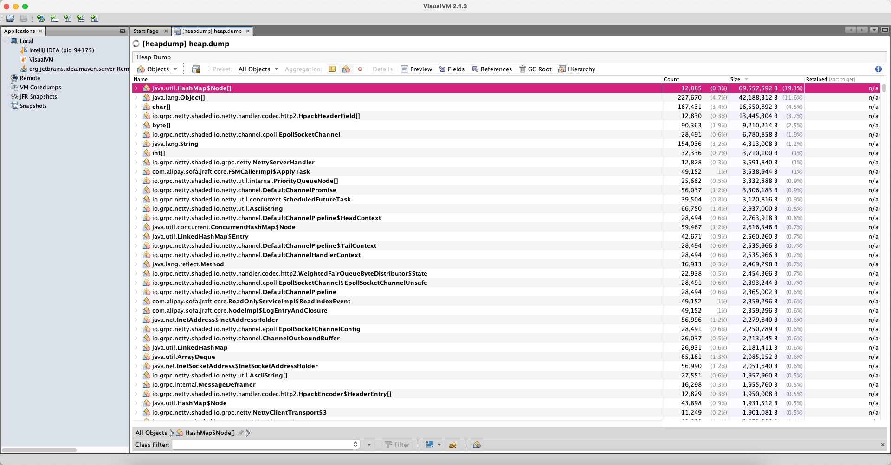
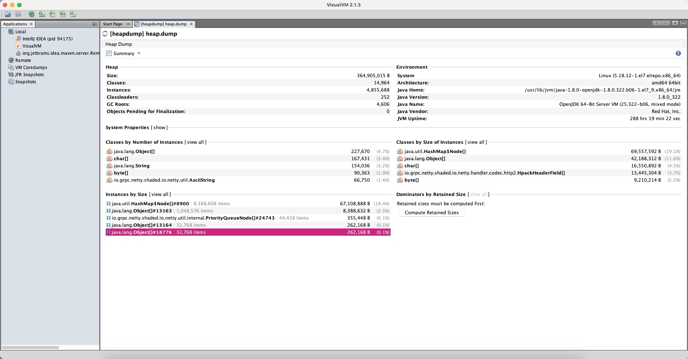

# 日常问题总结

## 发版机解决docker没有权限问题

```shell
su -c "setenforce 0"
```

## 提高maven编译速度

* 每次只编译改动的模块
* 开启并行编译
* 编译前不需要clean

```bash
mvn compile -P prd -T 16C -Dmaven.compile.fork=true
```

## 关闭ipv4流量转发导致无法访问

1、查看主机是否打开ipv4流量转发

```bash
sysctl net.ipv4.ip_forward
# 如果出现net.ipv4.ip_forward = 1 则表明开启ipv4了流量转发
# 如果出现net.ipv4.ip_forward = 0 则表明没有开启ipv4流量转发
```

2、查看主机是否只能bind在ipv6上

```bash
sysctl net.ipv6.bindv6only
# 如果出现net.ipv6.bindv6only = 0 表明程序可以bind在ipv4和ipv6上
# 如果出现net.ipv6.bindv6only = 1 表明程序只能bind在ipv6上
```

解决方案：

```bash
# 开启ipv4
echo "net.ipv4.ip_forward=1" >> /etc/sysctl.conf
# 刷新配置
sysctl -p /etc/sysctl.conf
# 重启网络
systemctl restart network
```

## 修改gitlab访问频率控制

```bash
cd /etc/gitlab
vim /gitlab.rb

gitlab_rails['rack_attack_git_basic_auth'] = {
	'enabled' => true,
	'ip_whitelist' => ["127.0.0.1", "IP地址"],
	'maxretry' => 300,
	"findtime" => 5,
	"bantime" => 60
}

# 保存gitlab配置
gitlab-ctl reconfigure
# 重启gitlab
gitlab-ctl restart
```

## 修复XFF头伪造IP漏洞

### 什么叫XFF头伪造IP漏洞？

X-Forwarded-For:简称XFF头，它代表客户端，也就是HTTP的请求端真实的IP，只有在通过了HTTP 代理或者负载均衡服务器时才会添加该项。它不是RFC中定义的标准请求头信息，在squid缓存代理服务器开发文档中可以找到该项的详细介绍。
标准格式如下：
X-Forwarded-For: client1, proxy1, proxy2
从标准格式可以看出，X-Forwarded-For头信息可以有多个，中间用逗号分隔，第一项为真实的客户端ip，剩下的就是曾经经过的代理或负载均衡的ip地址，经过几个就会出现几个。

通常在nginx中会进行如下配置：

```bash
proxy_set_header        X-Forwarded-For $proxy_add_x_forwarded_for;
```

$proxy_add_x_forwarded_for变量包含客户端请求头中的"X-Forwarded-For"，与$remote_addr用逗号分开，**如果没有"X-Forwarded-For" 请求头，则$proxy_add_x_forwarded_for等于$remote_addr。$remote_addr变量的值是客户端的IP（如果客户端进行了多层代理，那么$remote_addr是最后一层代理的IP地址）。**

当Nginx设置X-Forwarded-For于$proxy_add_x_forwarded_for后会有两种情况发生：

**1、如果从CDN过来的请求没有设置X-Forwarded-For头（通常这种事情不会发生），而到了我们这里Nginx设置将其设置为$proxy_add_x_forwarded_for的话，X-Forwarded-For的信息应该为CDN的IP，因为相对于Nginx负载均衡来说客户端即为CDN，这样的话，后端的web程序时死活也获得不了真实用户的IP的。**

**2、CDN设置了X-Forwarded-For，我们这里又设置了一次，且值为$proxy_add_x_forwarded_for的话，那么X-Forwarded-For的内容变成 ”客户端IP,Nginx负载均衡服务器IP“如果是这种情况的话，那后端的程序通过X-Forwarded-For获得客户端IP，则取逗号分隔的第一项即可。**

所谓伪造XFF头伪造IP，就是当浏览器发送请求之后被黑客劫持请求并修改请求包中的**X-Forwarded-For**的值，这样就修改了原本真实的客户端IP地址，如果业务中存在相关IP限制业务的话，那么很有可能影响业务正常运行。

### 解决方案

- X-Forwarded-For

这是一个 Squid 开发的字段，只有在通过了HTTP代理或者负载均衡服务器时才会添加该项。

格式为X-Forwarded-For:client1,proxy1,proxy2，一般情况下，第一个ip为客户端真实ip，后面的为经过的代理服务器ip。现在大部分的代理都会加上这个请求头。

- Proxy-Client-IP/WL- Proxy-Client-IP

这个一般是经过apache http服务器的请求才会有，用apache http做代理时一般会加上Proxy-Client-IP请求头，而WL-Proxy-Client-IP是他的weblogic插件加上的头。

- HTTP_CLIENT_IP

有些代理服务器会加上此请求头。

- X-Real-IP

nginx代理一般会加上此请求头。

**有几点要注意**

1. 这些请求头都不是http协议里的标准请求头，也就是说这个是各个代理服务器自己规定的表示客户端地址的请求头。如果哪天有一个代理服务器软件用oooo-client-ip这个请求头代表客户端请求，那上面的代码就不行了。
2. 这些请求头不是代理服务器一定会带上的，网络上的很多匿名代理就没有这些请求头，所以获取到的客户端ip不一定是真实的客户端ip。代理服务器一般都可以自定义请求头设置。
3. 即使请求经过的代理都会按自己的规范附上代理请求头，上面的代码也不能确保获得的一定是客户端ip。不同的网络架构，判断请求头的顺序是不一样的。
4. 最重要的一点，请求头都是可以伪造的。如果一些对客户端校验较严格的应用（比如投票）要获取客户端ip，应该直接使用ip=request.getRemoteAddr()，虽然获取到的可能是代理的ip而不是客户端的ip，但这个获取到的ip基本上是不可能伪造的，也就杜绝了刷票的可能。(有分析说arp欺骗+syn有可能伪造此ip，如果真的可以，这是所有基于TCP协议都存在的漏洞)，这个ip是tcp连接里的ip。

```bash
# nginx设置
location xxx {
  proxy_set_header X-Real-IP $remote_addr; # 真实ip（最后一次代理）
  proxy_set_header X-Forwarded-For $proxy_add_x_forwarded_for; # 真实ip,代理1（内部代理）,代理2（内部代理）
  proxy_pass   http://127.0.0.1:8080;
}
```

```java
// java代码获取真实IP
import lombok.extern.slf4j.Slf4j;

import javax.servlet.http.HttpServletRequest;
import java.net.InetAddress;
import java.net.NetworkInterface;
import java.net.SocketException;
import java.net.UnknownHostException;
import java.util.Enumeration;

/**
 * 获取IP的工具类
 *
 * @author Ling, Jiatong
 * Date: 2020/8/13 15:20
 */
@Slf4j
public class IpUtil {

    private static final String UNKNOWN = "unknown";
    private static final String LOCALHOST = "0:0:0:0:0:0:0:1";
    private static final String SEPARATOR = ",";

    /**
     * 从request请求中获取ip地址
     *
     * @param request HttpServletRequest请求对象
     * @return IP地址
     */
    public static String getIpAddr(HttpServletRequest request) {
        String ipAddress;
        if (request == null) {
            return "";
        }
        try {
          	// 先获取真实IP
            String xRealIpHeader = request.getHeader("X-Real-IP");
          	// 获取x-forwarded-for请求头（nginx），如果只有nginx代理层，那么后面的两个if可以不需要
            ipAddress = request.getHeader("x-forwarded-for");
          	// 如果nginx代理头没有，那么获取apache http代理的请求头
            if (ipAddress == null || ipAddress.length() == 0 || UNKNOWN.equalsIgnoreCase(ipAddress)) {
                ipAddress = request.getHeader("Proxy-Client-IP");
            }
						// 如果apache http代理有没有，那么获取其weblogic代理的请求头
            if (ipAddress == null || ipAddress.length() == 0 || UNKNOWN.equalsIgnoreCase(ipAddress)) {
                ipAddress = request.getHeader("WL-Proxy-Client-IP");
            }
            // 如果以上的都没有，那么直接获取remote_addr（真实ip，即客户端的最后一个代理的ip）
            if (ipAddress == null || ipAddress.length() == 0 || UNKNOWN.equalsIgnoreCase(ipAddress)) {
                ipAddress = request.getRemoteAddr();
                if (LOCALHOST.equals(ipAddress)) {
                    InetAddress inet = null;
                    try {
                        inet = InetAddress.getLocalHost();
                    } catch (UnknownHostException e) {
                        log.error(e.toString(), e);
                    }
                    ipAddress = inet.getHostAddress();
                }
            }
            // 对于通过多个代理的情况，第一个IP为客户端真实IP,多个IP按照','分割
            // "***.***.***.***".length()
          	// 以下判断只有可能是x-forwarded-for请求头
            if (ipAddress != null && ipAddress.length() > 15) {
                if (ipAddress.indexOf(SEPARATOR) > 0) {
                    ipAddress = ipAddress.substring(0, ipAddress.indexOf(","));
                    if (!ipAddress.equalsIgnoreCase(xRealIpHeader)) {
                        ipAddress = xRealIpHeader;
                    }
                }
            }
        } catch (Exception e) {
            ipAddress = "";
        }
        return ipAddress;
    }


    /**
     * 获取本机的ip地址
     *
     * @return 本机内网地址，如果获取不到内网地址，那么返回公网地址
     */
    public static String getLocalIp() {
        String localip = null;
        String netip = null;
        Enumeration<NetworkInterface> netInterfaces = null;
        try {
            netInterfaces = NetworkInterface.getNetworkInterfaces();
        } catch (SocketException e) {
            log.error("IpUtil -> 获取网卡信息失败, 原因：{}", e.getMessage());
        }
        boolean finded = false;
        if (netInterfaces != null) {
            InetAddress ip;
            while (netInterfaces.hasMoreElements() && !finded) {
                NetworkInterface ni = netInterfaces.nextElement();
                Enumeration<InetAddress> address = ni.getInetAddresses();
                while (address.hasMoreElements()) {
                    ip = address.nextElement();
                    if (!ip.isSiteLocalAddress() && !ip.isLoopbackAddress() && !ip.getHostAddress().contains(":")) {
                        netip = ip.getHostAddress();
                        finded = true;
                        break;
                    } else if (ip.isSiteLocalAddress() && !ip.isLoopbackAddress() && !ip.getHostAddress().contains(":")) {
                        localip = ip.getHostAddress();
                    }
                }
            }
        }
        if (netip != null && !"".equals(netip)) {
            return netip;
        } else {
            return localip;
        }
    }
}
```


## 记录一次线上问题解决

起因：nacos的堆栈设置比较小，只有256m，运行一段时间没有问题，过了几个月之后出现了如下异常信息：

```java

Exception: java.lang.OutOfMemoryError thrown from the UncaughtExceptionHandler in thread "I/O dispatcher 4"
Exception in thread "I/O dispatcher 4" Exception in thread "pool-8-thread-1" java.lang.OutOfMemoryError: Java heap space
Exception in thread "I/O dispatcher 3" java.lang.OutOfMemoryError: Java heap space
Exception in thread "I/O dispatcher 2" java.lang.OutOfMemoryError: Java heap space
Exception in thread "I/O dispatcher 1" Exception in thread "http-nio-8848-ClientPoller" java.lang.OutOfMemoryError: Java heap space
java.lang.OutOfMemoryError: Java heap space
Exception in thread "pool-7-thread-1" java.lang.OutOfMemoryError: Java heap space
2022-11-25 20:16:04,652 ERROR Unexpected error occurred in scheduled task.

java.lang.OutOfMemoryError: Java heap space
Exception in thread "com.alibaba.nacos.naming.push.retransmitter.0" java.lang.OutOfMemoryError: Java heap space
Exception in thread "MySQL Statement Cancellation Timer" java.lang.OutOfMemoryError: Java heap space
Exception in thread "com.alibaba.nacos.naming.remote-connection-manager.0" java.lang.OutOfMemoryError: Java heap space

Exception: java.lang.OutOfMemoryError thrown from the UncaughtExceptionHandler in thread "ReadOnlyService-PendingNotify-Scanner0"

Exception: java.lang.OutOfMemoryError thrown from the UncaughtExceptionHandler in thread "AsyncAppender-Worker-async-naming-server"
Exception in thread "DoubleWriteDelayTaskEngine.0" java.lang.OutOfMemoryError: Java heap space
Exception: java.lang.OutOfMemoryError thrown from the UncaughtExceptionHandler in thread "ReadOnlyService-PendingNotify-Scanner1"

Exception in thread "com.alibaba.nacos.naming.timer.1" java.lang.OutOfMemoryError: Java heap space
Exception in thread "com.alibaba.nacos.naming.timer.2" java.lang.OutOfMemoryError: Java heap space
Exception in thread "Catalina-utility-1" java.lang.OutOfMemoryError: Java heap space
Exception in thread "Catalina-utility-2" java.lang.OutOfMemoryError: Java heap space
Exception in thread "handle events" java.lang.OutOfMemoryError: Java heap space

Exception: java.lang.OutOfMemoryError thrown from the UncaughtExceptionHandler in thread "ReadOnlyService-PendingNotify-Scanner1"
Exception in thread "Catalina-utility-3" 
Exception: java.lang.OutOfMemoryError thrown from the UncaughtExceptionHandler in thread "JRaft-LogManager-Disruptor-0"
java.lang.OutOfMemoryError: Java heap space
Exception in thread "Catalina-utility-4" java.lang.OutOfMemoryError: Java heap space

Exception: java.lang.OutOfMemoryError thrown from the UncaughtExceptionHandler in thread "ReadOnlyService-PendingNotify-Scanner2"

Exception: java.lang.OutOfMemoryError thrown from the UncaughtExceptionHandler in thread "com.alibaba.nacos.naming.service.empty.auto-clean.0"
Exception in thread "Catalina-utility-5" java.lang.OutOfMemoryError: Java heap space
Exception in thread "Catalina-utility-6" java.lang.OutOfMemoryError: Java heap space
Exception in thread "com.alibaba.nacos.naming.push.retransmitter.1" java.lang.OutOfMemoryError: Java heap space

Exception: java.lang.OutOfMemoryError thrown from the UncaughtExceptionHandler in thread "Catalina-utility-8"
Exception in thread "Catalina-utility-7" java.lang.OutOfMemoryError: Java heap space
Exception in thread "Catalina-utility-10" java.lang.OutOfMemoryError: Java heap space

Exception: java.lang.OutOfMemoryError thrown from the UncaughtExceptionHandler in thread "ReadOnlyService-PendingNotify-Scanner4"

Exception: java.lang.OutOfMemoryError thrown from the UncaughtExceptionHandler in thread "ReadOnlyService-PendingNotify-Scanner5"
Exception in thread "com.alibaba.nacos.naming.service.empty.auto-clean.1" 
Exception: java.lang.OutOfMemoryError thrown from the UncaughtExceptionHandler in thread "com.alibaba.nacos.naming.service.empty.auto-clean.1"
Exception in thread "Catalina-utility-11" 
Exception: java.lang.OutOfMemoryError thrown from the UncaughtExceptionHandler in thread "Catalina-utility-11"
Exception in thread "com.alibaba.nacos.naming.push.retransmitter.2" 
Exception: java.lang.OutOfMemoryError thrown from the UncaughtExceptionHandler in thread "ReadOnlyService-PendingNotify-Scanner6"
java.lang.OutOfMemoryError: Java heap space

Exception: java.lang.OutOfMemoryError thrown from the UncaughtExceptionHandler in thread "Catalina-utility-12"
Exception in thread "Catalina-utility-14" java.lang.OutOfMemoryError: Java heap space

Exception: java.lang.OutOfMemoryError thrown from the UncaughtExceptionHandler in thread "ReadOnlyService-PendingNotify-Scanner8"
Exception in thread "Catalina-utility-13" 
Exception: java.lang.OutOfMemoryError thrown from the UncaughtExceptionHandler in thread "Catalina-utility-13"
Exception in thread "Catalina-utility-16" java.lang.OutOfMemoryError: Java heap space

Exception: java.lang.OutOfMemoryError thrown from the UncaughtExceptionHandler in thread "http-nio-8848-Acceptor"
Exception in thread "Catalina-utility-15" java.lang.OutOfMemoryError: Java heap space
Exception in thread "com.alibaba.nacos.naming.service.empty.auto-clean.2" java.lang.OutOfMemoryError: Java heap space
Exception in thread "com.alibaba.nacos.naming.service.empty.auto-clean.3" 
Exception: java.lang.OutOfMemoryError thrown from the UncaughtExceptionHandler in thread "com.alibaba.nacos.naming.service.empty.auto-clean.3"
Exception in thread "Catalina-utility-17" 
Exception: java.lang.OutOfMemoryError thrown from the UncaughtExceptionHandler in thread "Catalina-utility-17"
Exception in thread "Catalina-utility-18" java.lang.OutOfMemoryError: Java heap space
Exception in thread "Catalina-utility-19" java.lang.OutOfMemoryError: Java heap space

Exception: java.lang.OutOfMemoryError thrown from the UncaughtExceptionHandler in thread "com.alibaba.nacos.naming.service.empty.auto-clean.4"
Exception in thread "Catalina-utility-20" java.lang.OutOfMemoryError: Java heap space
Exception in thread "Catalina-utility-21" java.lang.OutOfMemoryError: Java heap space
Exception in thread "Catalina-utility-23" 
Exception: java.lang.OutOfMemoryError thrown from the UncaughtExceptionHandler in thread "Catalina-utility-23"
Exception in thread "Catalina-utility-24" 
Exception: java.lang.OutOfMemoryError thrown from the UncaughtExceptionHandler in thread "Catalina-utility-24"
Exception in thread "Catalina-utility-25" 
Exception: java.lang.OutOfMemoryError thrown from the UncaughtExceptionHandler in thread "Catalina-utility-25"
Exception in thread "Catalina-utility-26" 
Exception: java.lang.OutOfMemoryError thrown from the UncaughtExceptionHandler in thread "Catalina-utility-26"

```

从异常消息可以看出来，基本上是因为堆栈设置的太小了，导致nacos出现空间不足异常。
这里，我们通过一系列命令将堆栈内存dump下来，然后用jvisualvm观察一下，具体操作步骤如下：

```bash

# 1、首先获取出现异常的进程id

[root@nacos-statefulset-0 nacos]# jps
1 nacos-server.jar
2395 Jps

# 可以看到目前是进程为1是我们需要查看的进程

# 2、使用jmap工具导出进程的内存信息

[root@nacos-statefulset-0 nacos]# jmap -dump:live,format=b,file=heap001 1
Dumping heap to /home/nacos/heap001 ...
Heap dump file created

# 3、将文件下载到本地，然后使用jvisualvm软件打开

```







可以看到堆栈空间已经达到了300多兆，但是分配的堆栈空间只有256m，所以会出现oom异常。


解决方案：调整nacos堆栈空间大小，重新启动nacos容器