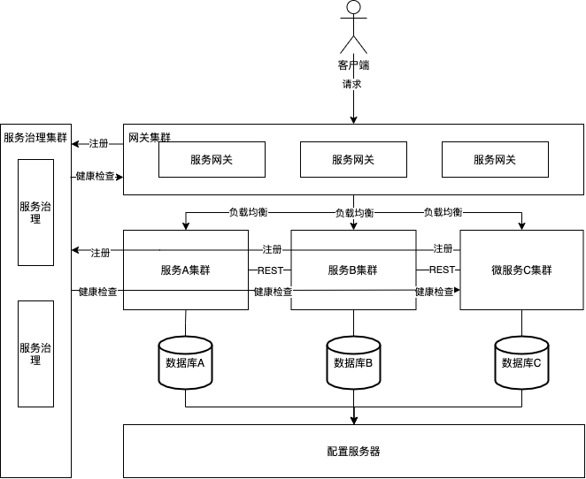
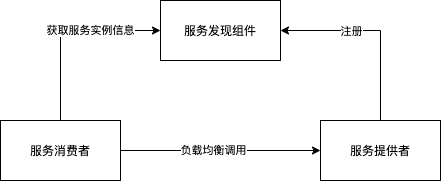
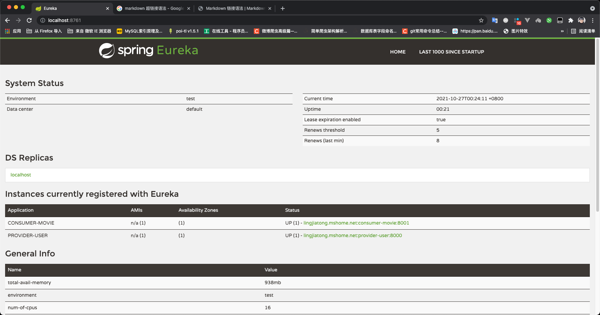
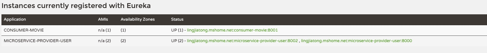

# SpringCloud与Docker微服务架构实战（周立）学习笔记

## 第一章微服务架构概述

学习重点：

1、单体架构和微服务架构的优缺点

2、微服务设计原则

3、微服务架构图

### 单体架构的优缺点

优点：

* 研发快
* 运维简单

缺点：

* 代码复杂性高
* 可靠性差
* 无法横向扩展
* 语言和技术栈受限

### 微服务架构的优缺点

优点：

* 易于开发和维护
* 技术栈不受限
* 按需伸缩

缺点：

* 运维要求高
* 分布式固有的复杂性
* 接口调整成本高

### 微服务设计原则

* 单一职责原则
* 服务自治原则
* 轻量通信机制
* 微服务粒度划分

### 微服务应用架构图



## 第二章 SpringCloud

本章内容无关紧要，略过

## 第三章 开始使用SpringCloud实战微服务

学习重点：

1、了解怎么使用RestTemplate硬编码的方式调用服务

2、了解SpringBoot Actuator自带的端点和其作用

### RestTamplate硬编码调用微服务

#### 编写服务提供者

1、创建maven项目microservice-simple-provider-user,pom.xml文件内容如下

```xml
<?xml version="1.0" encoding="UTF-8"?>
<project xmlns="http://maven.apache.org/POM/4.0.0"
         xmlns:xsi="http://www.w3.org/2001/XMLSchema-instance"
         xsi:schemaLocation="http://maven.apache.org/POM/4.0.0 http://maven.apache.org/xsd/maven-4.0.0.xsd">
    <modelVersion>4.0.0</modelVersion>

    <parent>
        <artifactId>spring-boot-starter-parent</artifactId>
        <groupId>org.springframework.boot</groupId>
        <version>1.5.9.RELEASE</version>
    </parent>

    <groupId>com.springcloudanddockerbook</groupId>
    <artifactId>microservice-simple-consumer-movie</artifactId>
    <version>1.0-SNAPSHOT</version>

    <properties>
        <project.build.sourceEncoding>UTF-8</project.build.sourceEncoding>
        <maven.compiler.source>8</maven.compiler.source>
        <maven.compiler.target>8</maven.compiler.target>
    </properties>

    <dependencies>
        <dependency>
            <groupId>org.springframework.boot</groupId>
            <artifactId>spring-boot-starter-web</artifactId>
        </dependency>

        <dependency>
            <groupId>org.projectlombok</groupId>
            <artifactId>lombok</artifactId>
        </dependency>
    </dependencies>

    <dependencyManagement>
        <dependencies>
            <dependency>
                <groupId>org.springframework.cloud</groupId>
                <artifactId>spring-cloud-dependencies</artifactId>
                <version>Edgware.RELEASE</version>
                <type>pom</type>
                <scope>import</scope>
            </dependency>
        </dependencies>
    </dependencyManagement>
</project>
```

2、准备好建表语句，在项目的classpath下建立schema.sql文件，并添加以下内容

```sql
DROP TABLE user IF EXISTS;
CREATE TABLE user (
    id BIGINT GENERATED BY DEFAULT AS identity,
    username VARCHAR(40),
    name VARCHAR(20),
    age INT(3),
    balance decimal(10, 2),
    PRIMARY KEY (id)
)

```

3、准备几条数据，在项目的classpath下建立文件data.sql，并添加以下内容

```sql
INSERT INTO user(id, username, name, age, balance) VALUES(1, 'account1', '张三', 20, 100.00);
INSERT INTO user(id, username, name, age, balance) VALUES(2, 'account2', '李四', 28, 180.00);
INSERT INTO user(id, username, name, age, balance) VALUES(3, 'account3', '王五', 32, 280.00);
```

4、创建实体类

```java
@Data
@Entity
public class User {

    @Id
    @GeneratedValue(strategy = GenerationType.AUTO)
    private Long id;

    @Column
    private String username;

    @Column
    private String name;

    @Column
    private Integer age;

    @Column
    private BigDecimal balance;
}
```

5、创建DAO

```java
@Repository
public interface UserRepository extends JpaRepository<User, Long> {
}
```

6、创建controller

```java
@RestController
public class UserController {

    @Autowired
    private UserRepository userRepository;


    @GetMapping("/{id}")
    public User findById(@PathVariable Long id) {
        User user = userRepository.findOne(id);
        return user;
    }

}
```

7、编写启动类

```java
@SpringBootApplication
public class ProviderUserApplication {

    public static void main(String[] args) {
        SpringApplication.run(ProviderUserApplication.class, args);
    }

}
```

8、编写配置文件

```yml
server:
  port: 8000
spring:
  jpa:
    generate-ddl: false
    show-sql: true
    hibernate:
      ddl-auto: none
  datasource:
    platform: h2
    schema: classpath:schema.sql
    data: classpath:data.sql
logging:
  level:
    root: INFO
    org.hibernate: INFO
    org.hibernate.type.descriptor.sql.BasicBinder: TRACE
    org.hibernate.type.descriptor.sql.BasicExtractor: TRACE
```

9、测试

```bash
# 访问http://localhost:8000/1
{
	"id": 1,
	"username": "account1",
	"name": "张三",
	"age": 20,
	"balance": 100
}
```

#### 编写服务消费者

1、创建项目microservice-simple-consumer-movie，pom.xml文件内容如下

```xml
<?xml version="1.0" encoding="UTF-8"?>
<project xmlns="http://maven.apache.org/POM/4.0.0"
         xmlns:xsi="http://www.w3.org/2001/XMLSchema-instance"
         xsi:schemaLocation="http://maven.apache.org/POM/4.0.0 http://maven.apache.org/xsd/maven-4.0.0.xsd">
    <modelVersion>4.0.0</modelVersion>

    <parent>
        <artifactId>spring-boot-starter-parent</artifactId>
        <groupId>org.springframework.boot</groupId>
        <version>1.5.9.RELEASE</version>
    </parent>

    <groupId>com.springcloudanddockerbook</groupId>
    <artifactId>microservice-simple-consumer-movie</artifactId>
    <version>1.0-SNAPSHOT</version>

    <properties>
        <project.build.sourceEncoding>UTF-8</project.build.sourceEncoding>
        <maven.compiler.source>8</maven.compiler.source>
        <maven.compiler.target>8</maven.compiler.target>
    </properties>

    <dependencies>
        <dependency>
            <groupId>org.springframework.boot</groupId>
            <artifactId>spring-boot-starter-web</artifactId>
        </dependency>

        <dependency>
            <groupId>org.projectlombok</groupId>
            <artifactId>lombok</artifactId>
        </dependency>
    </dependencies>

    <dependencyManagement>
        <dependencies>
            <dependency>
                <groupId>org.springframework.cloud</groupId>
                <artifactId>spring-cloud-dependencies</artifactId>
                <version>Edgware.RELEASE</version>
                <type>pom</type>
                <scope>import</scope>
            </dependency>
        </dependencies>
    </dependencyManagement>
</project>
```

2、创建用户实体类

```java
@Data
public class User {

    private Long id;

    private String username;

    private String name;

    private Integer age;
    
    private BigDecimal balance;
}
```

3、创建启动类

```java
@SpringBootApplication
public class ConsumerMovieApplication {

    public static void main(String[] args) {
        SpringApplication.run(ConsumerMovieApplication.class, args);
    }

    @Bean
    public RestTemplate restTemplate() {
        return new RestTemplate();
    }

}
```

此处注入RestTemplate以方便controller调用服务提供者的接口

4、创建controller

```java
@RestController
public class MovieController {

    @Autowired
    private RestTemplate restTemplate;

    @GetMapping("/user/{id}")
    public User findById(@PathVariable Long id)  {
        return restTemplate.getForObject("http://localhost:8000/" + id, User.class);
    }
}
```

5、编写配置文件

```yml
server:
  port: 8001
```

6、测试

```bash
# 访问http://localhost:8001/user/1
{
	"id": 1,
	"username": "account1",
	"name": "张三",
	"age": 20,
	"balance": 100
}
```

以上两个工程说明了可以使用RestTemplate进行微服务间的相互调用

### SpringBoot Actuator端点详解

SpringBoot Actuator是SpringBoot项目下的一个专门用于监控服务相关状态的模块，提供了很多端点来了解应用程序的运行状况

// TODO 待写

## 第四章 微服务注册与发现

学习重点：

1、了解服务发现组件的具备的功能和结构图

2、了解eureka原理，了解eureka的保护机制

3、搭建eureka高可用集群

4、了解eureka的Rest端点

5、eureka的自我保护模式

### 服务发现组件的作用

从第二章所示的例子来看，使用RestTemplate的方式进行服务间调用十分不方便，具体存在的问题有如下几点：

**1、适用场景有限**：如果服务提供者的网络地址（IP或者端口）发生了变化，就需要修改服务调用者的代码

**2、无法动态伸缩**：在生产环境中每个微服务一般都会部署多个实例，从而实现容灾和负载均衡。在微服务架构的系统中，还需要系统具备自动伸缩的能力，例如动态增减节点等。适用RestTemplate硬编码的方式无法适用这种需求

为了解决以上问题，需要一个服务发现组件，至少具备如下功能；

**1、服务注册表**

服务发现组件必须维护一张服务注册表，它记录了各个微服务的信息，例如微服务的名称、IP、端口等。服务注册表提供查询API和管理API，查询API用于查询可用的微服务实例，管理API用于服务的注册和注销。

**2、服务注册与发现**

服务注册是指微服务在启动时，将自己的信息注册到服务发现组件上的过程。服务发现是指查询可用微服务列表及其网路地址的机制。

**3、服务检查**

服务发现组件使用一定机制定时检测已注册的服务，如果发现某实例长时间无法访问，就会从服务注册表中移除该实例。

### 服务发现组件交互流程

* 各个微服务在启动时，将自己的网络地址等信息注册到服务发现组件中，服务发现组件会存储这些信息。
* 服务消费者可从服务发现组件查询服务提供者的网络地址，并使用该地址调用服务提供者的接口。
* 各个微服务与服务发现组件使用一定机制（例如心跳）通信。服务发现组件若长时间无法与某微服务实例通信，就会注销该实例。

### 服务发现架构图



### Eureka原理


相关概念解释：

* Application Service 应用服务（即服务提供者）
* Application Client 服务客户端（即服务消费者）
* Make Remote Call 远程调用
* us-east-1c、us-east-1d、us-east-1e等都是zone，它们都属于us-east-1这个region

由上图可知，Eureka包含两个组件：Eureka Server和Eureka Client，它们的作用如下：

* **Eureka Server提供服务发现的能力，各个微服务启动时，会向Eureka Server注册自己的信息（例如IP、端口、微服务名称等），Eureka Server会存储这些信息。**
* **Eureka Client是一个Java客户端，用于简化与Eureka Server的交互。**
* **微服务启动后，会周期性地向Eureka Server发送心跳以续约自己的“租期”。**
* **如果Eureka Server在一定时间内没有接收到某个微服务实例的心跳，Eureka Server将注销该实例（默认90s）**
* **默认情况下，Eureka Server同时也是Eureka Client。多个Eureka Server实例相互之间通过复制的方式来实现服务注册表中数据的同步。**
* **Eureka Clinet会缓存服务注册表中的信息。这种方式有一定的优势——首先，微服务无需每次请求都查询Eureka Server，从而降低了Eureka Server的压力；其次，即使Eureka Server所有节点都宕机，服务消费者依然可以使用缓存中的信息找到服务提供者并完成调用。**

### 将服务注册到EurekaServer的简单Demo

1、创建一个ArtifactId是microservice-discovery-eureka的Maven工程，pom文件内容如下

```xml
<?xml version="1.0" encoding="UTF-8"?>
<project xmlns="http://maven.apache.org/POM/4.0.0"
         xmlns:xsi="http://www.w3.org/2001/XMLSchema-instance"
         xsi:schemaLocation="http://maven.apache.org/POM/4.0.0 http://maven.apache.org/xsd/maven-4.0.0.xsd">
    <modelVersion>4.0.0</modelVersion>

    <parent>
        <artifactId>spring-boot-starter-parent</artifactId>
        <groupId>org.springframework.boot</groupId>
        <version>1.5.9.RELEASE</version>
    </parent>
    <groupId>com.com.springcloudanddockerbook</groupId>
    <artifactId>microservice-discovery-eureka</artifactId>
    <version>1.0-SNAPSHOT</version>

    <properties>
        <project.build.sourceEncoding>UTF-8</project.build.sourceEncoding>
        <maven.compiler.source>8</maven.compiler.source>
        <maven.compiler.target>8</maven.compiler.target>
    </properties>

    <dependencies>
        <dependency>
            <groupId>org.springframework.cloud</groupId>
            <artifactId>spring-cloud-starter-netflix-eureka-server</artifactId>
        </dependency>
    </dependencies>

    <dependencyManagement>
        <dependencies>
            <dependency>
                <groupId>org.springframework.cloud</groupId>
                <artifactId>spring-cloud-dependencies</artifactId>
                <version>Edgware.RELEASE</version>
                <type>pom</type>
                <scope>import</scope>
            </dependency>
        </dependencies>
    </dependencyManagement>
</project>
```

2、编写启动类，在启动类上面添加@EnableEurekaServer注解，声明这是一个Eureka Server

```java
@SpringBootApplication
@EnableEurekaServer
public class EurekaServerApplication {

    public static void main(String[] args) {
        SpringApplication.run(EurekaServerApplication.class, args);
    }

}
```

3、在配置文件application.yml中添加以下内容：

```yml
server:
  port: 8761
eureka:
  client:
  	# 是否将本微服务注册到eureka中，此处由于自身就是Eureka Server，所以不需要注册
    registerWithEureka: false
    # 是否需要从eureka server获取服务列表，由于本微服务不是服务消费者，所以不需要
    fetch-registry: false
    # 配置eureka交互地址
    service-url:
      defaultZone: http://localhost:8761/eureka/
```

4、测试访问地址[http://localhost:8761](http://localhost:8761)



5、复制项目microservice-simple-provider-user，将ArtifactId修改为microservice-provider-user。

6、在项目中添加以下依赖

```xml
        <dependency>
            <groupId>org.springframework.cloud</groupId>
            <artifactId>spring-cloud-starter-netflix-eureka-client</artifactId>
        </dependency>
```

7、在配置文件中添加以下配置

```yml
spring:
  application:
    name: provider-user
eureka:
  client:
    fetch-registry: true
    register-with-eureka: true
    service-url:
      defaultZone: http://localhost:8761/eureka/
  instance:
    prefer-ip-address: true
```

8、同理可将microservice-simple-consumer-movie改造为microservice-consumer-movie

9、测试

```properties
1、启动microservice-discovery-eureka
2、启动microservice-provider-user
3、启动microservice-consumer-movie
```


**注意事项：**

**1、eureka server的页面访问地址为http://localhost:8761，而服务注册的url为http://localhost:8761/eureka，不要弄混**

**2、在Spring Cloud Edgware之前，要想将微服务注册到Eureka Server或其他服务发现组件上，必须在启动类上添加@EnableEurekaClient或者@EnableDiscoveryClient**

**3、若不想将服务注册到Eureka Server，只需要设置spring.cloud.service-registry.auto-registration.enable=false或者@EnableDisCoveryClient(auto-register = false)即可**

### 搭建Eureka高可用环境Demo

在分布式系统中，服务发现组件至关重要，如果服务发现组件宕机，那么会导致严重的后果。不过，eureka客户端会定时连接eureka server，获取服务注册表中的信息并且缓存在本地。每次调用远程服务时都是从缓存中获取。如果eureka server宕机但是服务提供者未宕机，这个时候服务消费者仍可正常访问服务，如果服务提供者也宕机了，那么就无法访问了。因此，需要保证eureka server高可用来及时更新服务信息。

eureka server的高可用原理很简单，就是将多个eureka server相互注册，eureka server实例会彼此增量地同步信息，从而确保所有节点数据一致。

1、复制项目micro service-discovery-eureka，将ArtifactId修改为microservice-discovery-eureka-ha。

2、配置系统的hosts，Windows系统的hosts文件路径是`C:\Windows\System32\drivers\etc\hosts`；Linux以及Mac OS等系统的文件路径是/etc/hosts。

```bash
127.0.0.1 peer1 peer2
```

3、将application.yml修改如下，让两个节点的Eureka Server相互注册。

```yml
spring:
  application:
    name: microservice-discovery-eureka-ha

---
spring:
  profiles: peer1
server:
  port: 8761
eureka:
  instance:
    hostname: peer1
  client:
    service-url:
      defaultZone: http://peer2:8762/eureka/
---
spring:
  profiles: peer2
server:
  port: 8762
eureka:
  instance:
    hostname: peer2
  client:
    service-url:
      defaultZone: http://peer1:8761/eureka/
```

使用连字符（---）将该application.yml文件分为三段。第二段和第三段分别为spring.properties指定了一个值，该值表示它所在的那段内容应用在哪个Profile里。第一段由于并未指定spring.profiles，因此这段内容会对所有Profile生效。

4、pom.xml中加入springboot打包插件

```xml
<build>
        <plugins>
            <plugin>
                <groupId>org.springframework.boot</groupId>
                <artifactId>spring-boot-maven-plugin</artifactId>
            </plugin>
        </plugins>
</build>
```

5、测试

```properties
1、打包项目，并使用以下命令启动两个Eureka Server节点。
java -jar microservice-discovery-eureka-ha-0.0.1-SNAPSHOT.jar --spring.profiles.active=peer1
java -jar microservice-discovery-eureka-ha-0.0.1-SNAPSHOT.jar --spring.profiles.active=peer2
通过spring.profiles.active指定使用哪个profile启动。
2、访问http://peer1:8761，会发现“registered-replicas”中已有peer2节点；同理，访问http://peer2:8762，也能发现其中的“registered-replicas”有peer1节点
```


### 将应用注册到Eureka Server集群上

只需要将服务提供者的application.yml文件中的eureka.client.serviceUrl.defaultZone配置多个Eureka Server地址，就可以将其注册到Eureka Server集群上了。

```yml
eureka:
  client:
    fetch-registry: true
    register-with-eureka: true
    service-url:
      defaultZone: http://localhost:8761/eureka/, http://localhost:8762/eureka/
  instance:
    prefer-ip-address: true
```

当然，其实只配置其中某个节点也能将服务注册到eureka集群，因为eureka server之间的数据会相互同步。

### Eureka的元数据

eureka的元数据有两种，一种是**标准元数据**，一种是**自定义元数据**。

标准元数据是指主机名、IP地址、端口号、状态页和健康检查等信息，这些信息都会被发布在服务注册表中，用于服务之间的调用。自定义元数据可以使用eureka.instance.metadata-map设置，这些元数据可以在远程客户端中访问，但一般不会改变客户端的行为，除非客户端知道该元数据的含义。

### Eureka的Rest端点

// TODO 待写

### Eureka的自我保护模式

// TODO 待写

### Eureka的健康检查

// TODO 待写


## 第五章 使用Ribbon实现客户端侧负载均衡

学习重点：

1、eureka与ribbon配合使用demo

2、ribbon自定义负载均衡算法

3、脱离eureka使用ribbon

### eureka与ribbon配置使用

ribbon是netflix发布的负载均衡器，它有助于控制HTTP和TCP客户端的行为。为ribbon配置服务提供者地址列表后，ribbon就可以基于某种负载均衡算法，自动地帮助服务消费者去请求。ribbon默认为我们提供了很多负载均衡算法，例如轮询、随机等。当然，我们也可为ribbon实现自定义的负载均衡算法。

eureka与ribbon配置使用的架构图如下：


### 服务消费者整合ribbon案例

1、复制项目microservice-consumer-movie，将ArtifactId改为microservice-consumer-movie-ribbon。

2、为项目引入ribbon的依赖，ribbon的依赖如下：

```xml
        <dependency>
            <groupId>org.springframework.cloud</groupId>
            <artifactId>spring-cloud-starter-netflix-ribbon</artifactId>
        </dependency>
```

由于前文中电影微服务添加了spring-cloud-stater-netflix-eureka-client，该依赖已包含spring-cloud-stater-netflix-ribbon，因此无需再次引入。

3、为RestTemplate添加`@LoadBalanced`注解

```java

@SpringBootApplication
@EnableEurekaClient
public class ConsumerMovieApplication {

    public static void main(String[] args) {
        SpringApplication.run(ConsumerMovieApplication.class, args);
    }

    @Bean
    @LoadBalanced
    public RestTemplate restTemplate() {
        return new RestTemplate();
    }

}

```

4、对controller进行修改

```java

@Slf4j
@RestController
public class MovieController {

    @Autowired
    private RestTemplate restTemplate;
    @Autowired
    private LoadBalancerClient loadBalancerClient;

    @GetMapping("/user/{id}")
    public User findById(@PathVariable Long id)  {
        return restTemplate.getForObject("http://microservice-provider-user/" + id, User.class);
    }

    @GetMapping("/log-user-instance")
    public void logUserInstance()  {
        ServiceInstance serviceInstance = loadBalancerClient.choose("microservice-provider-user");
        log.info("{}:{}:{}", serviceInstance.getServiceId(), serviceInstance.getHost(), serviceInstance.getPort());
    }
}

```

由代码可知，将请求的地址改为`http://microservice-provider-user/`。microservice-provider-user是用户微服务的`虚拟主机名（virtual host name）`，当ribbon和eureka配合使用时，会自动将虚拟主机名映射成微服务的网络地址。在新增的log-user-instance()方法中可使用LoadBalancerClient的API更加直观地获取当前选择的用户微服务节点。

5、测试

```properties
1、启动microservice-discovery-eureka
2、启动2个或更多microservice-provider-user实例
3、启动microservice-consumer-movie-ribbon
4、访问http://localhost:8761查看eureka，如下图所示
```



```properties

5、多次访问http://localhost:8001/user/1，返回结果如下：
{
    "id": 1,
    "username": "account1",
    "name": "张三",
    "age": 20,
    "balance": 100
}
同时两个用户微服务实例都会打印类似如下的日志：
2021-10-29 00:37:55.182 TRACE 2614 --- [io-8000-exec-10] o.h.type.descriptor.sql.BasicBinder      : binding parameter [1] as [BIGINT] - [1]
2021-10-29 00:37:55.183 TRACE 2614 --- [io-8000-exec-10] o.h.type.descriptor.sql.BasicExtractor   : extracted value ([age2_0_0_] : [INTEGER]) - [20]
2021-10-29 00:37:55.183 TRACE 2614 --- [io-8000-exec-10] o.h.type.descriptor.sql.BasicExtractor   : extracted value ([balance3_0_0_] : [NUMERIC]) - [100.00]
2021-10-29 00:37:55.183 TRACE 2614 --- [io-8000-exec-10] o.h.type.descriptor.sql.BasicExtractor   : extracted value ([name4_0_0_] : [VARCHAR]) - [张三]
2021-10-29 00:37:55.183 TRACE 2614 --- [io-8000-exec-10] o.h.type.descriptor.sql.BasicExtractor   : extracted value ([username5_0_0_] : [VARCHAR]) - [account1]

6、多次访问http://localhost:8001/log-user-instance，控制台会打印如下日志：
2021-10-29 00:20:46.379  INFO 2602 --- [nio-8001-exec-4] c.s.movie.controller.MovieController     : microservice-provider-user:192.168.137.236:8002
2021-10-29 00:20:46.963  INFO 2602 --- [nio-8001-exec-5] c.s.movie.controller.MovieController     : microservice-provider-user:192.168.137.236:8000
2021-10-29 00:20:47.267  INFO 2602 --- [nio-8001-exec-6] c.s.movie.controller.MovieController     : microservice-provider-user:192.168.137.236:8002
2021-10-29 00:20:47.412  INFO 2602 --- [nio-8001-exec-7] c.s.movie.controller.MovieController     : microservice-provider-user:192.168.137.236:8000
2021-10-29 00:20:47.549  INFO 2602 --- [nio-8001-exec-8] c.s.movie.controller.MovieController     : microservice-provider-user:192.168.137.236:8002
```

可以看到，此时请求会均匀分布到两个用户微服务节点上，说明已经实现了负载均衡。

tips：
> * 虚拟主机名与虚拟IP非常类似，可使用配置属性**eureka.instance.virtual-host-name**或者**eureka.instance.secure-virtual-host-name**指定虚拟主机名。
> * 不能将**restTemplate.getForObject**与**loadBalancerClient.choose**写在同一个方法中，两者之间会有冲突——因为此时代码中的restTemplate实际上是一个Ribbon客户端，本身已经包含了“choose”的行为。