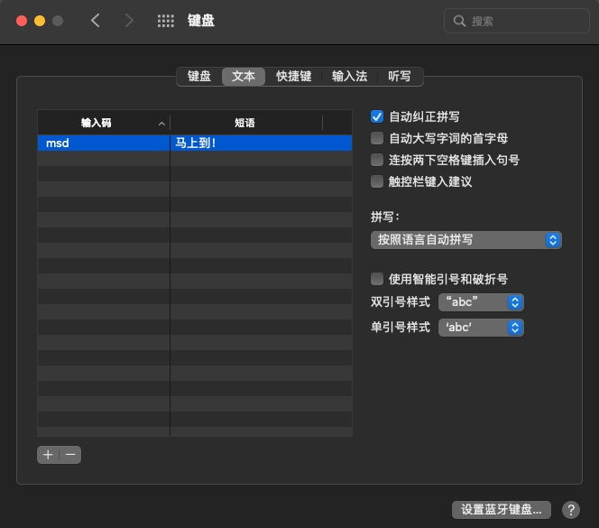

# MacOS日常使用总结

## 修复自带输入法卡顿的问题

1、首先切换到**拼音输入法**然后右键点击右上角的**拼**字图标
2、选择**打开简体拼音偏好设置**

<div align="center">



</div>

3、除自动纠正拼写外，不勾选其他功能，即可减轻打字卡顿问题

## 打tar.gz包时忽略系统自动生成的隐藏文件

```bash
tar --exclude ".DS_Store" --exclude "__MACOSX" -cvzf xxxarchive.tar.gz xxxarchive

```


## MacOS查看端口占用

```bash

lsof -i tcp:port

```


## 自启动脚本

OSX 原生使用一个叫launchd的进程任务管理器。

所以呢，你创建个launchctl的守护任务，就可以完全控制你启动脚本，让他执行一次，或者作为守护进程一直运行。

具体步骤：

1、根据苹果协议（ instructions in the Apple Dev docs here  ）创建一个 .plist 文档
2、把这个文件放到 ~/Library/LaunchAgents目录下面
3、重新登录，或者手动运行  launchctl load [filename.plist]

例如，你可以创建这样一个文件：

~/Library/LaunchAgents/com.user.loginscript.plist

```xml

<?xml version="1.0" encoding="UTF-8"?>
<!DOCTYPE plist PUBLIC "-//Apple Computer//DTD PLIST 1.0//EN" "http://www.apple.com/DTDs/PropertyList-1.0.dtd">
<plist version="1.0">
<dict>
   <key>Label</key>
   <string>com.user.loginscript</string>
   <key>ProgramArguments</key>
   <array><string>/path/to/executable/script.sh</string></array>
   <key>RunAtLoad</key>
   <true/>
</dict>
</plist>

```

记得 chmod a+x /path/to/executable/script.sh 给脚本可执行权限

错误日志在 /var/log/system.log


## 关闭brew的自动更新

每次使用brew安装软件时，默认都会自动检查更新homebrew，显示Updating Homebrew...，会浪费很多的时间，所以要关闭自动更新。

```bash

# 关闭自动更新，在.zshrc文件中加入下方命令，如果是bash请加在.bash_profile文件中，全局变量可以sudo vi /etc/profile
vim ~/.zshrc
export HOMEBREW_NO_AUTO_UPDATE=true

# 刷新环境变量
source ~/.zshrc

```

## 使用crontab设置定时任务

MacOS下的crontab定时任务和Linux略有不同，它是由**launchctl**来管理的。

首先查看服务是否运行

```bash

sudo launchctl list | grep cron

```

一般会输出

```bash

11782   0   com.vix.cron

```

或者

```bash

-   0   com.vix.cron

```

接下来查看启动项的配置：

```bash

locate com.vix.cron

```

> WARNING: The locate database (/var/db/locate.database) does not exist.
> To create the database, run the following command:
>   sudo launchctl load -w /System/Library/LaunchDaemons/com.apple.locate.plist
> Please be aware that the database can take some time to generate; once
> the database has been created, this message will no longer appear.

如果提示database不存在，按照提示步骤创建一个：

```bash

sudo launchctl load -w /System/Library/LaunchDaemons/com.apple.locate.plist

```

查看配置项

```bash

cat /System/Library/LaunchDaemons/com.vix.cron.plist

```

```xml

<?xml version="1.0" encoding="UTF-8"?>
<!DOCTYPE plist PUBLIC "-//Apple Computer//DTD PLIST 1.0//EN"
	"http://www.apple.com/DTDs/PropertyList-1.0.dtd">
<plist version="1.0">
<dict>
	<key>Label</key>
	<string>com.vix.cron</string>
	<key>ProgramArguments</key>
	<array>
		<string>/usr/sbin/cron</string>
	</array>
	<key>KeepAlive</key>
	<dict>
		<key>PathState</key>
		<dict>
			<key>/etc/crontab</key>
			<true/>
		</dict>
	</dict>
	<key>QueueDirectories</key>
	<array>
		<string>/usr/lib/cron/tabs</string>
	</array>
	<key>EnableTransactions</key>
	<true/>
</dict>
</plist>

```

过个几分钟再次执行

```bash

locate com.vix.cron

```

如果输出 **/System/Library/LaunchDaemons/com.vix.cron.plist** 表示启动项已配置好了。


最后检查下 **/etc/crontab** 文件是否存在，如果不存在则创建


```bash

sudo touch /etc/crontab

```

这些都检查完之后就可以通过crontab -e创建任务了。


PS：在macOS 10.15 Catalina以上的系统上，由于权限升级，还需要给cron添加完全磁盘访问权限，不然定时任务还是无法执行。

具体方法，先打开系统偏好设置->隐私->完全磁盘访问权限，左下角解锁。然后打开Finder，菜单栏前往->前往文件夹，输入/usr/sbin，找到cron，把它拖到完全磁盘访问权限的列表中。


## 删除某个文件夹下所有的.DS_Store文件

```zsh

find ./ -name ".DS_Store" -depth -exec rm {} \;

```

## Homebrew换成国内源

参考教程：[https://cloud.tencent.com/developer/article/1614039](https://cloud.tencent.com/developer/article/1614039)

Homebrew主要有四个部分组成：**brew**、**homebrew-ciore**、**homebrew-bottles**、**homebrew-cask**。

| 名称               | 说明                            |
|--------------------|:--------------------------------|
| brew               | Homebrew 源代码仓库 |
| homebrew-core | Homebrew 核心软件仓库           |
| homebrew-bottles | Homebrew 预编译二进制软件包     |
| homebrew-cask      | 提供 macOS 应用和大型二进制文件 |


### 替换为阿里源

```bash

# 查看 brew.git 当前源
cd "$(brew --repo)" && git remote -v
# origin    https://github.com/Homebrew/brew.git (fetch)
# origin    https://github.com/Homebrew/brew.git (push)
# 修改 brew.git 为阿里源
git -C "$(brew --repo)" remote set-url origin https://mirrors.aliyun.com/homebrew/brew.git


# 查看 homebrew-core.git 当前源
cd "$(brew --repo homebrew/core)" && git remote -v
# origin    https://github.com/Homebrew/homebrew-core.git (fetch)
# origin    https://github.com/Homebrew/homebrew-core.git (push)
# 修改 homebrew-core.git 为阿里源
git -C "$(brew --repo homebrew/core)" remote set-url origin https://mirrors.aliyun.com/homebrew/homebrew-core.git

# zsh 替换 brew bintray 镜像
echo 'export HOMEBREW_BOTTLE_DOMAIN=https://mirrors.aliyun.com/homebrew/homebrew-bottles' >> ~/.zshrc
source ~/.zshrc

# bash 替换 brew bintray 镜像
echo 'export HOMEBREW_BOTTLE_DOMAIN=https://mirrors.aliyun.com/homebrew/homebrew-bottles' >> ~/.bash_profile
source ~/.bash_profile

# 刷新源
brew update

```

### 替换为清华源

```bash

# 替换各个源
git -C "$(brew --repo)" remote set-url origin https://mirrors.ustc.edu.cn/brew.git
git -C "$(brew --repo homebrew/core)" remote set-url origin https://mirrors.ustc.edu.cn/homebrew-core.git
git -C "$(brew --repo homebrew/cask)" remote set-url origin https://mirrors.ustc.edu.cn/homebrew-cask.git

# zsh 替换 brew bintray 镜像
echo 'export HOMEBREW_BOTTLE_DOMAIN=https://mirrors.ustc.edu.cn/homebrew-bottles' >> ~/.zshrc
source ~/.zshrc

# bash 替换 brew bintray 镜像
echo 'export HOMEBREW_BOTTLE_DOMAIN=https://mirrors.ustc.edu.cn/homebrew-bottles' >> ~/.bash_profile
source ~/.bash_profile

# 刷新源
brew update

```

### 替换为中科大源

```bash

# 替换各个源
git -C "$(brew --repo)" remote set-url origin https://mirrors.ustc.edu.cn/brew.git
git -C "$(brew --repo homebrew/core)" remote set-url origin https://mirrors.ustc.edu.cn/homebrew-core.git
git -C "$(brew --repo homebrew/cask)" remote set-url origin https://mirrors.ustc.edu.cn/homebrew-cask.git

# zsh 替换 brew bintray 镜像
echo 'export HOMEBREW_BOTTLE_DOMAIN=https://mirrors.ustc.edu.cn/homebrew-bottles' >> ~/.zshrc
source ~/.zshrc

# bash 替换 brew bintray 镜像
echo 'export HOMEBREW_BOTTLE_DOMAIN=https://mirrors.ustc.edu.cn/homebrew-bottles' >> ~/.bash_profile
source ~/.bash_profile

# 刷新源
brew update

```

### 重置为官方源

```bash

# 重置 brew.git 为官方源
git -C "$(brew --repo)" remote set-url origin https://github.com/Homebrew/brew.git

# 重置 homebrew-core.git 为官方源
git -C "$(brew --repo homebrew/core)" remote set-url origin https://github.com/Homebrew/homebrew-core.git

# 重置 homebrew-cask.git 为官方源
git -C "$(brew --repo homebrew/cask)" remote set-url origin https://github.com/Homebrew/homebrew-cask

# zsh 注释掉 HOMEBREW_BOTTLE_DOMAIN 配置
vi ~/.zshrc
# export HOMEBREW_BOTTLE_DOMAIN=xxxxxxxxx

# bash 注释掉 HOMEBREW_BOTTLE_DOMAIN 配置
vi ~/.bash_profile
# export HOMEBREW_BOTTLE_DOMAIN=xxxxxxxxx

# 刷新源
brew update

```