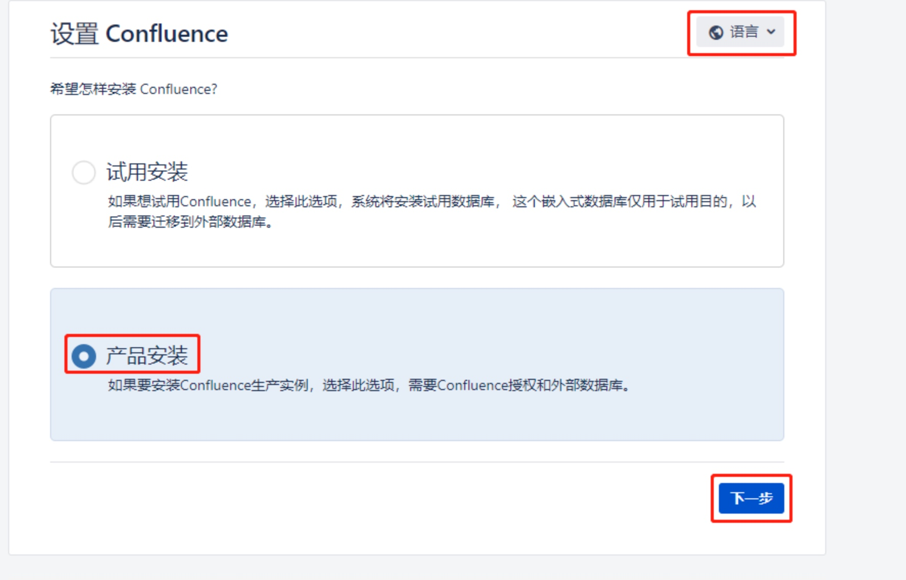
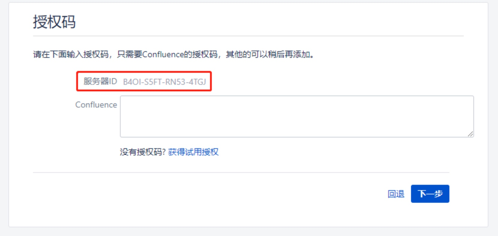
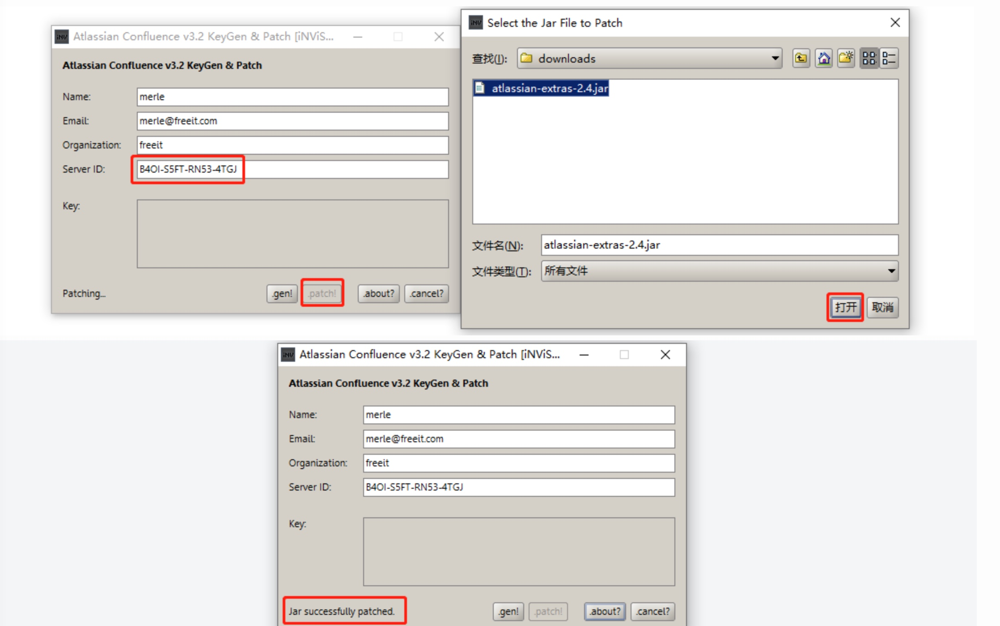
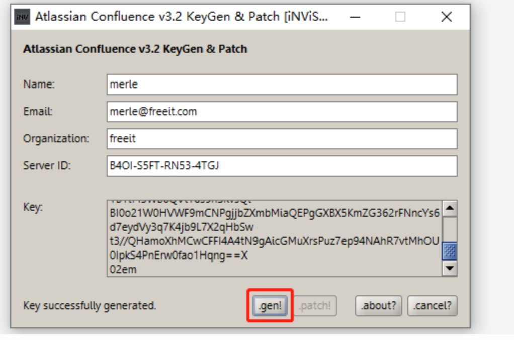
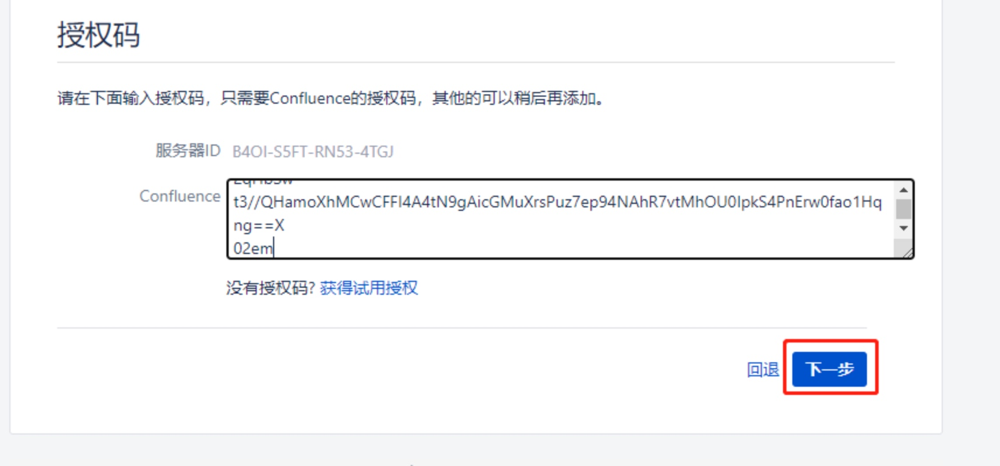

# confluence破解安装

## 环境准备

操作系统：centos7

confluence7.4.7安装包：

```bash

wget https://www.atlassian.com/software/confluence/downloads/binary/atlassian-confluence-7.4.7-x64.bin

```

破解补丁包：

```bash

https://pan.baidu.com/s/1NdEnw8y7BCdcJSkCu7UeDA 提取码: 2v09 

```

mysql驱动程序jar包：

```bash

wget https://repo1.maven.org/maven2/mysql/mysql-connector-java/8.0.22/mysql-connector-java-8.0.22.jar

```


## 安装confluence

1、执行confluence安装程序

```bash

chmod u+x atlassian-confluence-7.4.7-x64.bin

```

2、将confluence安装在数据盘

```bash

......
Unpacking JRE ...
Starting Installer ...

This will install Confluence 7.4.7 on your computer.
OK [o, Enter], Cancel [c]      # 直接回车

Click Next to continue, or Cancel to exit Setup.

Choose the appropriate installation or upgrade option.
Please choose one of the following:
Express Install (uses default settings) [1], 
Custom Install (recommended for advanced users) [2, Enter], 
Upgrade an existing Confluence installation [3]
2    # 自定义安装

Select the folder where you would like Confluence 7.4.7 to be installed,
then click Next.
Where should Confluence 7.4.7 be installed?
[/opt/atlassian/confluence]
/home/software/confluence7.4.7   # 指定安装目录

Default location for Confluence data
[/var/atlassian/application-data/confluence]
/home/software/confluence7.4.7-data     # 指定数据目录

Configure which ports Confluence will use.
Confluence requires two TCP ports that are not being used by any other
applications on this machine. The HTTP port is where you will access
Confluence through your browser. The Control port is used to Startup and
Shutdown Confluence.
Use default ports (HTTP: 8090, Control: 8000) - Recommended [1, Enter], Set custom value for HTTP and Control ports [2]      # 直接回车，使用默认端口


Confluence can be run in the background.
You may choose to run Confluence as a service, which means it will start
automatically whenever the computer restarts.
Install Confluence as Service?
Yes [y, Enter], No [n]      # 直接回车

Extracting files ...
                                                                           

Please wait a few moments while we configure Confluence.

Installation of Confluence 7.4.7 is complete
Start Confluence now?
Yes [y, Enter], No [n]      # 直接回车

Please wait a few moments while Confluence starts up.
Launching Confluence ...

Installation of Confluence 7.4.7 is complete
Your installation of Confluence 7.4.7 is now ready and can be accessed via
your browser.
Confluence 7.4.7 can be accessed at http://localhost:8090
Finishing installation ...

```

3、web端配置, 浏览器打开http://x.x.x.x:8090







4、复制上面的服务ID，并保存好。下载/home/software/confluence7.4.7/confluence/WEB-INF/lib/atlassian-extras-decoder-v2-3.4.1.jar至本地，并修改文件名为atlassian-extras-2.4.jar。

5、运行破解工具[confluence_keygen.jar](https://pan.baidu.com/s/1NdEnw8y7BCdcJSkCu7UeDA) (提取码2v09)，填入上面的服务器ID，然后点击.patch加载atlassian-extras-2.4.jar包进行修补。




6、修不完会产生一个.bak的文件，不用理会。将atlassian-extras-2.4.jar改名为atlassian-extras-decoder-v2-3.4.1.jar，并且和mysql驱动一起放回到原confluence安装目录的lib目录下（/home/software/confluence7.4.7/confluence/WEB-INF/lib），并重启confluence。

```bash

mv atlassian-extras-2.4.jar atlassian-extras-decoder-v2-3.4.1.jar

/etc/init.d/confluence restart

```


7、浏览器打开http://x.x.x.x:8090，回到填写授权码的界面，然后点击注册机的.gen生成key信息，将key信息复制到confluence安装界面的授权码栏，继续安装。







8、部署mysql（安装一个外部mysql，具体可查阅相关mysql安装教程）

需要注意的是，my.cnf中需要将mysql的默认事务隔离级别改为RC，需要创建一个名为confluence的数据库，并设置排序规则为utf8mb4_bins

```bash

# my.cnf

[mysqld]
transaction-isolation=READ-COMMITTED

```

