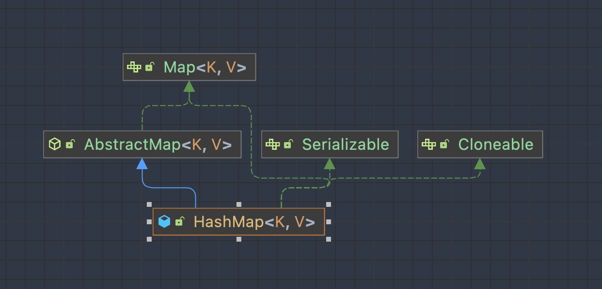

# 集合框架源码详解

## 集合框架的继承关系图


## List接口


### ArrayList原理分析

ArrayList底层数据结构使用的是Object数组。

#### ArrayList扩容机制

ArrayList无参构造函数默认初始化一个空的Object数组，当真正对数组进行添加元素操作时，才真正分配容量。即向数组中添加第一个元素时，数组容量扩为10。

```java

package java.util;

import java.util.function.Consumer;
import java.util.function.Predicate;
import java.util.function.UnaryOperator;


public class ArrayList<E> extends AbstractList<E>
    implements List<E>, RandomAccess, Cloneable, java.io.Serializable
{
private static final long serialVersionUID = 8683452581122892189L;

/**
 * 默认初始容量大小
 */
private static final int DEFAULT_CAPACITY = 10;

/**
 * 空数组（用于空实例）。
 */
private static final Object[] EMPTY_ELEMENTDATA = {};

 //用于默认大小空实例的共享空数组实例。
  //我们把它从EMPTY_ELEMENTDATA数组中区分出来，以知道在添加第一个元素时容量需要增加多少。
private static final Object[] DEFAULTCAPACITY_EMPTY_ELEMENTDATA = {};

/**
 * 保存ArrayList数据的数组
 */
transient Object[] elementData; // non-private to simplify nested class access

/**
 * ArrayList 所包含的元素个数
 */
private int size;

/**
 * 带初始容量参数的构造函数（用户可以在创建ArrayList对象时自己指定集合的初始大小）
 */
public ArrayList(int initialCapacity) {
    if (initialCapacity > 0) {
        //如果传入的参数大于0，创建initialCapacity大小的数组
        this.elementData = new Object[initialCapacity];
    } else if (initialCapacity == 0) {
        //如果传入的参数等于0，创建空数组
        this.elementData = EMPTY_ELEMENTDATA;
    } else {
        //其他情况，抛出异常
        throw new IllegalArgumentException("Illegal Capacity: "+
                                           initialCapacity);
    }
}

/**
 *默认无参构造函数
 *DEFAULTCAPACITY_EMPTY_ELEMENTDATA 为0.初始化为10，也就是说初始其实是空数组 当添加第一个元素的时候数组容量才变成10
 */
public ArrayList() {
    this.elementData = DEFAULTCAPACITY_EMPTY_ELEMENTDATA;
}

/**
 * 构造一个包含指定集合的元素的列表，按照它们由集合的迭代器返回的顺序。
 */
public ArrayList(Collection<? extends E> c) {
    //将指定集合转换为数组
    elementData = c.toArray();
    //如果elementData数组的长度不为0
    if ((size = elementData.length) != 0) {
        // 如果elementData不是Object类型数据（c.toArray可能返回的不是Object类型的数组所以加上下面的语句用于判断）
        if (elementData.getClass() != Object[].class)
            //将原来不是Object类型的elementData数组的内容，赋值给新的Object类型的elementData数组
            elementData = Arrays.copyOf(elementData, size, Object[].class);
    } else {
        // 其他情况，用空数组代替
        this.elementData = EMPTY_ELEMENTDATA;
    }
}

/**
 * 修改这个ArrayList实例的容量是列表的当前大小。 应用程序可以使用此操作来最小化ArrayList实例的存储。
 */
public void trimToSize() {
    modCount++;
    if (size < elementData.length) {
        elementData = (size == 0)
          ? EMPTY_ELEMENTDATA
          : Arrays.copyOf(elementData, size);
    }
}
//下面是ArrayList的扩容机制
//ArrayList的扩容机制提高了性能，如果每次只扩充一个，
//那么频繁的插入会导致频繁的拷贝，降低性能，而ArrayList的扩容机制避免了这种情况。
/**
 * 如有必要，增加此ArrayList实例的容量，以确保它至少能容纳元素的数量
 * @param   minCapacity   所需的最小容量
 */
public void ensureCapacity(int minCapacity) {
    //如果是true，minExpand的值为0，如果是false,minExpand的值为10
    int minExpand = (elementData != DEFAULTCAPACITY_EMPTY_ELEMENTDATA)
        // any size if not default element table
        ? 0
        // larger than default for default empty table. It's already
        // supposed to be at default size.
        : DEFAULT_CAPACITY;
    //如果最小容量大于已有的最大容量
    if (minCapacity > minExpand) {
        ensureExplicitCapacity(minCapacity);
    }
}
//1.得到最小扩容量
//2.通过最小容量扩容
private void ensureCapacityInternal(int minCapacity) {
    if (elementData == DEFAULTCAPACITY_EMPTY_ELEMENTDATA) {
          // 获取“默认的容量”和“传入参数”两者之间的最大值
        minCapacity = Math.max(DEFAULT_CAPACITY, minCapacity);
    }

    ensureExplicitCapacity(minCapacity);
}
//判断是否需要扩容
private void ensureExplicitCapacity(int minCapacity) {
    modCount++;

    // overflow-conscious code
    if (minCapacity - elementData.length > 0)
        //调用grow方法进行扩容，调用此方法代表已经开始扩容了
        grow(minCapacity);
}

/**
 * 要分配的最大数组大小
 */
private static final int MAX_ARRAY_SIZE = Integer.MAX_VALUE - 8;

/**
 * ArrayList扩容的核心方法。
 */
private void grow(int minCapacity) {
    // oldCapacity为旧容量，newCapacity为新容量
    int oldCapacity = elementData.length;
    //将oldCapacity 右移一位，其效果相当于oldCapacity /2，
    //我们知道位运算的速度远远快于整除运算，整句运算式的结果就是将新容量更新为旧容量的1.5倍，
    int newCapacity = oldCapacity + (oldCapacity >> 1);
    //然后检查新容量是否大于最小需要容量，若还是小于最小需要容量，那么就把最小需要容量当作数组的新容量，
    if (newCapacity - minCapacity < 0)
        newCapacity = minCapacity;
    //再检查新容量是否超出了ArrayList所定义的最大容量，
    //若超出了，则调用hugeCapacity()来比较minCapacity和 MAX_ARRAY_SIZE，
    //如果minCapacity大于MAX_ARRAY_SIZE，则新容量则为Interger.MAX_VALUE，否则，新容量大小则为 MAX_ARRAY_SIZE。
    if (newCapacity - MAX_ARRAY_SIZE > 0)
        newCapacity = hugeCapacity(minCapacity);
    // minCapacity is usually close to size, so this is a win:
    elementData = Arrays.copyOf(elementData, newCapacity);
}
//比较minCapacity和 MAX_ARRAY_SIZE
private static int hugeCapacity(int minCapacity) {
    if (minCapacity < 0) // overflow
        throw new OutOfMemoryError();
    return (minCapacity > MAX_ARRAY_SIZE) ?
        Integer.MAX_VALUE :
        MAX_ARRAY_SIZE;
}

/**
 *返回此列表中的元素数。
 */
public int size() {
    return size;
}

/**
 * 如果此列表不包含元素，则返回 true 。
 */
public boolean isEmpty() {
    //注意=和==的区别
    return size == 0;
}

/**
 * 如果此列表包含指定的元素，则返回true 。
 */
public boolean contains(Object o) {
    //indexOf()方法：返回此列表中指定元素的首次出现的索引，如果此列表不包含此元素，则为-1
    return indexOf(o) >= 0;
}

/**
 *返回此列表中指定元素的首次出现的索引，如果此列表不包含此元素，则为-1
 */
public int indexOf(Object o) {
    if (o == null) {
        for (int i = 0; i < size; i++)
            if (elementData[i]==null)
                return i;
    } else {
        for (int i = 0; i < size; i++)
            //equals()方法比较
            if (o.equals(elementData[i]))
                return i;
    }
    return -1;
}

/**
 * 返回此列表中指定元素的最后一次出现的索引，如果此列表不包含元素，则返回-1。.
 */
public int lastIndexOf(Object o) {
    if (o == null) {
        for (int i = size-1; i >= 0; i--)
            if (elementData[i]==null)
                return i;
    } else {
        for (int i = size-1; i >= 0; i--)
            if (o.equals(elementData[i]))
                return i;
    }
    return -1;
}

/**
 * 返回此ArrayList实例的浅拷贝。 （元素本身不被复制。）
 */
public Object clone() {
    try {
        ArrayList<?> v = (ArrayList<?>) super.clone();
        //Arrays.copyOf功能是实现数组的复制，返回复制后的数组。参数是被复制的数组和复制的长度
        v.elementData = Arrays.copyOf(elementData, size);
        v.modCount = 0;
        return v;
    } catch (CloneNotSupportedException e) {
        // 这不应该发生，因为我们是可以克隆的
        throw new InternalError(e);
    }
}

/**
 *以正确的顺序（从第一个到最后一个元素）返回一个包含此列表中所有元素的数组。
 *返回的数组将是“安全的”，因为该列表不保留对它的引用。 （换句话说，这个方法必须分配一个新的数组）。
 *因此，调用者可以自由地修改返回的数组。 此方法充当基于阵列和基于集合的API之间的桥梁。
 */
public Object[] toArray() {
    return Arrays.copyOf(elementData, size);
}

/**
 * 以正确的顺序返回一个包含此列表中所有元素的数组（从第一个到最后一个元素）;
 *返回的数组的运行时类型是指定数组的运行时类型。 如果列表适合指定的数组，则返回其中。
 *否则，将为指定数组的运行时类型和此列表的大小分配一个新数组。
 *如果列表适用于指定的数组，其余空间（即数组的列表数量多于此元素），则紧跟在集合结束后的数组中的元素设置为null 。
 *（这仅在调用者知道列表不包含任何空元素的情况下才能确定列表的长度。）
 */
@SuppressWarnings("unchecked")
public <T> T[] toArray(T[] a) {
    if (a.length < size)
        // 新建一个运行时类型的数组，但是ArrayList数组的内容
        return (T[]) Arrays.copyOf(elementData, size, a.getClass());
        //调用System提供的arraycopy()方法实现数组之间的复制
    System.arraycopy(elementData, 0, a, 0, size);
    if (a.length > size)
        a[size] = null;
    return a;
}

// Positional Access Operations

@SuppressWarnings("unchecked")
E elementData(int index) {
    return (E) elementData[index];
}

/**
 * 返回此列表中指定位置的元素。
 */
public E get(int index) {
    rangeCheck(index);

    return elementData(index);
}

/**
 * 用指定的元素替换此列表中指定位置的元素。
 */
public E set(int index, E element) {
    //对index进行界限检查
    rangeCheck(index);

    E oldValue = elementData(index);
    elementData[index] = element;
    //返回原来在这个位置的元素
    return oldValue;
}

/**
 * 将指定的元素追加到此列表的末尾。
 */
public boolean add(E e) {
    ensureCapacityInternal(size + 1);  // Increments modCount!!
    //这里看到ArrayList添加元素的实质就相当于为数组赋值
    elementData[size++] = e;
    return true;
}

/**
 * 在此列表中的指定位置插入指定的元素。
 *先调用 rangeCheckForAdd 对index进行界限检查；然后调用 ensureCapacityInternal 方法保证capacity足够大；
 *再将从index开始之后的所有成员后移一个位置；将element插入index位置；最后size加1。
 */
public void add(int index, E element) {
    rangeCheckForAdd(index);

    ensureCapacityInternal(size + 1);  // Increments modCount!!
    //arraycopy()这个实现数组之间复制的方法一定要看一下，下面就用到了arraycopy()方法实现数组自己复制自己
    System.arraycopy(elementData, index, elementData, index + 1,
                     size - index);
    elementData[index] = element;
    size++;
}

/**
 * 删除该列表中指定位置的元素。 将任何后续元素移动到左侧（从其索引中减去一个元素）。
 */
public E remove(int index) {
    rangeCheck(index);

    modCount++;
    E oldValue = elementData(index);

    int numMoved = size - index - 1;
    if (numMoved > 0)
        System.arraycopy(elementData, index+1, elementData, index,
                         numMoved);
    elementData[--size] = null; // clear to let GC do its work
  //从列表中删除的元素
    return oldValue;
}

/**
 * 从列表中删除指定元素的第一个出现（如果存在）。 如果列表不包含该元素，则它不会更改。
 *返回true，如果此列表包含指定的元素
 */
public boolean remove(Object o) {
    if (o == null) {
        for (int index = 0; index < size; index++)
            if (elementData[index] == null) {
                fastRemove(index);
                return true;
            }
    } else {
        for (int index = 0; index < size; index++)
            if (o.equals(elementData[index])) {
                fastRemove(index);
                return true;
            }
    }
    return false;
}

/*
 * Private remove method that skips bounds checking and does not
 * return the value removed.
 */
private void fastRemove(int index) {
    modCount++;
    int numMoved = size - index - 1;
    if (numMoved > 0)
        System.arraycopy(elementData, index+1, elementData, index,
                         numMoved);
    elementData[--size] = null; // clear to let GC do its work
}

/**
 * 从列表中删除所有元素。
 */
public void clear() {
    modCount++;

    // 把数组中所有的元素的值设为null
    for (int i = 0; i < size; i++)
        elementData[i] = null;

    size = 0;
}

/**
 * 按指定集合的Iterator返回的顺序将指定集合中的所有元素追加到此列表的末尾。
 */
public boolean addAll(Collection<? extends E> c) {
    Object[] a = c.toArray();
    int numNew = a.length;
    ensureCapacityInternal(size + numNew);  // Increments modCount
    System.arraycopy(a, 0, elementData, size, numNew);
    size += numNew;
    return numNew != 0;
}

/**
 * 将指定集合中的所有元素插入到此列表中，从指定的位置开始。
 */
public boolean addAll(int index, Collection<? extends E> c) {
    rangeCheckForAdd(index);

    Object[] a = c.toArray();
    int numNew = a.length;
    ensureCapacityInternal(size + numNew);  // Increments modCount

    int numMoved = size - index;
    if (numMoved > 0)
        System.arraycopy(elementData, index, elementData, index + numNew,
                         numMoved);

    System.arraycopy(a, 0, elementData, index, numNew);
    size += numNew;
    return numNew != 0;
}

/**
 * 从此列表中删除所有索引为fromIndex （含）和toIndex之间的元素。
 *将任何后续元素移动到左侧（减少其索引）。
 */
protected void removeRange(int fromIndex, int toIndex) {
    modCount++;
    int numMoved = size - toIndex;
    System.arraycopy(elementData, toIndex, elementData, fromIndex,
                     numMoved);

    // clear to let GC do its work
    int newSize = size - (toIndex-fromIndex);
    for (int i = newSize; i < size; i++) {
        elementData[i] = null;
    }
    size = newSize;
}

/**
 * 检查给定的索引是否在范围内。
 */
private void rangeCheck(int index) {
    if (index >= size)
        throw new IndexOutOfBoundsException(outOfBoundsMsg(index));
}

/**
 * add和addAll使用的rangeCheck的一个版本
 */
private void rangeCheckForAdd(int index) {
    if (index > size || index < 0)
        throw new IndexOutOfBoundsException(outOfBoundsMsg(index));
}

/**
 * 返回IndexOutOfBoundsException细节信息
 */
private String outOfBoundsMsg(int index) {
    return "Index: "+index+", Size: "+size;
}

/**
 * 从此列表中删除指定集合中包含的所有元素。
 */
public boolean removeAll(Collection<?> c) {
    Objects.requireNonNull(c);
    //如果此列表被修改则返回true
    return batchRemove(c, false);
}

/**
 * 仅保留此列表中包含在指定集合中的元素。
 *换句话说，从此列表中删除其中不包含在指定集合中的所有元素。
 */
public boolean retainAll(Collection<?> c) {
    Objects.requireNonNull(c);
    return batchRemove(c, true);
}


/**
 * 从列表中的指定位置开始，返回列表中的元素（按正确顺序）的列表迭代器。
 *指定的索引表示初始调用将返回的第一个元素为next 。 初始调用previous将返回指定索引减1的元素。
 *返回的列表迭代器是fail-fast 。
 */
public ListIterator<E> listIterator(int index) {
    if (index < 0 || index > size)
        throw new IndexOutOfBoundsException("Index: "+index);
    return new ListItr(index);
}

/**
 *返回列表中的列表迭代器（按适当的顺序）。
 *返回的列表迭代器是fail-fast 。
 */
public ListIterator<E> listIterator() {
    return new ListItr(0);
}

/**
 *以正确的顺序返回该列表中的元素的迭代器。
 *返回的迭代器是fail-fast 。
 */
public Iterator<E> iterator() {
    return new Itr();
}


```

当我们要add进第一个元素到ArrayList时，elementData.length为0（因为还是一个空的list），因为执行了`ensureCapacityInternal()`方法，所以minCapacity此时为10。此时，`minCapacity - elementData.length > 0`成立，所以会进入grow(minCapacity)方法。

当 add 第 2 个元素时，minCapacity 为 2，此时 e lementData.length(容量)在添加第一个元素后扩容成 10 了。此时，`minCapacity - elementData.length > 0` 不成立，所以不会进入 （执行）`grow(minCapacity)` 方法。

添加第 3、4···到第 10 个元素时，依然不会执行 grow 方法，数组容量都为 10。

直到添加第 11 个元素，minCapacity(为 11)比 elementData.length（为 10）要大。进入 grow 方法进行扩容。

每次扩容为原来的1.5倍。


### LinkedList的原理分析

## Map接口

### HashMap类定义

```java

public class HashMap<K,V> extends AbstractMap<K,V>
    implements Map<K,V>, Cloneable, Serializable

```

HashMap继承自AbstractMap类，实现了Map接口，Cloneable接口，Serializable接口。这里其实AbstractMap类已经实现了Map接口，之所以这样写是一种历史原因。

**HashMap不是线程安全的，key、value都可以为null，映射不是有序的。**

JDK1.8之前HashMap由**数组和链表**组成，数组是HashMap的主体，链表则是主要为了解决**哈希冲突**（两个对象调用的hashCode方法计算的哈希码值一致导致计算的数组索引相同）而存在（“拉链法”解决冲突）。JDK1.8以后在解决哈希冲突时有了较大的变化，**当链表长度大于阈值（或者红黑树的边界值，默认为8）并且当前数组的长度大于64时，此时索引位置上的所有数据改为使用红黑树存储。**

**补充：将链表转换成红黑树前会判断，即使阈值大于8，但是数组长度小于64，此时并不会将链表变为红黑树。而是选择进行数组扩容。**

这样做的目的是因为数组比较小，尽量避开红黑树结构，这种情况下变为红黑树，反而会降低效率，因为红黑树需要进行左旋，右旋，变色这些操作来保持平衡。同时数组长度小于64时，搜索时间相对要快些。所以综上所述为了提高性能和减少搜索时间，底层在阈值大于8并且数组长度大于64时，链表才转换为红黑树。具体可以参考`treeifyBin`方法。

当然虽然增了红黑树作为底层数据结构，结构变得复杂了，但是阈值大于8并且数组长度大于64时，链表转换为红黑树时，效率也变得更高效。

特点：

1、存取时无序的
2、键和值都可以是null，但是键位置只能是一个null
3、键位置是唯一的，底层的数据结构控制键的
4、jdk1.8之前数据结构是：链表 + 数组，jdk1.8之后数据结构是：链表 + 数组 + 红黑树
5、阈值（边界值）> 8并且数组长度大于64，才将链表转换为红黑树，变为红黑树的目的是为了高效的查询

### HashMap底层数据结构

首先，HashMap是用于存储健值对的容器。在Map接口内部定义了一个Entry接口，这个接口有两个范型，一个代表健，一个代表值。然后在HashMap内部有一个静态内部类，实现了这个接口。这个Node就是我们存储的每个键值对元素的数据结构。


### HashMap的继承关系




说明：

* Cloneable空接口，表示可以克隆。创建并返回HashMap对象的一个副本。
* Serializable序列化接口。属于标记性接口。HashMap对象可以被序列化和反序列化。
* AbstractMap父类提供了Map实现接口。以最大限度地减少实现此接口所需的工作。

补充：通过上述继承关系我们发现一个很奇怪的现象，就是HashMap已经继承了AbstractMap而AbstractMap类实现了Map接口，那为什么HashMap还要再实现Map接口呢？同样在ArrayList和LinkedList中都是这种结构。

> 据java集合框架的创始人Josh Block描述说，这样的写法是一个失误。在java集合框架中，类似这样的写法很多，最开始写java集合框架的时候，他认为这样写可能是有价值的，直到他意识到错了。显然的，JDK的维护者，后来不认为这个小小的失误值得去修改，所以就这样存在下来了。


### HashMap的字段成员

#### 成员变量

1、序列化版本号

```java

private static final long serialVersionUID = 362498820763181265L;

```

2、集合的初始化容量（必须是2的n次幂）

```java

static final int DEFAULT_INITIAL_CAPACITY = 1 << 4;

```

问题：**为什么一定是2的n次幂？**

HashMap构造方法还可以指定集合的初始化容量大小：

```txt

HashMap(int initialCapacity)构造一个带指定初始容量和默认加载因子（0.75）的空HashMap。

```

根据上述讲解我们已经知道，当向HashMap中添加一个元素的时候，需要根据key的hash值，去确定其在数组中的具体位置。HashMap为了存取高效，要尽量减少碰撞，就是要尽量把数据分配均匀，每个链表长度大致相同，这个实现就在把数据存到哪个链表中的算法。

**这个算法实际就是取模，hash % length，计算机中直接求余效率不如位运算（这点上述已经讲解）。所以源码中做了优化，使用hash & (length - 1)，而实际上hash % length等于hash & (length - 1)的前提是2的n次幂。**


问题：**为什么这样能均匀分布减少碰撞呢？**


小结：

1、由上面可以看出，当我们根据key的hash确定其在数组的位置时，如果n为2的幂次方，可以保证数据的均匀插入，如果n不是2的幂次方，可能数组的一些位置永远不会插入数据，浪费数组的空间，加大hash冲突。

2、另一方面，一般我们可能会想通过%求余来确定位置，这样也可以，只不过性能不如&运算。而且当n是2的幂次方时：hash & (length - 1) == hash % length

3、因此，HashMap容量为2次幂的原因，就是为了数据的均匀分布，减少hash冲突，毕竟hash冲突越大，代表数组中的一个链的长度越大，这样的话会降低hashmap的性能

4、如果创建HashMap对象时，输入的数组长度是10，不是2的幂，HashMap通过一系列位运算得到的肯定是2的幂次方，并且是离那个数最近的数字。

源代码如下：

```java

    static final int tableSizeFor(int cap) {
        int n = cap - 1;
        n |= n >>> 1;
        n |= n >>> 2;
        n |= n >>> 4;
        n |= n >>> 8;
        n |= n >>> 16;
        return (n < 0) ? 1 : (n >= MAXIMUM_CAPACITY) ? MAXIMUM_CAPACITY : n + 1;
    }

```


```java

    // 序列化ID
    private static final long serialVersionUID = 362498820763181265L;

    // 默认初始容量为16（必须是2的倍数）
    static final int DEFAULT_INITIAL_CAPACITY = 1 << 4; // aka 16

    // 集合的最大容量，如果通过带参数构造指定最大容量超过此数值，默认还是使用此数值
    static final int MAXIMUM_CAPACITY = 1 << 30;

    // 默认的填充因子
    static final float DEFAULT_LOAD_FACTOR = 0.75f;

    // 当桶（bucket）上的节点大于这个值时会转成红黑树（JDK1.8新增）
    static final int TREEIFY_THRESHOLD = 8;

    // 当桶（bucket）上的节点数小于这个值时会转成链表（JDK1.8新增）
    static final int UNTREEIFY_THRESHOLD = 6;

    // 当集合中的容量大于这个值时，表中的桶才能进行树形化，否则桶内元素太多时会扩容
    static final int MIN_TREEIFY_CAPACITY = 64;
    
    // 初始化使用，长度总是2的幂
    transient Node<K,V>[] table;

    // 保存缓存的entrySet()
    transient Set<Map.Entry<K,V>> entrySet;
    
    // 此映射中包含的键值对的数量
    transient int size;
    
    // 记录集合被修改的次数
    transient int modCount;

    // 调整下一个值大小（容量 * 加载因子） capacity * load factor
    int threshold;
    
    // 散列表的加载因子
    final float loadFactor;

```


## Stack栈


## Queue和Deque


## Set集合

