# 彻底搞定网络协议

## 第1章 基本概念

### 网络互连模型

为了更好的促进互联网络的研究和发展，国际标准化组织ISO在1985年制定了网络互连模型

OSI参考模型（Open System Interconnect Reference Model），具有7层结构

OSI网络模式是标准化组织制定的理想化模型，在此之前很多公司已经有大量的实践经验并总结出了现实可行的TCP/IP模型。我们目前实践中就用的是这种模型。此外，有很多教材为了研究，会将网络模型描述为5层结构，方便研究。

## 第2章 集线器、网桥、交换机

### 计算机之间的通信基础

* 最终是根据MAC地址（网卡地址），输送数据到网卡，被网卡接受
* 如果网卡发现数据的目标MAC地址是自己，就会将数据传递给上一层进行处理
* 如果网卡发现数据的目标MAC地址不是自己，就会将数据丢弃，不会传递给上一层处理

### 计算机之间的连接方式 - 网线直连

### 计算机之间的连接方式 - 同轴电缆（Coaxial）

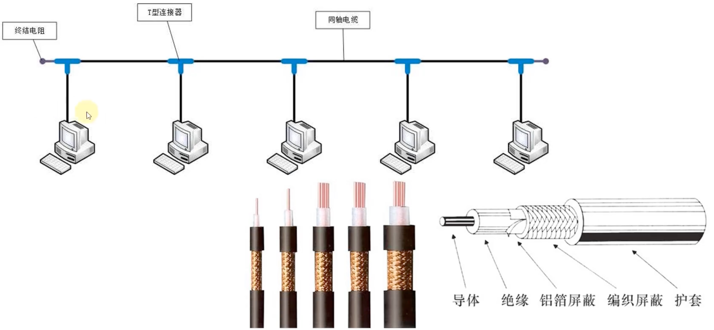

同轴电缆属于半双工通信。

### 计算机之间的连接方式 - 集线器（Hub）

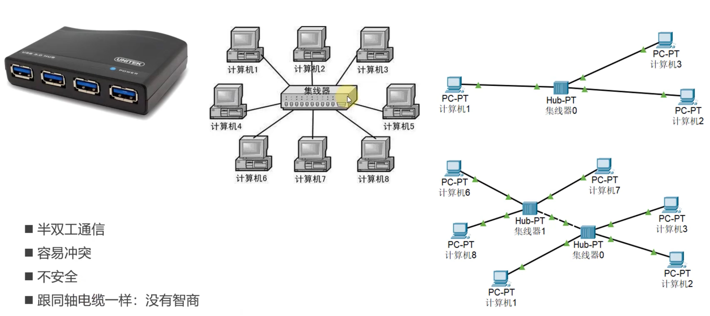

### 计算机之间的连接方式 - 网桥（bridge）

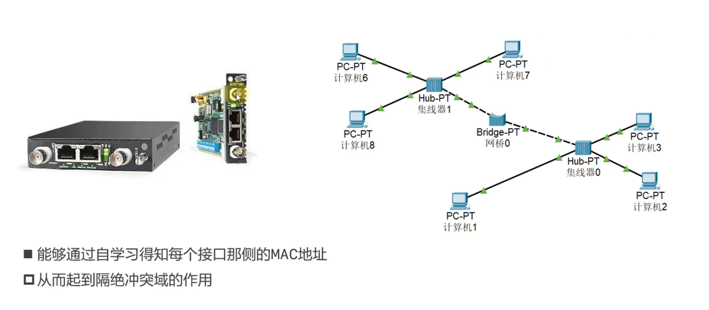

### 计算机之间的连接方式 - 交换机（Switch）

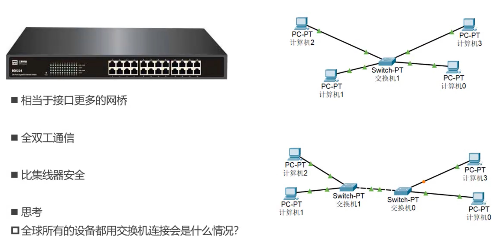

当全球所有的设备都用交换机连接的时候，会出现广播风暴的问题：

只要有一台机器发送arp包获取目标计算机mac地址时，全球所有的计算机都能收到广播消息，这样就线路中就全部都是arp广播包了，这就是所谓的广播风暴。

### 计算机之间的连接方式 - 路由器（router）

路由器可以在不同网段之间转发数据，避免广播风暴。

## 第3章 Mac地址、IP地址、子网掩码

### MAC地址

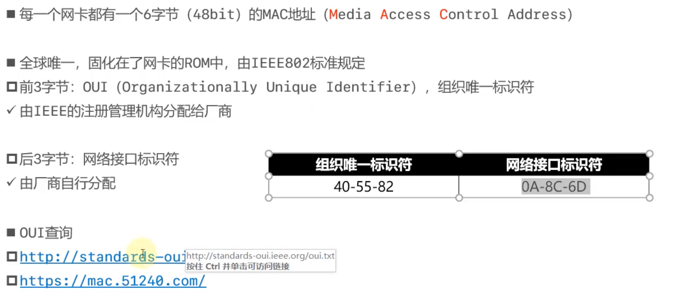

* 每一个网卡都有一个6字节（48bit）的MAC地址（Media Access Control Address）
* 全球唯一，固化在网卡的ROM中，由IEEE802标准规定
    * 前3个字节：OUI（Organizationally Unique Identifier），组织唯一标识符，由IEEE的注册管理机构分配给厂商。
    * 后3个字节：网络接口标识符，由厂商自行分配。

### IP地址

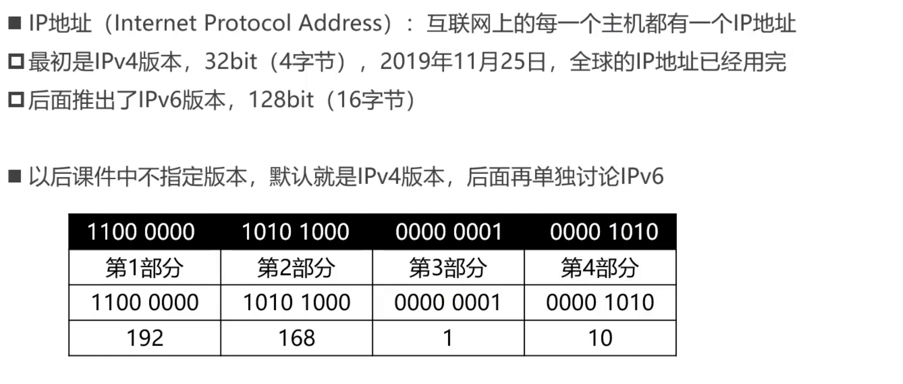

IP地址的组成：

* IP地址由2部分组成：网络标识（网络ID）、主机标识（主机ID）
    * 同一网段的计算机，网络ID相同
    * 通过子网掩码（subnet mask）可以计算出网络ID：子网掩码 & IP地址

 
* 计算机和其他计算机通信前，会先判断目标主机和自己是否在同一网段
    * 同一网段：不需要由路由器进行转发
    * 不同网段：交给路由器进行转发

IP地址分类

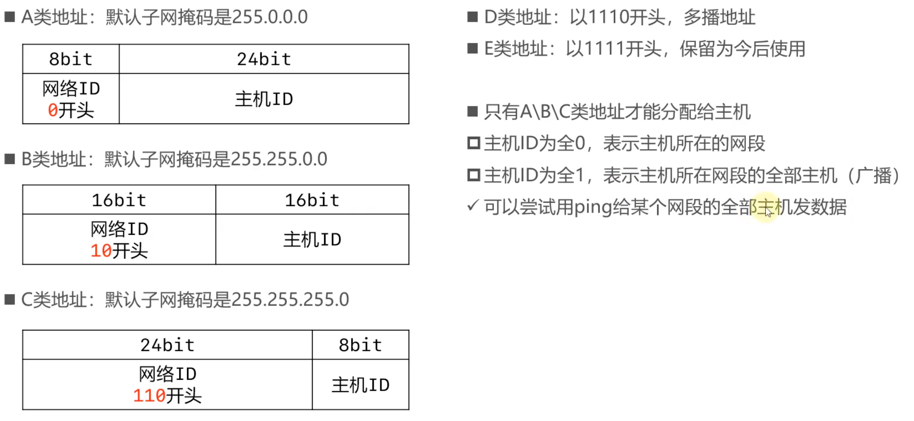

A类地址

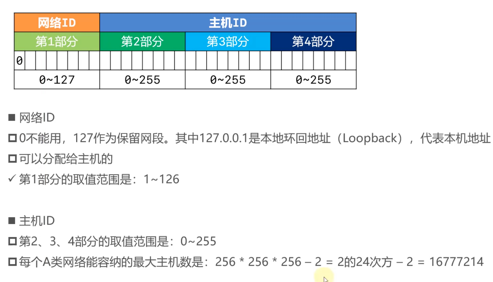

B类地址

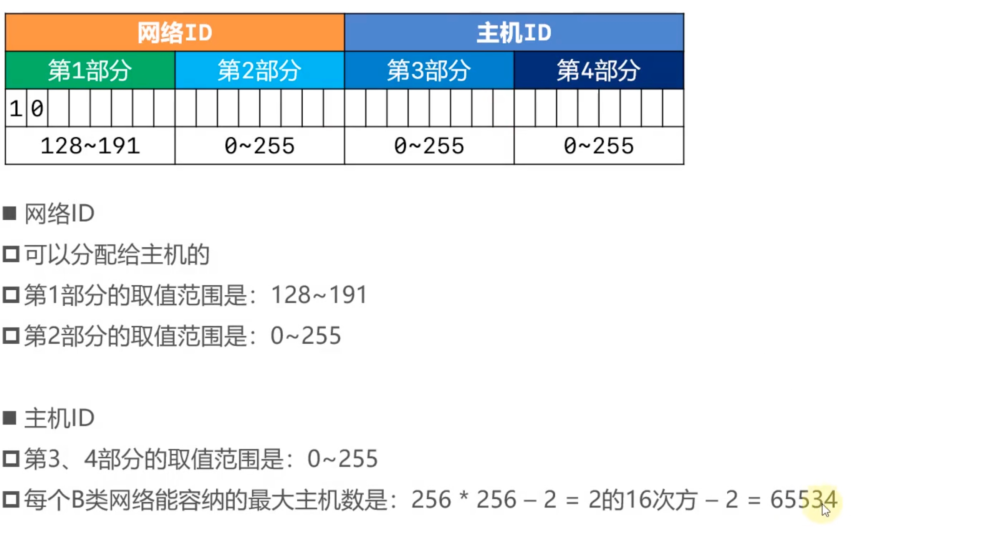

C类地址

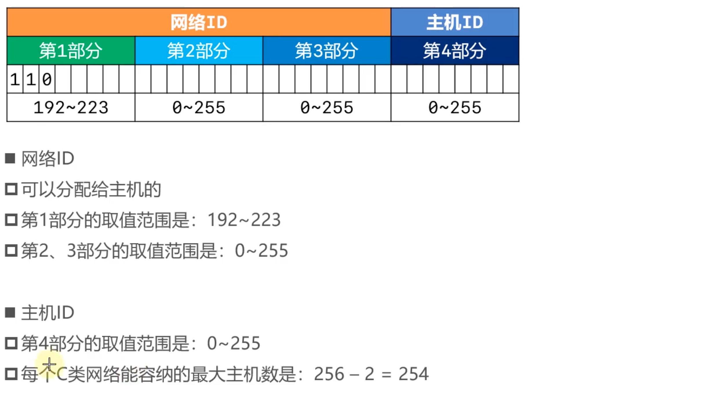

D类地址、E类地址

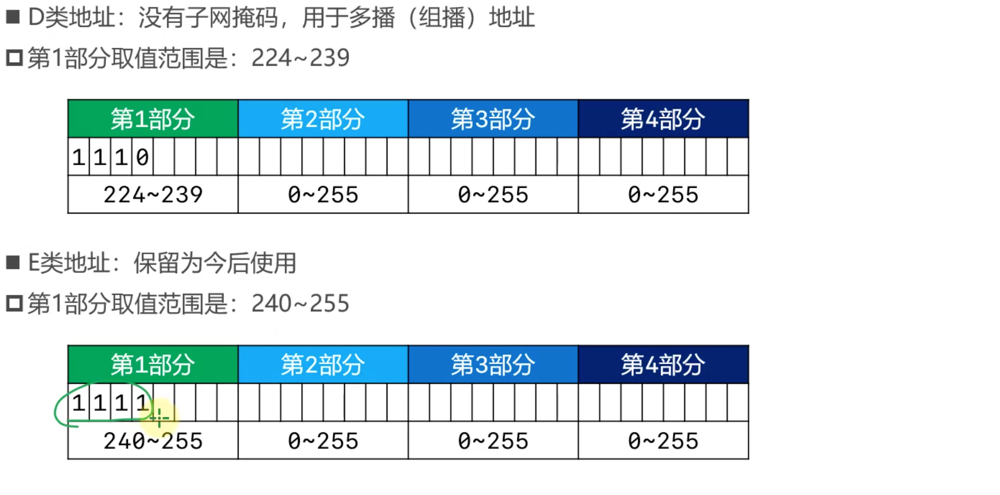

### 子网掩码的CIDR表示方法

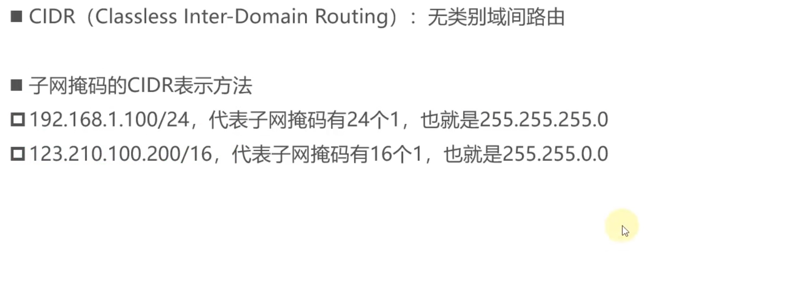

### 为什么要进行子网划分？

* 如果需要让200台主机在同一个网段内，可以分配一个C类网段，比如192.168.1.0/24
    * 共254个可用IP地址：192.168.1.1 ~ 192.168.1.254
    * 多出54个空闲的IP地址，这种情况并不算浪费资源

* 如果需要让500台主机在同一个网段内，可以分配一个B类网段，比如191.100.0.0/16
    * 共65534个可用IP地址：191.100.0.1 ~ 191.100.255.254
    * 多出65034个空闲的IP地址，这种情况属于极大的浪费资源

如何尽量的避免浪费IP地址资源？

#### 等长子网划分

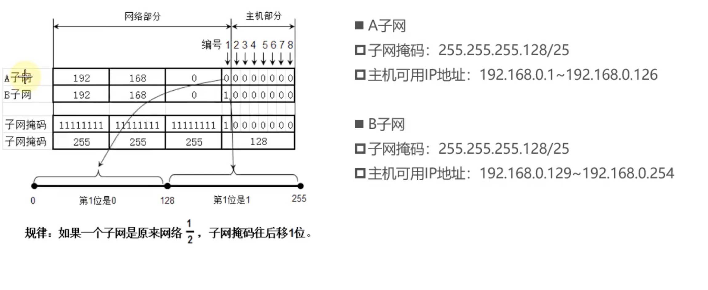

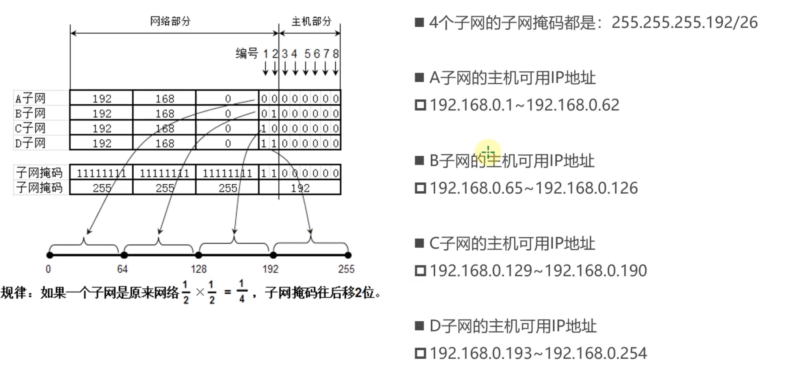

