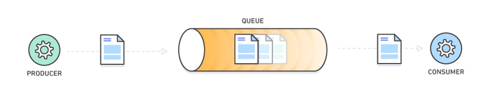
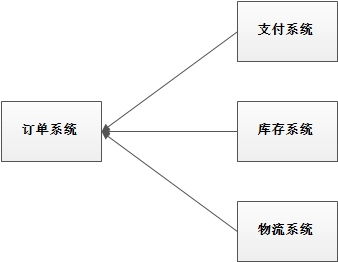
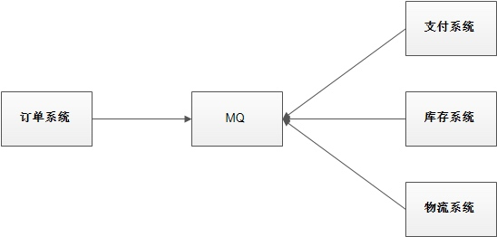
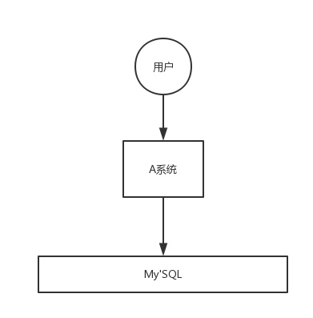
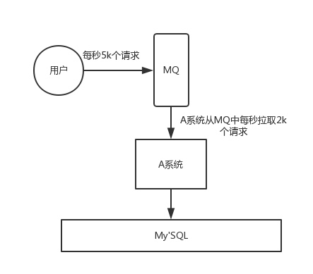
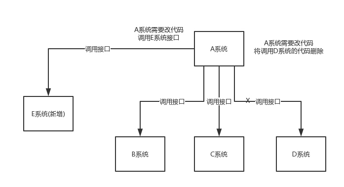
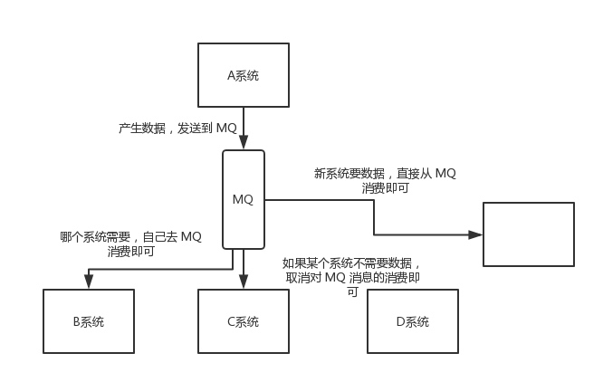
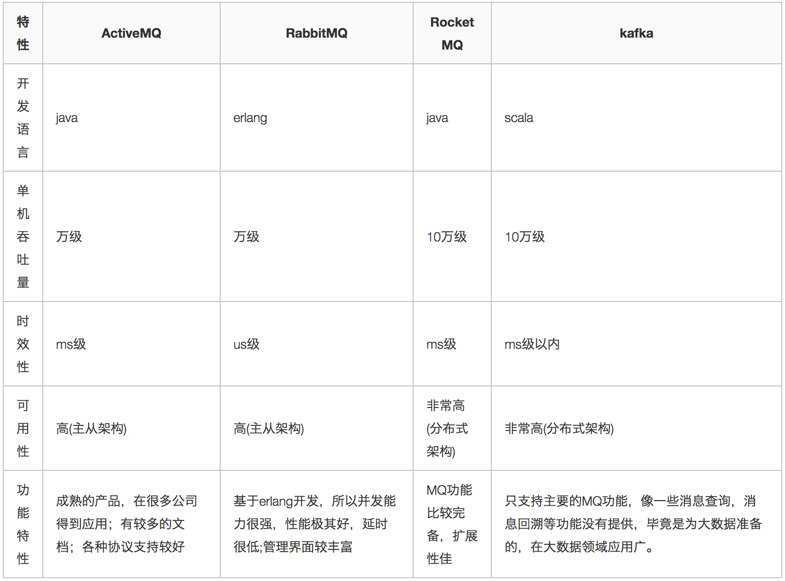

# 黑马程序员RocketMQ系统精讲

视频链接：[https://www.bilibili.com/video/BV1L4411y7mn](https://www.bilibili.com/video/BV1L4411y7mn)

## 第一章

### 为什么要用MQ

消息队列是一种“先进先出”的数据结构

其应用场景主要包含以下3个方面：

* 应用解偶

系统的耦合性越高，容错性就越低。以电商应用为例，用户创建订单后，如果耦合调用库存系统、物流系统、支付系统，任何一个子系统出了故障或者因为升级等原因暂时不可用，都会造成下单操作异常，影响用户使用体验。

使用消息队列解耦合，系统的耦合性就会降低。比如物流系统发生故障，需要几分钟才能来修复，在这段时间内，物流系统要处理的数据被缓存到消息队列中，用户的下单操作正常完成。当物流系统回复后，补充处理存在消息队列中的订单消息即可，终端系统感知不到物流系统发生过几分钟故障。

* 流量削峰

应用系统如果遇到系统请求流量的瞬间猛增，有可能会将系统压垮。有了消息队列可以将大量请求缓存起来，分散到很长一段时间处理，这样可以大大提高系统的稳定性和用户体验。

一般情况，为了保证系统的稳定性，如果系统负载超过阈值，就会阻止用户请求，这样影响用户体验，而如果使用消息队列将请求缓存起来，等待系统处理完毕后通知用户下单完毕，这样总不能下单体验要好。

出于经济考量目的：

业务系统正常时段的QPS如果是1000，流量高峰是10000，为了应对流量高峰配置高性能的服务器显然不划算，这时可以使用消息队列对峰值流量削峰

* 数据分发

通过消息队列可以让数据在多个系统之间进行流通。数据的产生方不需要关系谁来使用数据，只需要将数据发送到消息队列，数据使用方直接在消息队列中获取数据即可。

### MQ的优点和缺点

缺点包含以下几点：

* 系统可用性降低

系统引入的外部依赖越多，系统稳定性越差。一旦MQ宕机，就会对业务产生影响。
如何保证MQ的高可用？

* 系统复杂度提高

MQ的加入大大增加了系统的复杂度，以前系统间是同步的远程调用，现在是通过MQ进行异步调用。
如何保证消息没有被重复消费？怎么处理消息丢失情况？怎么保证消息传递的顺序性？

* 一致性问题

A系统处理完业务，通过MQ给B、C、D三个系统发消息数据，如果B系统、C系统处理成功，D系统处理失败，如何保证消息数据处理的一致性？

### 各种MQ产品的比较

常见的MQ产品包括Kafka、ActiveMQ、RabbitMQ、RocketMQ。 

### RocketMQ快速入门

RocketMQ安装教程见RocketMQ安装教程文档。

### RocketMQ集群搭建

#### RocketMQ各角色介绍

* Producer：消息的发送者；举例：发信者
* Consumer：消息的接收者；举例：收信者
* Broker：暂存和传输消息；举例：邮局
* NameServer：管理Broker；举例：各个邮局的管理机构
* Topic：区分消息的种类；一个发送者可以发送消息给一个或者多个Topic；一个消息的接受者可以订阅一个或者多个Topic消息
* Message Queue：相当于Topic的分区；用于并行发送和接收消息

#### 集群搭建方式

##### 集群特点

- **NameServer是一个几乎无状态节点，可集群部署，节点之间无任何信息同步。**

- **Broker部署相对复杂，Broker分为Master与Slave，一个Master可以对应多个Slave，但是一个Slave只能对应一个Master，Master与Slave的对应关系通过指定相同的BrokerName，不同的BrokerId来定义，BrokerId为0表示Master，非0表示Slave。Master也可以部署多个。每个Broker与NameServer集群中的所有节点建立长连接，定时注册Topic信息到所有NameServer。**

- **Producer与NameServer集群中的其中一个节点（随机选择）建立长连接，定期从NameServer取Topic路由信息，并向提供Topic服务的Master建立长连接，且定时向Master发送心跳。Producer完全无状态，可集群部署。**

- **Consumer与NameServer集群中的其中一个节点（随机选择）建立长连接，定期从NameServer取Topic路由信息，并向提供Topic服务的Master、Slave建立长连接，且定时向Master、Slave发送心跳。Consumer既可以从Master订阅消息，也可以从Slave订阅消息，订阅规则由Broker配置决定。**

##### 集群模式

按照broker的部署模式不同，可分为以下几种：

###### 单Master模式

这种方式风险较大，一旦Broker重启或者宕机时，会导致整个服务不可用。不建议线上环境使用,可以用于本地测试。

###### 多Master模式

一个集群无Slave，全是Master，例如2个Master或者3个Master，这种模式的优缺点如下：

- **优点：配置简单，单个Master宕机或重启维护对应用无影响，在磁盘配置为RAID10时，即使机器宕机不可恢复情况下，由于RAID10磁盘非常可靠，消息也不会丢（异步刷盘丢失少量消息，同步刷盘一条不丢），性能最高；**
- **缺点：单台机器宕机期间，这台机器上未被消费的消息在机器恢复之前不可订阅，消息实时性会受到影响。**

###### 多Master多Slave模式（异步）

每个Master配置一个Slave，有多对Master-Slave，HA采用异步复制方式，主备有短暂消息延迟（毫秒级），这种模式的优缺点如下：

- **优点：即使磁盘损坏，消息丢失的非常少，且消息实时性不会受影响，同时Master宕机后，消费者仍然可以从Slave消费，而且此过程对应用透明，不需要人工干预，性能同多Master模式几乎一样；**
- **缺点：Master宕机，磁盘损坏情况下会丢失少量消息。**

###### 多Master多Slave模式（同步）

每个Master配置一个Slave，有多对Master-Slave，HA采用同步双写方式，即只有主备都写成功，才向应用返回成功，这种模式的优缺点如下：

- **优点：数据与服务都无单点故障，Master宕机情况下，消息无延迟，服务可用性与数据可用性都非常高；**
- **缺点：性能比异步复制模式略低（大约低10%左右），发送单个消息的RT会略高，且目前版本在主节点宕机后，备机不能自动切换为主机。**

#### 双主双从集群搭建

##### 总体架构

2主2从，HA采用同步双写方式

##### 集群工作流程

1、启动NameServer，NameServer起来后监听端口，等待Broker、Producer、Consumer连上来，相当于一个路由控制中心。

2、Broker启动，跟所有NameServer保持长连接，定时发送心跳包。心跳包中包含当前Broker信息（IP + 端口等）以及存储所有Topic信息。注册成功后，NameServer集群中就有Topic跟Broker的映射关系。

3、收发消息前，先创建Topic，创建Topic时需要指定该Topic要存储在哪些Broker上，也可以在发送消息时自动创建Topic。

4、Producer发送消息，启动时先跟NameServer集群中的一台建立长连接，并从NameServer中获取当前发送的Topic存在哪些Broker上，轮询从队列列表中选择一个队列，然后与队列所在的Broker建立长连接从而向Broker发消息。

5、Consumer跟Producer类似，跟其中一台NameServer建立长连接，获取当前订阅Topic存在哪些Broker上，然后直接跟Broker建立连接通道，开始消费消息。

## 第三章

### 高级功能

#### 高可用性机制

