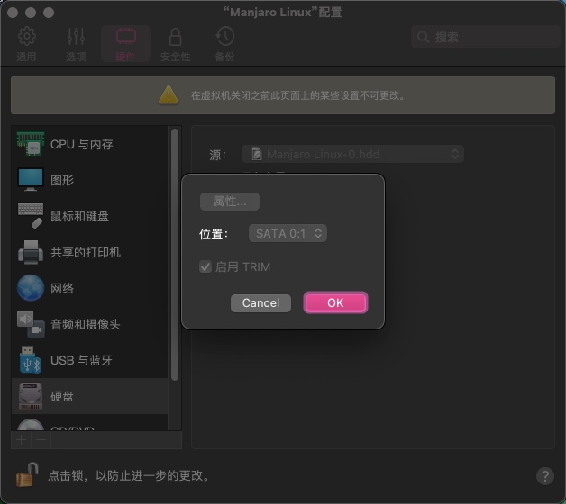
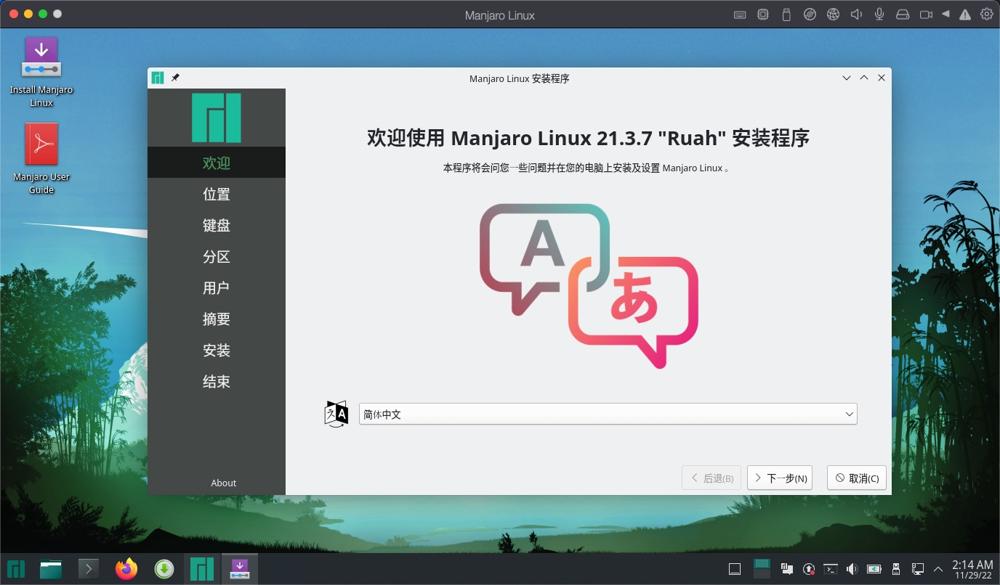
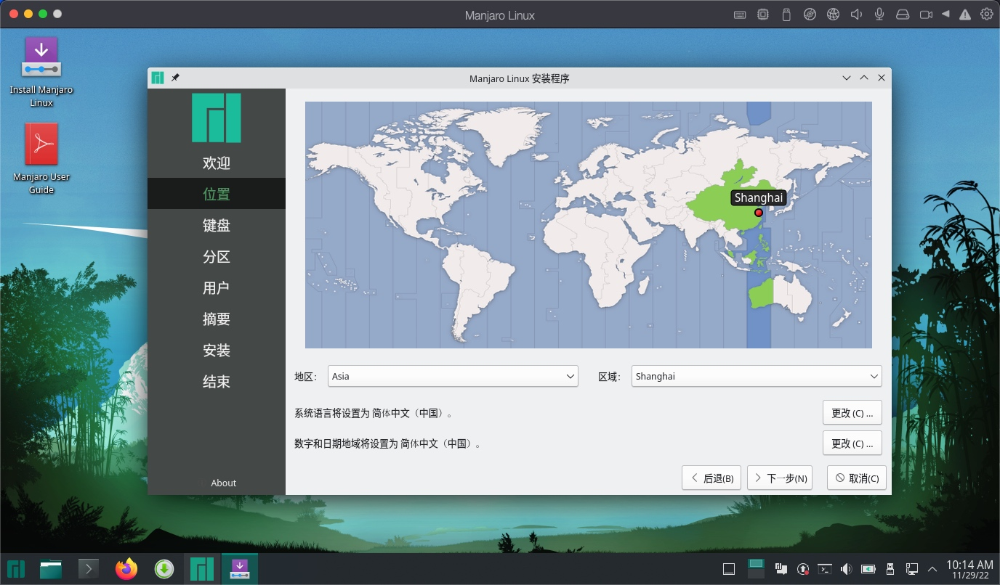
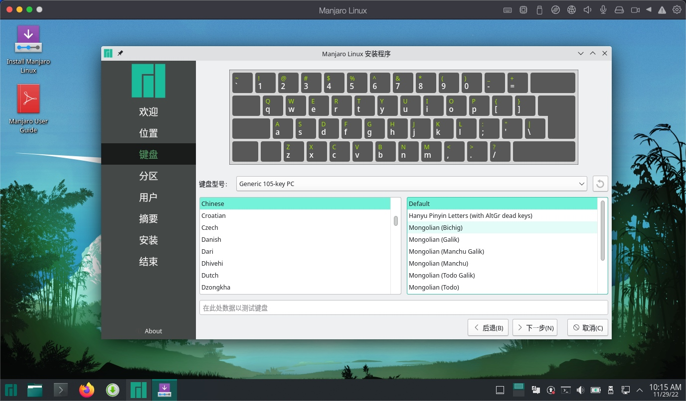
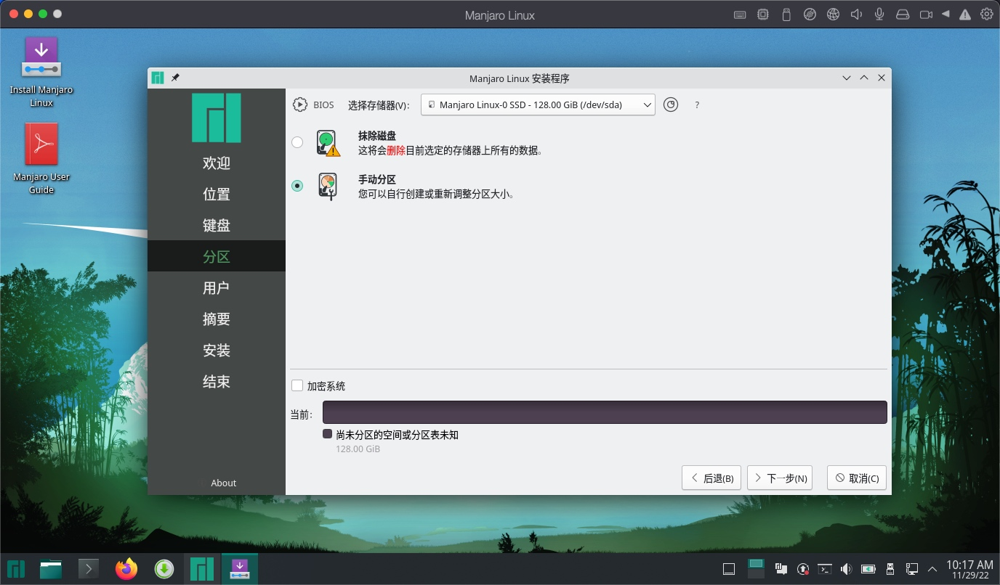
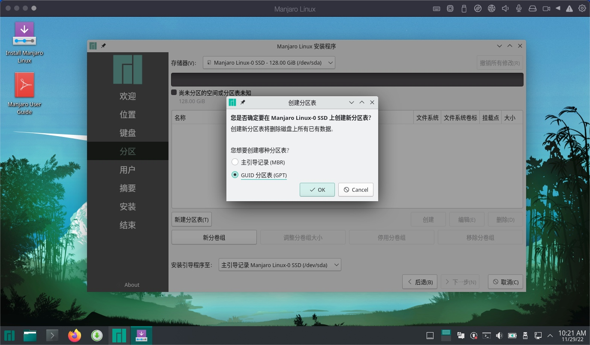
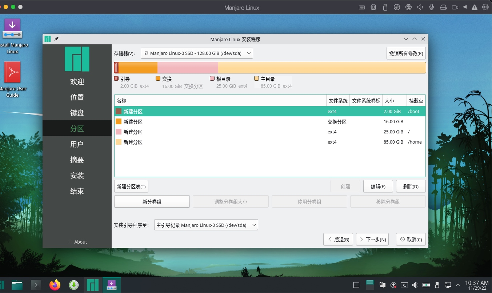
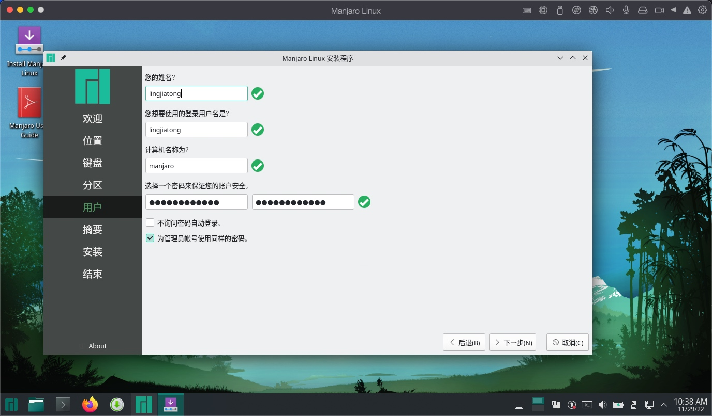
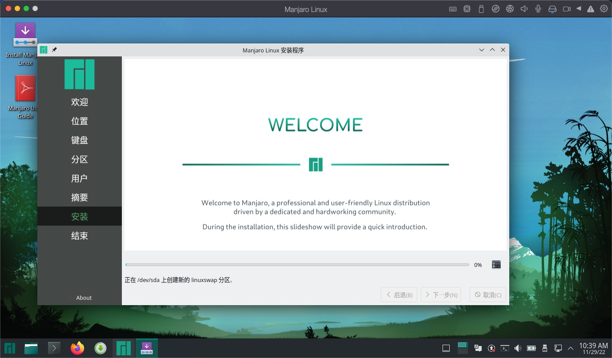

# Manjaro安装教程

引言

> 近来无事，一直在试用各种linux发行版，想找到一个适合自己作为主力系统的linux发行版，前面安装arch失败了，先来试用Manjaro，后面再折腾arch。

Manjaro系统介绍

> Manjaro是一个基于独立开发的Arch Linux对用户友好的Linux发行版。Arch本身以突出的运行速度、强大功能和轻量体积而闻名，且提供非常及时的先进——而且前沿的——软件。然而，Arch也面向更有经验的或技术性的用户。因此，它通常被看作是缺少专业知识或毅力然而需要使用的用户所难以企及的。
> 开发于澳大利亚、法国和德国的Manjaro在提供Arch Linux的所有好处同时也结合了对“用户友好”和“可用性”的聚焦。Manjaro紧随Arch Linux且仅提供64位版本。Manjaro对于新手和经验丰富的Linux用户都很合适。“对于新手”，有一个用户友好的软件安装器，而且系统本身也被设计成为完全“开箱即用”——包含其中的功能与特性。
> * 预装桌面环境
> * 预装图形软件管理器更容易安装软件和更新你的系统
> * 预装解码器播放多媒体文件

## 下载镜像

Manjaro的官方镜像下载地址：[https://manjaro.org/download/](https://manjaro.org/download/)

本次使用的是21.3.7版本的PLASMA(KDE)桌面最小化安装镜像。

## 使用虚拟机软件开始安装

这里使用的是PD，其他虚拟机软件同理。

1、设置内存大小

2、设置硬盘大小

3、设置CPU核数

以上就不多赘述了。

我们主要介绍使用iso文件启动之后的流程。

## 安装流程

1、选择使用简体中文安装

2、地区选择上海

3、默认键盘布局设置

4、选择手动分区

5、选择使用GPT分区方式

这里说明一下MBR和GPT分区方式的区别：

> 1、MBR分区表最多只能识别2TB左右的空间，大于2TB的容量将无法识别从而导致硬盘空间浪费；GPT分区表则能够识别2TB以上的硬盘空间。
> 2、MBR分区表最多只能支持4个主分区或三个主分区+1个扩展分区(逻辑分区不限制)；GPT分区表在Windows系统下可以支持128个主分区。
> 3、在MBR中，分区表的大小是固定的；在GPT分区表头中可自定义分区数量的最大值，也就是说GPT分区表的大小不是固定的。

6、自定义分区大小

* /boot，启动引导分区大小，一般800M-2G。
* swap，交换空间，交换空间大小与计算机内存内存存在关联。**内存在8G以下设置内存容量*2，8G以上设置和内存同等大小即可**。当内存不够用时，系统会将长时间没有运行的程序的缓存从内存中写入 swap分区中，并释放该程序所占用的内存给其他程序使用。Linux电源管理有休眠模式，系统会将内存中程序运行状态存储在swap中然后设备进入完全断电状态，当下次启动计算机时系统会从swap恢复休眠前的计算机运行状态。
* / 根目录，25G左右（etx4 文件系统）。
* /home（etx4 文件系统）Linux系统中用户的家文件，此目录空间越大越好。

7、设置用户信息

8、等待安装完成

