# Fedora安装教程

Fedora系统介绍

> Fedora 为硬件、云和容器创建了一个创新、免费和开源的平台，使软件开发人员和社区成员能够为他们的用户构建量身定制的解决方案。

## 下载Fedora Spins版本

Fedora默认使用Gnome桌面，为了安装KDE桌面，可选择使用Spins版本的Fedora。Fedora提供了默认安装各种桌面环境的iso镜像文件，包括KDE、GNOME、XFACE、LXQT、MATE等。

这里使用KDE版本的Fedora，下载地址：[https://download.fedoraproject.org/pub/fedora/linux/releases/37/Spins/x86_64/iso/Fedora-KDE-Live-x86_64-37-1.7.is](https://download.fedoraproject.org/pub/fedora/linux/releases/37/Spins/x86_64/iso/Fedora-KDE-Live-x86_64-37-1.7.is)

## 安装流程

1、选择英文进行安装

如果不选择英文安装的话，那么自动生成的文件夹名会变成中文名，由于可能存在各种软件不支持中文文件夹的问题，建议使用英文安装，安装完毕之后再安装中文语言。

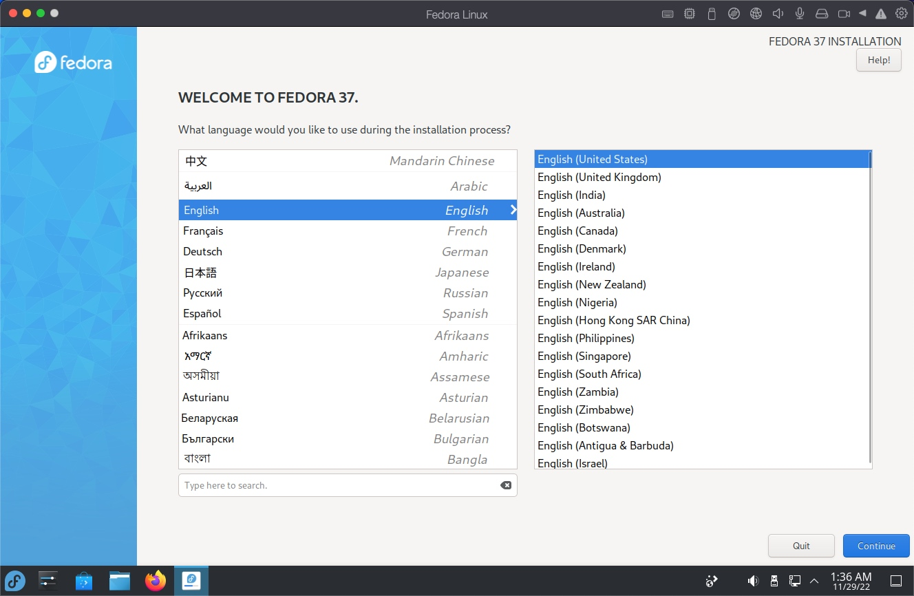

2、自定义分区设置

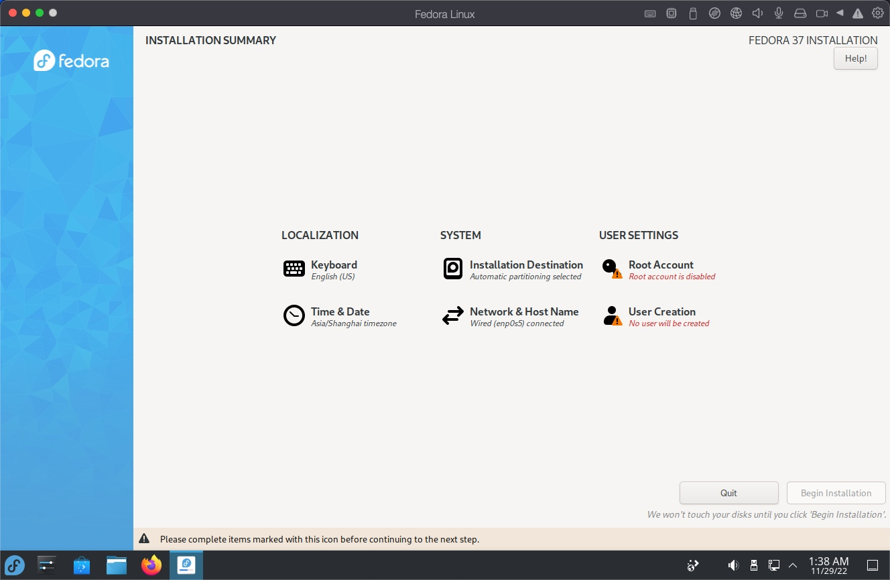

点击Installation Destination选项，点击如下三个选项进行自定义设置。

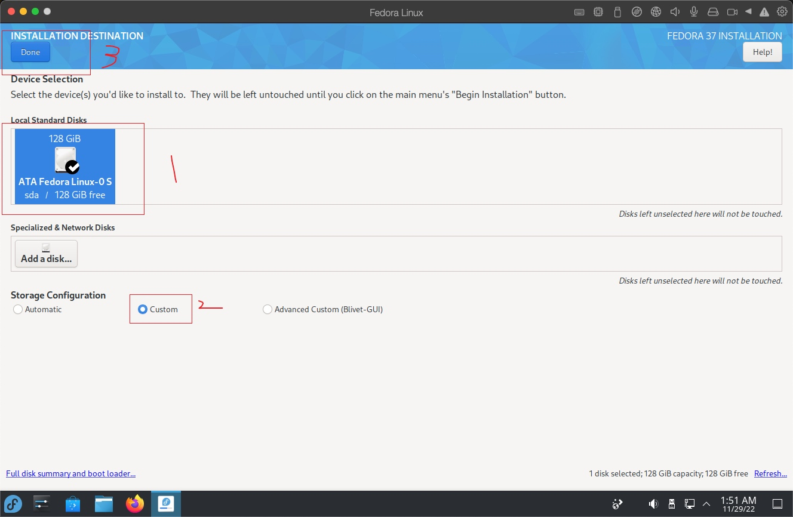

选择标准分区

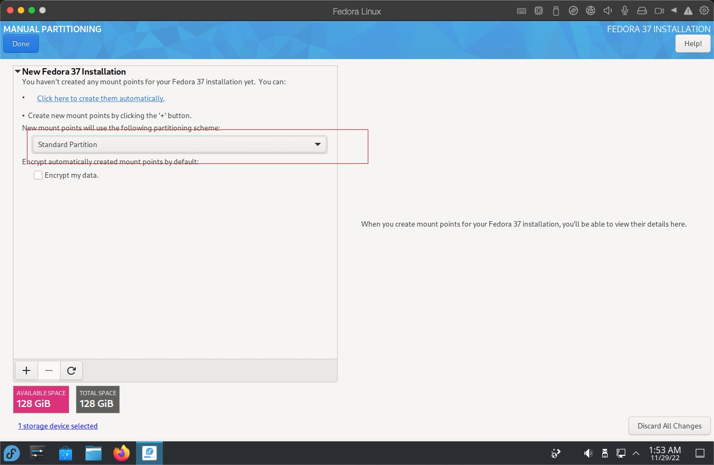

创建挂载点/boot，大小为1G

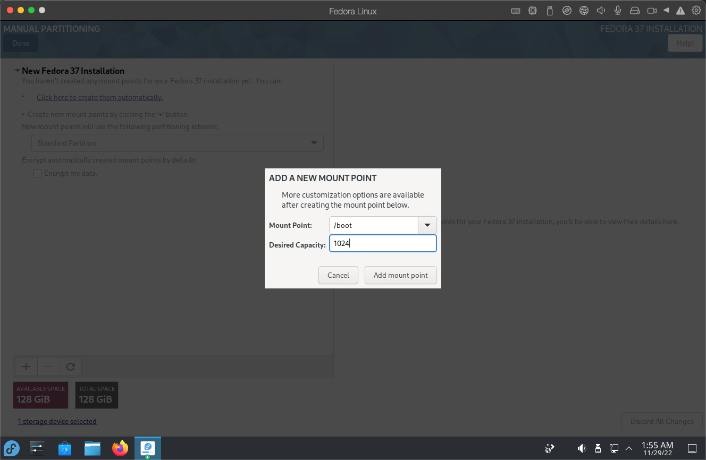

创建swap分区，大小为16GiB

创建 / 挂载点，大小为25GiB

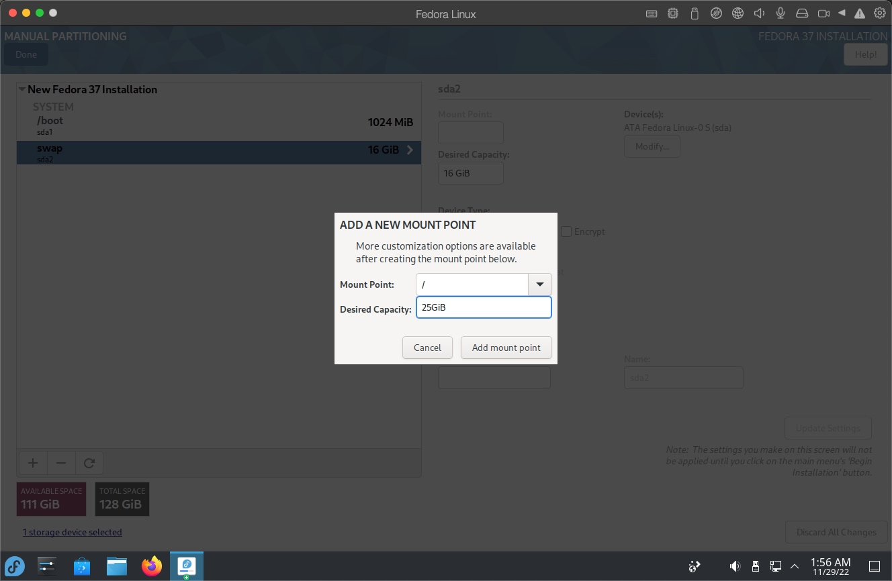

创建一个大小为1MiB的biosboot分区

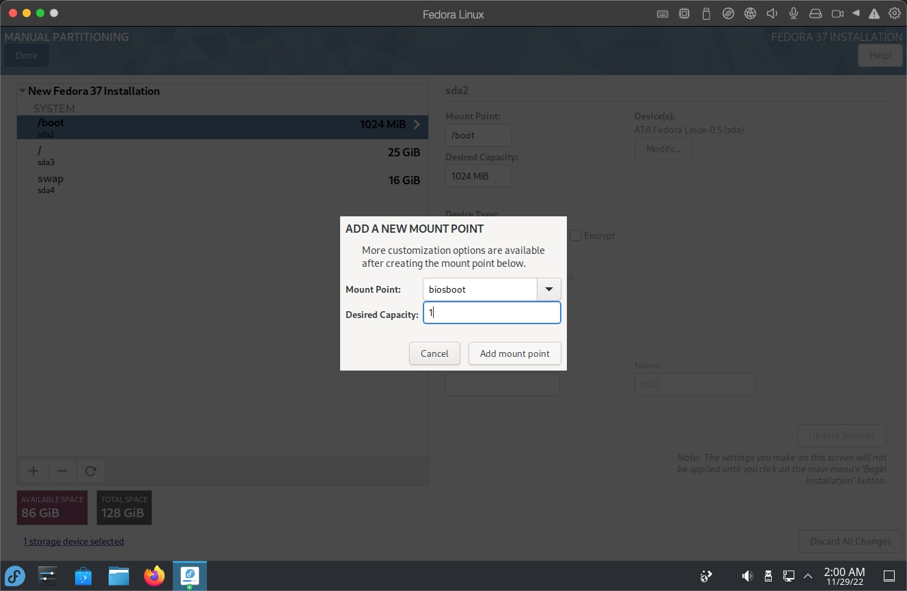

剩余空间都分配给/home挂载点

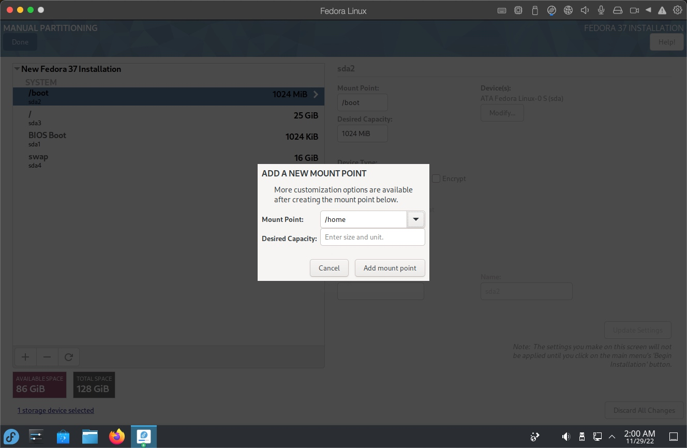

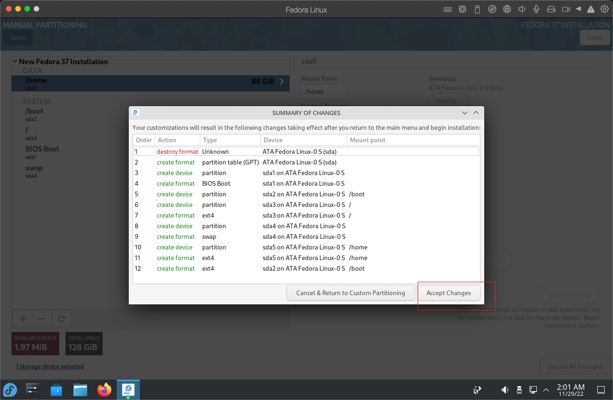

3、配置用户信息

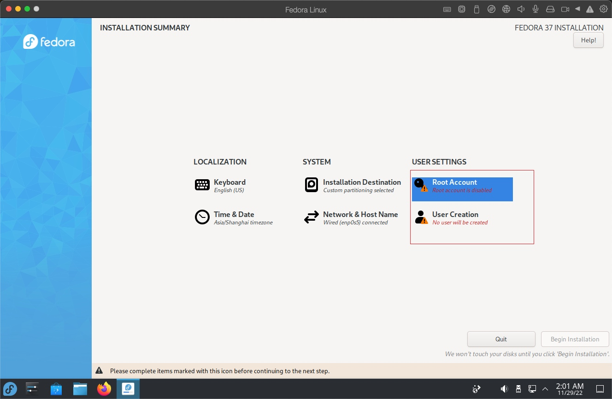

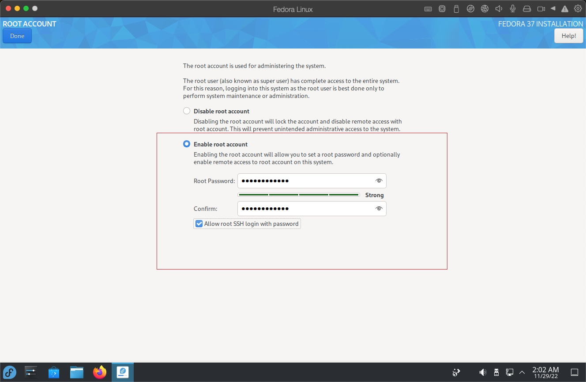

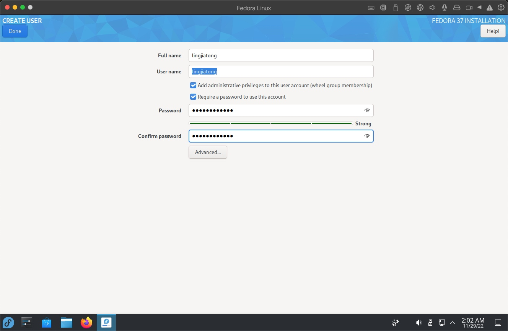

4、等待安装完成

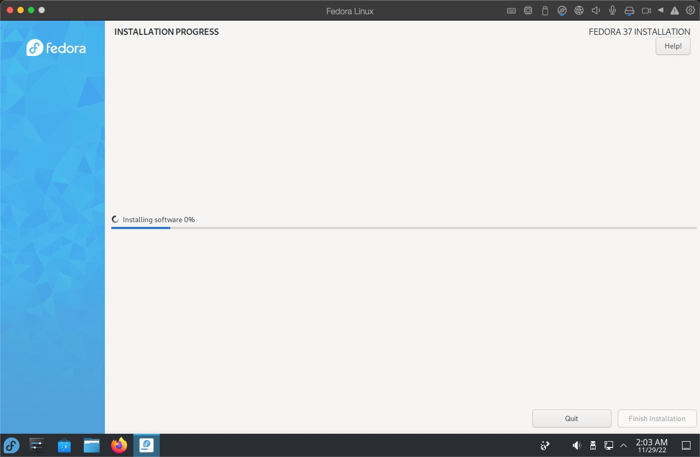

