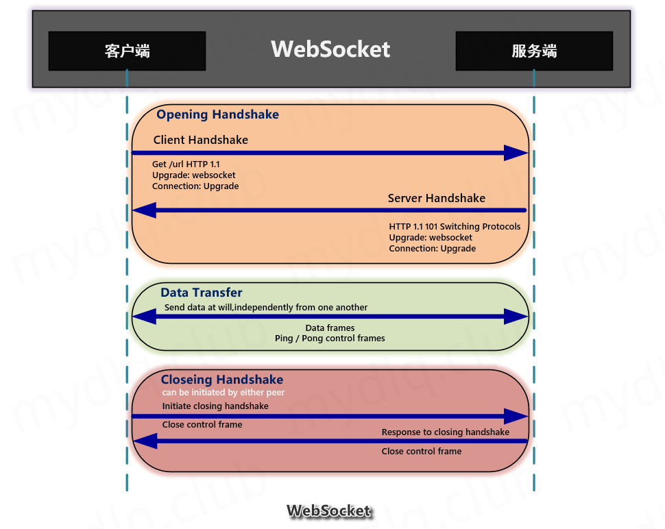
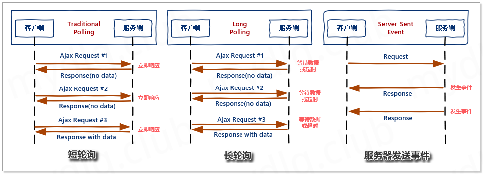
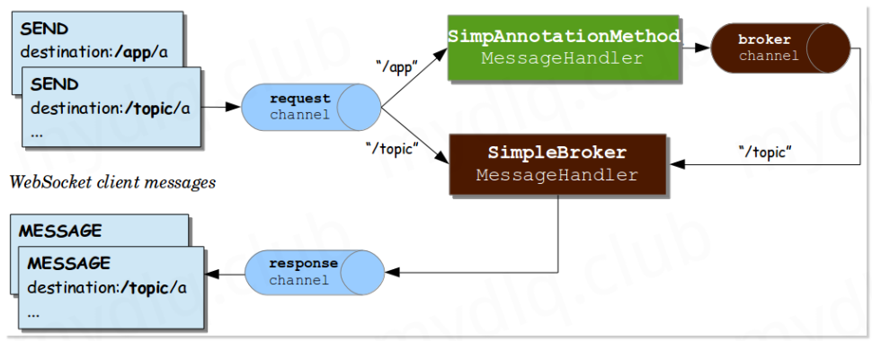
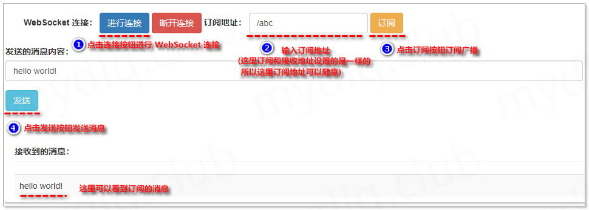
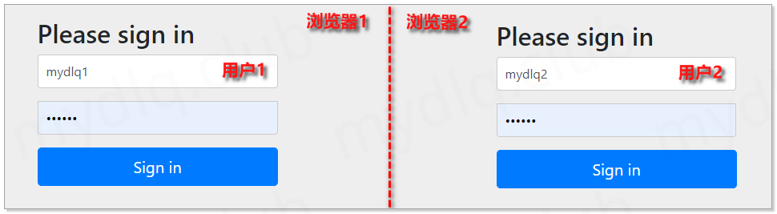
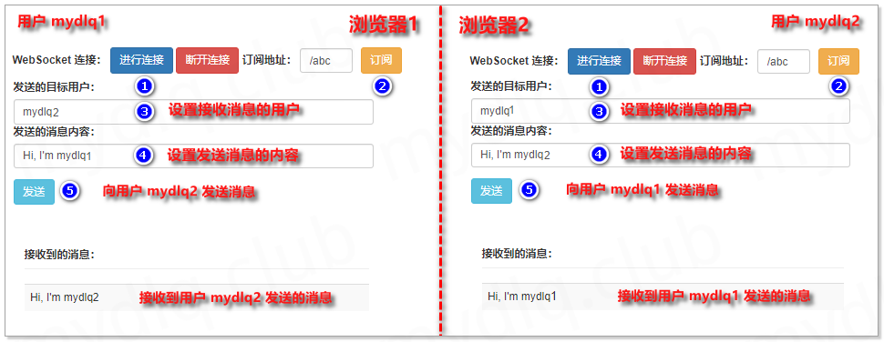
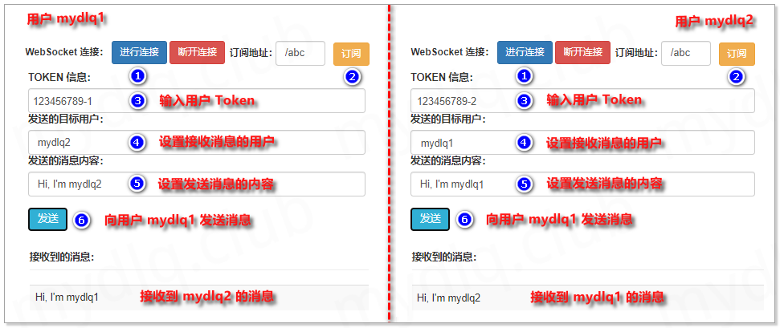
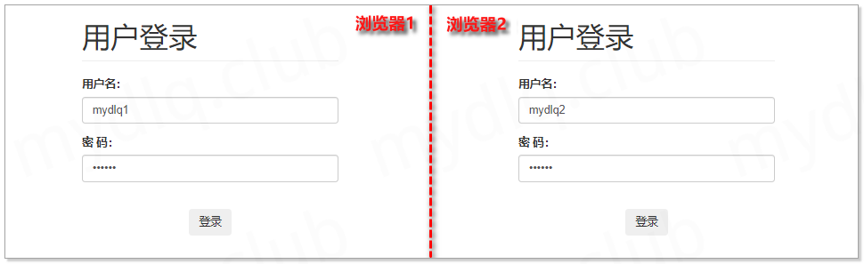

目录[-]

[. 一、WebSocket 简介](http://www.mydlq.club/article/86/#wow0)

[. 二、WebSocket 特点](http://www.mydlq.club/article/86/#wow1)

[. 三、为什么需要 WebSocket](http://www.mydlq.club/article/86/#wow2)

[. 四、WebSocket 连接流程](http://www.mydlq.club/article/86/#wow3)

[. 五、WebSocket 使用场景](http://www.mydlq.club/article/86/#wow4)

[. 六、WebSocket 中子协议支持](http://www.mydlq.club/article/86/#wow5)

[. 七、什么是 STOMP 协议](http://www.mydlq.club/article/86/#wow6)

[. 八、Spring 封装的 STOMP](http://www.mydlq.club/article/86/#wow7)

[. 九、SpringBoot 实现 WebSocket 示例一：实现简单的广播模式](http://www.mydlq.club/article/86/#wow8)

[. 1、Maven 引入相关依赖](http://www.mydlq.club/article/86/#wow9)

[. 2、创建测试实体类](http://www.mydlq.club/article/86/#wow10)

[. 3、创建 WebSocket 配置类](http://www.mydlq.club/article/86/#wow11)

[. 4、创建测试 Controller 类](http://www.mydlq.club/article/86/#wow12)

[. 5、SpringBoot 启动类](http://www.mydlq.club/article/86/#wow13)

[. 6、创建测试的前端 html 和 js](http://www.mydlq.club/article/86/#wow14)

[. 7、启动并进行测试](http://www.mydlq.club/article/86/#wow15)

[. 十、SpringBoot 实现 WebSocket 示例二：实现点对点模式(引入 Spring Security 实现鉴权)](http://www.mydlq.club/article/86/#wow16)

[. 1、Maven 引入相关依赖](http://www.mydlq.club/article/86/#wow17)

[. 2、创建测试实体类](http://www.mydlq.club/article/86/#wow18)

[. 3、创建 WebSocket 配置类](http://www.mydlq.club/article/86/#wow19)

[. 4、创建 Security 配置](http://www.mydlq.club/article/86/#wow20)

[. 5、创建测试 Controller 类](http://www.mydlq.club/article/86/#wow21)

[. 6、SpringBoot 启动类](http://www.mydlq.club/article/86/#wow22)

[. 7、创建测试的前端 html 和 js](http://www.mydlq.club/article/86/#wow23)

[. 8、启动并进行测试](http://www.mydlq.club/article/86/#wow24)

[. 十一、SpringBoot 实现 WebSocket 示例三：实现点对点模式(根据请求头 Header 实现鉴权)](http://www.mydlq.club/article/86/#wow25)

[. 1、Maven 引入相关依赖](http://www.mydlq.club/article/86/#wow26)

[. 2、创建测试实体类](http://www.mydlq.club/article/86/#wow27)

[. 3、配置 WebSocket 通道拦截器](http://www.mydlq.club/article/86/#wow28)

[. 4、创建 WebSocket 配置类](http://www.mydlq.club/article/86/#wow29)

[. 5、创建测试 Controller 类](http://www.mydlq.club/article/86/#wow30)

[. 6、SpringBoot 启动类](http://www.mydlq.club/article/86/#wow31)

[. 7、创建测试的前端 html 和 js](http://www.mydlq.club/article/86/#wow32)

[. 8、启动并进行测试](http://www.mydlq.club/article/86/#wow33)

[. 十二、SpringBoot 实现 WebSocket 示例四：实现点对点模式(根据 HTTP Session 实现鉴权)](http://www.mydlq.club/article/86/#wow34)

[. 1、Maven 引入相关依赖](http://www.mydlq.club/article/86/#wow35)

[. 2、创建测试实体类](http://www.mydlq.club/article/86/#wow36)

[. 3、WebSocket 握手请求拦截器](http://www.mydlq.club/article/86/#wow37)

[. 4、创建 WebSocket 握手处理器](http://www.mydlq.club/article/86/#wow38)

[. 5、创建 WebSocket 配置类](http://www.mydlq.club/article/86/#wow39)

[. 6、创建测试 Controller 类](http://www.mydlq.club/article/86/#wow40)

[. 7、创建登录 Controller 类](http://www.mydlq.club/article/86/#wow41)

[. 8、SpringBoot 启动类](http://www.mydlq.club/article/86/#wow42)

[. 9、创建测试的前端 html 和 js](http://www.mydlq.club/article/86/#wow43)

[. 10、启动并进行测试](http://www.mydlq.club/article/86/#wow44)

[. 十三、SpringBoot 结合 WebSocket 的常用方法示例](http://www.mydlq.club/article/86/#wow45)

[. 1、WebSocket 开启跨域选项](http://www.mydlq.club/article/86/#wow46)

[. 2、WebSocket 用户上、下线监听](http://www.mydlq.club/article/86/#wow47)

------

**参考地址：**

- [Stomp 1.2 协议规范](https://stomp.github.io/stomp-specification-1.2.html)
- [Spring 框架对 WebSocket 的支持](https://docs.spring.io/spring-framework/docs/5.0.0.BUILD-SNAPSHOT/spring-framework-reference/html/websocket.html#websocket-intro-sub-protocol)

**环境信息：**

- SpringBoot 版本：2.3.1.RELEASE
- Spring WebSocket 版本：5.2.7.RELEASE
- 前端使用的框架：bootstrap 3.4.1、Jquery 3.5.1、sockjs-client 1.4.0、stomp.js 2.3.3

## 一、WebSocket 简介

[](https://mydlq-club.oss-cn-beijing.aliyuncs.com/images/springboot-websocket-1002.png?x-oss-process=style/shuiyin)

​    WebSocket 是一种基于 TCP 的网络协议。在 2009 年诞生，于 2011 年被 IETF 定为标准 RFC 6455 通信标准，并由 RFC7936 补充规范。WebSocket API 也被 W3C 定为标准。

WebSocket 也是一种全双工通信的协议，既允许客户端向服务器主动发送消息，也允许服务器主动向客户端发送消息。在 WebSocket 中，浏览器和服务器只需要完成一次握手，两者之间就可以建立持久性的连接，进行双向数据传输。

## 二、WebSocket 特点

- 连接握手阶段使用 HTTP 协议；
- 协议标识符是 ws，如果采用加密则是 wss；
- 数据格式比较轻量，性能开销小，通信高效；
- 没有同源限制，客户端可以与任意服务器通信；
- 建立在 TCP 协议之上，服务器端的实现比较容易；
- 通过 WebSocket 可以发送文本，也可以发送二进制数据；
- 与 HTTP 协议有着良好的兼容性。默认端口也是 80 和 443，并且握手阶段采用 HTTP 协议，因此握手时不容易屏蔽，能通过各种 HTTP 代理服务器；

## 三、为什么需要 WebSocket

​    谈起为什么需要 WebSocket 前，那得先了解在没有 WebSocket 那段时间说起，那时候基于 Web 的消息基本上是靠 Http 协议进行通信，而经常有”聊天室”、”消息推送”、”股票信 息实时动态”等这样需求，而实现这样的需求常用的有以下几种解决方案：

[](https://mydlq-club.oss-cn-beijing.aliyuncs.com/images/springboot-websocket-1003.png?x-oss-process=style/shuiyin)

**(1)、短轮询(Traditional Polling)**

短轮询是指客户端每隔一段时间就询问一次服务器是否有新的消息，如果有就接收消息。这样方式会增加很多次无意义的发送请求信息，每次都会耗费流量及处理器资源。

- 优点：短连接，服务器处理简单，支持跨域、浏览器兼容性较好。
- 缺点：有一定延迟、服务器压力较大，浪费带宽流量、大部分是无效请求。

 ——————

**(2)、长轮询(Long Polling)**

长轮询是段轮询的改进，客户端执行 HTTP 请求发送消息到服务器后，等待服务器回应，如果没有新的消息就一直等待，知道服务器有新消息传回或者超时。这也是个反复的过程，这种做法只是减小了网络带宽和处理器的消耗，但是带来的问题是导致消息实时性低，延迟严重。而且也是基于循环，最根本的带宽及处理器资源占用并没有得到有效的解决。

- 优点：减少轮询次数，低延迟，浏览器兼容性较好。
- 缺点：服务器需要保持大量连接。

 ——————

**(3)、服务器发送事件(Server-Sent Event)**

> 目前除了 IE/Edge，其他浏览器都支持。

服务器发送事件是一种服务器向浏览器客户端发起数据传输的技术。一旦创建了初始连接，事件流将保持打开状态，直到客户端关闭。该技术通过传统的 HTTP 发送，并具有 WebSockets 缺乏的各种功能，例如”自动重新连接”、”事件ID” 及 “发送任意事件”的能力。

服务器发送事件是单向通道，只能服务器向浏览器发送，因为流信息本质上就是下载。

- 优点：适用于更新频繁、低延迟并且数据都是从服务端发到客户端。
- 缺点：浏览器兼容难度高。

 ——————

显然，上面这几种方式都有各自的优缺点，虽然靠轮询方式能够实现这些一些功能，但是其对性能的开销和低效率是非常致命的，尤其是在移动端流行的现在。现在客户端与服务端双向通信的需求越来越多，且现在的浏览器大部分都支持 WebSocket。所以对实时性和双向通信及其效率有要求的话，比较推荐使用 WebSocket。

## 四、WebSocket 连接流程

**(1)、客户端先用带有 Upgrade:Websocket 请求头的 HTTP 请求，向服务器端发起连接请求，实现握手(HandShake)。**

客户端 HTTP 请求的 Header 头信息如下：

```bash
Connection: Upgrade
Sec-WebSocket-Extensions: permessage-deflate; client_max_window_bits
Sec-WebSocket-Key: IRQYhWINfX5Fh1zdocDl6Q==
Sec-WebSocket-Version: 13
Upgrade: websocket
```

- **Connection：** Upgrade 表示要升级协议。
- **Upgrade：** Websocket 要升级协议到 websocket 协议。
- **Sec-WebSocket-Extensions：** 表示客户端所希望执行的扩展(如消息压缩插件)。
- **Sec-WebSocket-Key：** 主要用于WebSocket协议的校验，对应服务端响应头的 Sec-WebSocket-Accept。
- **Sec-WebSocket-Version：** 表示 websocket 的版本。如果服务端不支持该版本，需要返回一个Sec-WebSocket-Versionheader，里面包含服务端支持的版本号。

**(2)、握手成功后，由 HTTP 协议升级成 Websocket 协议，进行长连接通信，两端相互传递信息。**

服务端响应的 HTTP Header 头信息如下：

```bash
Connection: upgrade
Sec-Websocket-Accept: TSF8/KitM+yYRbXmjclgl7DwbHk=
Upgrade: websocket
```

- **Connection：** Upgrade 表示要升级协议。
- **Upgrade：** Websocket 要升级协议到 websocket 协议。
- **Sec-Websocket-Accept：** 对应 Sec-WebSocket-Key 生成的值，主要是返回给客户端，让客户端对此值进行校验，证明服务端支持 WebSocket。

## 五、WebSocket 使用场景

- **数据流状态：** 比如说上传下载文件，文件进度，文件是否上传成功。
- **协同编辑文档：** 同一份文档，编辑状态得同步到所有参与的用户界面上。
- **多玩家游戏：** 很多游戏都是协同作战的，玩家的操作和状态肯定需要及时同步到所有玩家。
- **多人聊天：** 很多场景下都需要多人参与讨论聊天，用户发送的消息得第一时间同步到所有用户。
- **社交订阅：** 有时候我们需要及时收到订阅消息，比如说开奖通知，比如说在线邀请，支付结果等。
- **股票虚拟货币价格：** 股票和虚拟货币的价格都是实时波动的，价格跟用户的操作息息相关，及时推送对用户跟盘有很大的帮助。

## 六、WebSocket 中子协议支持

​    WebSocket 确实指定了一种消息传递体系结构，但并不强制使用任何特定的消息传递协议。而且它是 TCP 上的一个非常薄的层，它将字节流转换为消息流（文本或二进制）仅此而已。由应用程序来解释消息的含义。

与 HTTP（它是应用程序级协议）不同，在 WebSocket 协议中，**传入消息中根本没有足够的信息供框架或容器知道如何路由或处理它**。因此，对于非常琐碎的应用程序而言 WebSocket 协议的级别可以说太低了。**可以做到的是引导在其上面再创建一层框架。这就相当于当今大多数 Web 应用程序使用的是 Web 框架，而不直接仅使用 Servlet API 进行编码一样**。

WebSocket RFC 定义了子协议的使用。在握手过程中，客户机和服务器可以使用头 Sec-WebSocket 协议商定子协议，即使不需要使用子协议，而是用更高的应用程序级协议，但应用程序仍需要选择客户端和服务器都可以理解的消息格式。且该格式可以是自定义的、特定于框架的或标准的消息传递协议。

Spring 框架支持使用 STOMP，这是一个简单的消息传递协议，最初创建用于脚本语言，框架灵感来自 HTTP。STOMP 被广泛支持，非常适合在 WebSocket 和 web 上使用。

## 七、什么是 STOMP 协议

> 关于详细的 STOMP 请查看 [STOMP 协议规范](https://stomp.github.io/stomp-specification-1.2.html) 了解。

**(1)、STOMP 协议概述**

​    STOMP（Simple Text-Orientated Messaging Protocol）是一种简单的面向文本的消息传递协议。它提供了一个可互操作的连接格式，允许 STOMP 客户端与任意 STOMP 消息代理（Broker）进行交互。STOMP 协议由于设计简单，易于开发客户端，因此在多种语言和多种平台上得到广泛地应用。

**(2)、简单介绍可以分为以下几点：**

- STOMP 是基于帧的协议，其帧以 HTTP 为模型。
- STOMP 框架由命令，一组可选的标头和可选的主体组成。
- STOMP 基于文本，但也允许传输二进制消息。
- STOMP 的默认编码为 UTF-8，但它支持消息正文的替代编码的规范。

**(3)、STOMP 客户端是一种用户代理，可以分为两种模式运行：**

- 作为生产者，通过 SEND 帧将消息发送到目标服务器上。
- 作为消费者，对目标地址发送 SUBSCRIBE 帧，并作为 MESSAGE 帧从服务器接收消息。

**(4)、STOMP 帧**

STOMP 是基于帧的协议，其帧以 HTTP 为模型。STOMP 结构为：

```bash
COMMAND
header1:value1
header2:value2

Body^@
```

客户端可以使用 SEND 或 SUBSCRIBE 命令发送或订阅消息，还可以使用 “destination” 头来描述消息的内容和接收者。这支持一种简单的发布-订阅机制，可用于通过代理将消息发送到其他连接的客户端，或将消息发送到服务器以请求执行某些工作。

**(5)、Stomp 常用帧**

STOMP 的客户端和服务器之间的通信是通过”**帧**“（Frame）实现的，每个帧由多”**行**“（Line）组成，其包含的帧如下：

- *Connecting Frames：*
  - [CONNECT（连接）](https://stomp.github.io/stomp-specification-1.2.html#CONNECT_or_STOMP_Frame)
  - [CONNECTED（成功连接）](https://stomp.github.io/stomp-specification-1.2.html#CONNECTED_Frame)
- *Client Frames：*
  - [SEND（发送）](https://stomp.github.io/stomp-specification-1.2.html#SEND)
  - [SUBSRIBE（订阅）](https://stomp.github.io/stomp-specification-1.2.html#SUBSCRIBE)
  - [UNSUBSCRIBE（取消订阅）](https://stomp.github.io/stomp-specification-1.2.html#UNSUBSCRIBE)
  - [BEGIN（开始）](https://stomp.github.io/stomp-specification-1.2.html#BEGIN)
  - [COMMIT（提交）](https://stomp.github.io/stomp-specification-1.2.html#COMMIT)
  - [ABORT（中断）](https://stomp.github.io/stomp-specification-1.2.html#ABORT)
  - [ACK（确认））](https://stomp.github.io/stomp-specification-1.2.html#ACK)
  - [NACK（否认））](https://stomp.github.io/stomp-specification-1.2.html#NACK)
  - [DISCONNECT（断开连接））](https://stomp.github.io/stomp-specification-1.2.html#DISCONNECT)
- *Server Frames：*
  - [MESSAGE（消息））](https://stomp.github.io/stomp-specification-1.2.html#MESSAGE)
  - [RECEIPT（接收））](https://stomp.github.io/stomp-specification-1.2.html#RECEIPT)
  - [ERROR（错误））](https://stomp.github.io/stomp-specification-1.2.html#ERROR)

**(6)、Stomp 与 WebSocket 的关系**

​    直接使用 WebSocket 就很类似于使用 TCP 套接字来编写 Web 应用，因为没有高层级的应用协议（wire protocol），因而就需要我们定义应用之间所发送消息的语义，还需要确保连接的两端都能遵循这些语义。同 HTTP 在 TCP 套接字上添加请求-响应模型层一样，STOMP 在 WebSocket 之上提供了一个基于帧的线路格式层，用来定义消息语义。

**(7)、使用 STOMP 作为 WebSocket 子协议的好处**

- 无需发明自定义消息格式
- 在浏览器中 使用现有的stomp.js客户端
- 能够根据目的地将消息路由到
- 可以使用成熟的消息代理（例如RabbitMQ，ActiveMQ等）进行广播的选项
- 使用STOMP（相对于普通 WebSocket）使 Spring Framework 能够为应用程序级使用提供编程模型，就像 Spring MVC 提供基于 HTTP 的编程模型一样。

## 八、Spring 封装的 STOMP

​    使用 Spring 的 STOMP 支持时，Spring WebSocket 应用程序充当客户端的 STOMP 代理。消息被路由到 @Controller 消息处理方法或简单的内存中代理，该代理跟踪订阅并向订阅的用户广播消息。还可以将 Spring 配置为与专用的 STOMP 代理（例如 RabbitMQ，ActiveM Q等）一起使用，以实际广播消息。在那种情况下，Spring 维护与代理的 TCP 连接，将消息中继到该代理，并将消息从该代理向下传递到已连接的 WebSocket 客户端。因此 Spring Web 应用程序可以依赖基于统一 HTTP 的安全性，通用验证以及熟悉的编程模型消息处理工作。

Spring 官方提供的处理流图:

[](https://mydlq-club.oss-cn-beijing.aliyuncs.com/images/springboot-websocket-1004.png?x-oss-process=style/shuiyin)

上面中的一些概念关键词：

- **Message：** 消息，里面带有 header 和 payload。

- **MessageHandler：** 处理 client 消息的实体。

- MessageChannel：

   

  解耦消息发送者与消息接收者的实体

  - clientInboundChannel：用于从 WebSocket 客户端接收消息。
  - clientOutboundChannel：用于将服务器消息发送给 WebSocket 客户端。
  - brokerChannel：用于从服务器端、应用程序中向消息代理发送消息

- **Broker：** 存放消息的中间件，client 可以订阅 broker 中的消息。

上面的设置包括3个消息通道：

- **clientInboundChannel：** 用于来自WebSocket客户端的消息。
- **clientOutboundChannel：** 用于向WebSocket客户端发送消息。
- **brokerChannel：** 从应用程序内部发送给代理的消息。

## 九、SpringBoot 实现 WebSocket 示例一：实现简单的广播模式

WebSocket 常分为广播与队列模式，广播模式是向订阅广播的用户发送信息，只要订阅相关广播就能收到对应信息。而队列模式常用于点对点模式，为单个用户向另一个用户发送信息，这里先介绍下广播模式的实现示例。

### 1、Maven 引入相关依赖

这里使用 Maven 工具管理依赖包，分别引入下面依赖：

- lombok： Lombok 工具依赖，便于生成实体对象的 Get 与 Set 方法。
- spring-boot-starter-websocket：SpringBoot 实现 WebSocket 的依赖，里面对 WebSocket 进行了一些列封装，并且也包含了 SpringBoot Web 依赖。

```xml
<?xml version="1.0" encoding="UTF-8"?>
<project xmlns="http://maven.apache.org/POM/4.0.0" xmlns:xsi="http://www.w3.org/2001/XMLSchema-instance"
         xsi:schemaLocation="http://maven.apache.org/POM/4.0.0 https://maven.apache.org/xsd/maven-4.0.0.xsd">
    <modelVersion>4.0.0</modelVersion>

    <parent>
        <groupId>org.springframework.boot</groupId>
        <artifactId>spring-boot-starter-parent</artifactId>
        <version>2.3.1.RELEASE</version>
    </parent>

    <groupId>mydlq.club</groupId>
    <artifactId>springboot-websocket-topic-example</artifactId>
    <version>0.0.1</version>
    <name>springboot-websocket-topic-example</name>
    <description>Spring Boot WebSocket Example</description>

    <properties>
        <java.version>1.8</java.version>
    </properties>

    <dependencies>
        <!-- SpringBoot WebSocket -->
        <dependency>
            <groupId>org.springframework.boot</groupId>
            <artifactId>spring-boot-starter-websocket</artifactId>
        </dependency>
        <!-- Lombok -->
        <dependency>
            <groupId>org.projectlombok</groupId>
            <artifactId>lombok</artifactId>
            <scope>provided</scope>
        </dependency>
    </dependencies>

    <build>
        <plugins>
            <plugin>
                <groupId>org.springframework.boot</groupId>
                <artifactId>spring-boot-maven-plugin</artifactId>
            </plugin>
        </plugins>
    </build>

</project>
```

### 2、创建测试实体类

创建便于传输消息的实体类，里面字段内容如下：

```java
import lombok.Data;

@Data
public class MessageBody {
    /** 消息内容 */
    private String content;
    /** 广播转发的目标地址（告知 STOMP 代理转发到哪个地方） */
    private String destination;
}
```

### 3、创建 WebSocket 配置类

创建 WebSocket 配置类，配置进行连接注册的端点 `/mydlq` 和消息代理前缀 `/topic` 及接收客户端发送消息的前缀 `/app`。

```java
import org.springframework.context.annotation.Configuration;
import org.springframework.messaging.simp.config.MessageBrokerRegistry;
import org.springframework.web.socket.config.annotation.EnableWebSocketMessageBroker;
import org.springframework.web.socket.config.annotation.StompEndpointRegistry;
import org.springframework.web.socket.config.annotation.WebSocketMessageBrokerConfigurer;

@Configuration
@EnableWebSocketMessageBroker
public class WebSocketConfig implements WebSocketMessageBrokerConfigurer {

    /**
     * 配置 WebSocket 进入点，及开启使用 SockJS，这些配置主要用配置连接端点，用于 WebSocket 连接
     *
     * @param registry STOMP 端点
     */
    @Override
    public void registerStompEndpoints(StompEndpointRegistry registry) {
        registry.addEndpoint("/mydlq").withSockJS();
    }

    /**
     * 配置消息代理选项
     *
     * @param registry 消息代理注册配置
     */
    @Override
    public void configureMessageBroker(MessageBrokerRegistry registry) {
        // 设置一个或者多个代理前缀，在 Controller 类中的方法里面发生的消息，会首先转发到代理从而发送到对应广播或者队列中。
        registry.enableSimpleBroker("/topic");
        // 配置客户端发送请求消息的一个或多个前缀，该前缀会筛选消息目标转发到 Controller 类中注解对应的方法里
        registry.setApplicationDestinationPrefixes("/app");
    }

}
```

### 4、创建测试 Controller 类

创建 Controller 类，该类也类似于正常 Web 项目中 Controller 写法一样，在方法上面添加 `@MessageMapping` 注解，当客户端发送消息请求的前缀匹配上 `WebSocket` 配置类中的 `/app` 前缀后，会进入到 `Controller` 类中进行匹配，如果匹配成功则执行注解所在的方法内容。

```java
import mydlq.club.model.MessageBody;
import org.springframework.beans.factory.annotation.Autowired;
import org.springframework.messaging.handler.annotation.MessageMapping;
import org.springframework.messaging.simp.SimpMessageSendingOperations;
import org.springframework.stereotype.Controller;

@Controller
public class MessageController {

    /** 消息发送工具对象 */
    @Autowired
    private SimpMessageSendingOperations simpMessageSendingOperations;

    /** 广播发送消息，将消息发送到指定的目标地址 */
    @MessageMapping("/test")
    public void sendTopicMessage(MessageBody messageBody) {
        // 将消息发送到 WebSocket 配置类中配置的代理中（/topic）进行消息转发
        simpMessageSendingOperations.convertAndSend(messageBody.getDestination(), messageBody);
    }

}
```

### 5、SpringBoot 启动类

```java
import org.springframework.boot.SpringApplication;
import org.springframework.boot.autoconfigure.SpringBootApplication;

@SpringBootApplication
public class Application {

    public static void main(String[] args) {
        SpringApplication.run(Application.class, args);
    }

}
```

### 6、创建测试的前端 html 和 js

**(1)、创建 WebSocket JS**

创建用于操作 WebSocket 的 JS 文件 `app-websocket.js`，内容如下：

```js
// 设置 STOMP 客户端
var stompClient = null;
// 设置 WebSocket 进入端点
var SOCKET_ENDPOINT = "/mydlq";
// 设置订阅消息的请求前缀
var SUBSCRIBE_PREFIX = "/topic"
// 设置订阅消息的请求地址
var SUBSCRIBE = "";
// 设置服务器端点，访问服务器中哪个接口
var SEND_ENDPOINT = "/app/test";

/* 进行连接 */
function connect() {
    // 设置 SOCKET
    var socket = new SockJS(SOCKET_ENDPOINT);
    // 配置 STOMP 客户端
    stompClient = Stomp.over(socket);
    // STOMP 客户端连接
    stompClient.connect({}, function (frame) {
        alert("连接成功");
    });
}

/* 订阅信息 */
function subscribeSocket(){
    // 设置订阅地址
    SUBSCRIBE = SUBSCRIBE_PREFIX + $("#subscribe").val();
    // 输出订阅地址
    alert("设置订阅地址为：" + SUBSCRIBE);
    // 执行订阅消息
    stompClient.subscribe(SUBSCRIBE, function (responseBody) {
        var receiveMessage = JSON.parse(responseBody.body);
        $("#information").append("<tr><td>" + receiveMessage.content + "</td></tr>");
    });
}

/* 断开连接 */
function disconnect() {
    stompClient.disconnect(function() {
        alert("断开连接");
    });
}

/* 发送消息并指定目标地址（这里设置的目标地址为自身订阅消息的地址，当然也可以设置为其它地址） */
function sendMessageNoParameter() {
    // 设置发送的内容
    var sendContent = $("#content").val();
    // 设置待发送的消息内容
    var message = '{"destination": "' + SUBSCRIBE + '", "content": "' + sendContent + '"}';
    // 发送消息
    stompClient.send(SEND_ENDPOINT, {}, message);
}
```

**(2)、创建 WebSocket HTML**

创建用于展示 WebSocket 相关功能的 WEB HTML 页面 `index.html`，内容如下：

```html
<!DOCTYPE html>
<html>
<head>
    <title>Hello WebSocket</title>
    <link href="https://cdn.bootcdn.net/ajax/libs/twitter-bootstrap/3.4.1/css/bootstrap.min.css" rel="stylesheet">
    <meta http-equiv="Content-Type" content="text/html; charset=utf-8"/>
    <script src="https://cdn.bootcdn.net/ajax/libs/jquery/3.5.1/jquery.js"></script>
    <script src="https://cdn.bootcdn.net/ajax/libs/sockjs-client/1.4.0/sockjs.min.js"></script>
    <script src="https://cdn.bootcdn.net/ajax/libs/stomp.js/2.3.3/stomp.min.js"></script>
    <script src="app-websocket.js"></script>
</head>
<body>
    <div id="main-content" class="container" style="margin-top: 10px;">
        <div class="row">
            <form class="navbar-form" style="margin-left:0px">
                <div class="col-md-12">
                    <div class="form-group">
                        <label>WebSocket 连接：</label>
                        <button class="btn btn-primary" type="button" onclick="connect();">进行连接</button>
                        <button class="btn btn-danger" type="button" onclick="disconnect();">断开连接</button>
                    </div>
                    <label>订阅地址：</label>
                    <div class="form-group">
                        <input type="text" id="subscribe" class="form-control" placeholder="订阅地址">
                    </div>
                    <button class="btn btn-warning" onclick="subscribeSocket();" type="button">订阅</button>
                </div>
            </form>
        </div>
        </br>
        <div class="row">
            <div class="form-group">
                <label for="content">发送的消息内容：</label>
                <input type="text" id="content" class="form-control" placeholder="消息内容">
            </div>
            <button class="btn btn-info" onclick="sendMessageNoParameter();" type="button">发送</button>
        </div>
        </br>
        <div class="row">
            <div class="col-md-12">
                <h5 class="page-header" style="font-weight:bold">接收到的消息：</h5>
                <table class="table table-striped">
                    <tbody id="information"></tbody>
                </table>
            </div>
        </div>
    </div>
</body>
</html>
```

### 7、启动并进行测试

输入地址 http://localhost:8080/index.html 访问测试的前端页面，然后执行下面步骤进行测试：

- (1)、点击”进行连接”按钮，连接 WebSocket 服务端；
- (2)、在订阅地址栏输入订阅地址（因为本人设置的订阅地址和接收消息的地址是一个，所以随意输入）；
- (3)、点击订阅按钮订阅对应地址的消息；
- (4)、在发送消息内容的输入框中输入”hello world!“，然后点击”发送”按钮发送消息；

执行完上面步骤成后，可以观察到成功接收到订阅地址的消息，如下：

[](https://mydlq-club.oss-cn-beijing.aliyuncs.com/images/springboot-websocket-1005.png?x-oss-process=style/shuiyin)

## 十、SpringBoot 实现 WebSocket 示例二：实现点对点模式(引入 Spring Security 实现鉴权)

### 1、Maven 引入相关依赖

这里使用 Maven 工具管理依赖包，分别引入下面依赖：

- lombok： Lombok 工具依赖，便于生成实体对象的 Get 与 Set 方法。
- spring-boot-starter-websocket：SpringBoot 实现 WebSocket 的依赖，里面对 WebSocket 进行了一些列封装，并且也包含了 SpringBoot Web 依赖。
- spring-boot-starter-security：Spring Security，这是一种基于 Spring AOP 和 Servlet 过滤器的安全框架。它提供全面的安全性解决方案，同时在 Web 请求级和方法调用级处理身份确认和授权。

```xml
<?xml version="1.0" encoding="UTF-8"?>
<project xmlns="http://maven.apache.org/POM/4.0.0" xmlns:xsi="http://www.w3.org/2001/XMLSchema-instance"
         xsi:schemaLocation="http://maven.apache.org/POM/4.0.0 https://maven.apache.org/xsd/maven-4.0.0.xsd">
    <modelVersion>4.0.0</modelVersion>

    <parent>
        <groupId>org.springframework.boot</groupId>
        <artifactId>spring-boot-starter-parent</artifactId>
        <version>2.3.1.RELEASE</version>
    </parent>

    <groupId>mydlq.club</groupId>
    <artifactId>springboot-websocket-queue-security-example</artifactId>
    <version>0.0.1</version>
    <name>springboot-websocket-queue-security-example</name>
    <description>Spring Boot WebSocket Example</description>

    <properties>
        <java.version>1.8</java.version>
    </properties>

    <dependencies>
        <!-- SpringBoot WebSocket -->
        <dependency>
            <groupId>org.springframework.boot</groupId>
            <artifactId>spring-boot-starter-websocket</artifactId>
        </dependency>
        <!-- Security -->
        <dependency>
            <groupId>org.springframework.boot</groupId>
            <artifactId>spring-boot-starter-security</artifactId>
        </dependency>
        <!-- Lombok -->
        <dependency>
            <groupId>org.projectlombok</groupId>
            <artifactId>lombok</artifactId>
            <scope>provided</scope>
        </dependency>
    </dependencies>

    <build>
        <plugins>
            <plugin>
                <groupId>org.springframework.boot</groupId>
                <artifactId>spring-boot-maven-plugin</artifactId>
            </plugin>
        </plugins>
    </build>

</project>
```

### 2、创建测试实体类

创建便于传输消息的实体类，里面字段内容如下：

```java
import lombok.Data;

@Data
public class MessageBody {
    /** 发送消息的用户 */
    private String from;
    /** 消息内容 */
    private String content;
    /** 目标用户（告知 STOMP 代理转发到哪个用户） */
    private String targetUser;
    /** 广播转发的目标地址（告知 STOMP 代理转发到哪个地方） */
    private String destination;
}
```

### 3、创建 WebSocket 配置类

创建 WebSocket 配置类，配置进行连接注册的端点 `/mydlq` 和消息代理前缀 `/queue` 及接收客户端发送消息的前缀 `/app`。

```java
import org.springframework.context.annotation.Configuration;
import org.springframework.messaging.simp.config.MessageBrokerRegistry;
import org.springframework.web.socket.config.annotation.EnableWebSocketMessageBroker;
import org.springframework.web.socket.config.annotation.StompEndpointRegistry;
import org.springframework.web.socket.config.annotation.WebSocketMessageBrokerConfigurer;

@Configuration
@EnableWebSocketMessageBroker
public class WebSocketConfig implements WebSocketMessageBrokerConfigurer {

    /**
     * 配置 WebSocket 进入点，及开启使用 SockJS，这些配置主要用配置连接端点，用于 WebSocket 连接
     *
     * @param registry STOMP 端点
     */
    @Override
    public void registerStompEndpoints(StompEndpointRegistry registry) {
        registry.addEndpoint("/mydlq").withSockJS();
    }

    /**
     * 配置消息代理选项
     *
     * @param registry 消息代理注册配置
     */
    @Override
    public void configureMessageBroker(MessageBrokerRegistry registry) {
        // 设置一个或者多个代理前缀，在 Controller 类中的方法里面发生的消息，会首先转发到代理从而发送到对应广播或者队列中。
        registry.enableSimpleBroker("/queue");
        // 配置客户端发送请求消息的一个或多个前缀，该前缀会筛选消息目标转发到 Controller 类中注解对应的方法里
        registry.setApplicationDestinationPrefixes("/app");
        // 服务端通知特定用户客户端的前缀，可以不设置，默认为user
        registry.setUserDestinationPrefix("/user");
    }

}
```

### 4、创建 Security 配置

Spring Security 的配置类，可以在该类中配置权限认证及测试的两个用户相关信息：

- 测试用户名/密码1：mydlq1/123456
- 测试用户名/密码2：mydlq2/123456

```java
import org.springframework.context.annotation.Bean;
import org.springframework.context.annotation.Configuration;
import org.springframework.security.config.annotation.authentication.builders.AuthenticationManagerBuilder;
import org.springframework.security.config.annotation.web.builders.HttpSecurity;
import org.springframework.security.config.annotation.web.configuration.WebSecurityConfigurerAdapter;
import org.springframework.security.crypto.password.NoOpPasswordEncoder;
import org.springframework.security.crypto.password.PasswordEncoder;

@Configuration
public class SecurityConfig extends WebSecurityConfigurerAdapter {

    /**
     * 设置密码编码的配置参数，这里设置为 NoOpPasswordEncoder，不配置密码加密，方便测试。
     *
     * @return 密码编码实例
     */
    @Bean
    PasswordEncoder passwordEncoder() {
        return NoOpPasswordEncoder.getInstance();
    }

    /**
     * 设置权限认证参数，这里用于创建两个用于测试的用户信息。
     *
     * @param auth SecurityBuilder 用于创建 AuthenticationManager。
     * @throws Exception 抛出的异常
     */
    @Override
    protected void configure(AuthenticationManagerBuilder auth) throws Exception {
        auth.inMemoryAuthentication()
                .withUser("mydlq1")
                .password("123456")
                .roles("admin")
                .and()
                .withUser("mydlq2")
                .password("123456")
                .roles("admin");
    }

    /**
     * 设置 HTTP 安全相关配置参数
     *
     * @param http HTTP Security 对象
     * @throws Exception 抛出的异常信息
     */
    @Override
    protected void configure(HttpSecurity http) throws Exception {
        http.authorizeRequests()
                .anyRequest().authenticated()
                .and()
                .formLogin()
                .permitAll();
    }

}
```

### 5、创建测试 Controller 类

跟上面介绍广播模式一样，作用也是根据 WebSocket 配置类中 /app 前缀匹配后进入 Controller 类进行逻辑处理操作。

```java
import mydlq.club.example.model.MessageBody;
import org.springframework.beans.factory.annotation.Autowired;
import org.springframework.messaging.handler.annotation.MessageMapping;
import org.springframework.messaging.simp.SimpMessageSendingOperations;
import org.springframework.stereotype.Controller;
import java.security.Principal;

@Controller
public class MessageController {

    @Autowired
    private SimpMessageSendingOperations simpMessageSendingOperations;

    /**
     * 点对点发送消息，将消息发送到指定用户
     */
    @MessageMapping("/test")
    public void sendUserMessage(Principal principal, MessageBody messageBody) {
        // 设置发送消息的用户
        messageBody.setFrom(principal.getName());
        // 调用 STOMP 代理进行消息转发
        simpMessageSendingOperations.convertAndSendToUser(messageBody.getTargetUser(), messageBody.getDestination(), messageBody);
    }

}
```

### 6、SpringBoot 启动类

```java
import org.springframework.boot.SpringApplication;
import org.springframework.boot.autoconfigure.SpringBootApplication;

@SpringBootApplication
public class Application {

    public static void main(String[] args) {
        SpringApplication.run(Application.class, args);
    }

}
```

### 7、创建测试的前端 html 和 js

**(1)、创建 WebSocket JS**

创建用于操作 WebSocket 的 JS 文件 app-websocket.js，内容如下：

```js
// 设置 STOMP 客户端
var stompClient = null;
// 设置 WebSocket 进入端点
var SOCKET_ENDPOINT = "/mydlq";
// 设置订阅消息的请求前缀
var SUBSCRIBE_PREFIX = "/topic"
// 设置订阅消息的请求地址
var SUBSCRIBE = "";
// 设置服务器端点，访问服务器中哪个接口
var SEND_ENDPOINT = "/app/test";

/* 进行连接 */
function connect() {
    // 设置 SOCKET
    var socket = new SockJS(SOCKET_ENDPOINT);
    // 配置 STOMP 客户端
    stompClient = Stomp.over(socket);
    // STOMP 客户端连接
    stompClient.connect({}, function (frame) {
        alert("连接成功");
    });
}

/* 订阅信息 */
function subscribeSocket(){
    // 设置订阅地址
    SUBSCRIBE = SUBSCRIBE_PREFIX + $("#subscribe").val();
    // 输出订阅地址
    alert("设置订阅地址为：" + SUBSCRIBE);
    // 执行订阅消息
    stompClient.subscribe(SUBSCRIBE, function (responseBody) {
        var receiveMessage = JSON.parse(responseBody.body);
        $("#information").append("<tr><td>" + receiveMessage.content + "</td></tr>");
    });
}

/* 断开连接 */
function disconnect() {
    stompClient.disconnect(function() {
        alert("断开连接");
    });
}

/* 发送消息并指定目标地址 */
function sendMessageNoParameter() {
    // 设置发送的内容
    var sendContent = $("#content").val();
    // 设置待发送的消息内容
    var message = '{"destination": "' + SUBSCRIBE + '", "content": "' + sendContent + '"}';
    // 发送消息
    stompClient.send(SEND_ENDPOINT, {}, message);
}
```

**(2)、创建 WebSocket HTML**

创建用于展示 WebSocket 相关功能的 WEB HTML 页面 index.html，内容如下：

```html
<!DOCTYPE html>
<html>
<head>
    <title>Hello WebSocket</title>
    <link href="https://cdn.bootcdn.net/ajax/libs/twitter-bootstrap/3.4.1/css/bootstrap.min.css" rel="stylesheet">
    <meta http-equiv="Content-Type" content="text/html; charset=utf-8"/>
    <script src="https://cdn.bootcdn.net/ajax/libs/jquery/3.5.1/jquery.js"></script>
    <script src="https://cdn.bootcdn.net/ajax/libs/sockjs-client/1.4.0/sockjs.min.js"></script>
    <script src="https://cdn.bootcdn.net/ajax/libs/stomp.js/2.3.3/stomp.min.js"></script>
    <script src="app-websocket.js"></script>
</head>
<body>
    <div id="main-content" class="container" style="margin-top: 10px;">
        <div class="row">
            <form class="navbar-form" style="margin-left:0px">
                <div class="col-md-12">
                    <div class="form-group">
                        <label>WebSocket 连接：</label>
                        <button class="btn btn-primary" type="button" onclick="connect();">进行连接</button>
                        <button class="btn btn-danger" type="button" onclick="disconnect();">断开连接</button>
                    </div>
                    <label>订阅地址：</label>
                    <div class="form-group">
                        <input type="text" id="subscribe" class="form-control" placeholder="订阅地址">
                    </div>
                    <button class="btn btn-warning" onclick="subscribeSocket();" type="button">订阅</button>
                </div>
            </form>
        </div>
        </br>
        <div class="row">
            <div class="form-group">
                <label for="content">发送的消息内容：</label>
                <input type="text" id="content" class="form-control" placeholder="消息内容">
            </div>
            <button class="btn btn-info" onclick="sendMessageNoParameter();" type="button">发送</button>
        </div>
        </br>
        <div class="row">
            <div class="col-md-12">
                <h5 class="page-header" style="font-weight:bold">接收到的消息：</h5>
                <table class="table table-striped">
                    <tbody id="information"></tbody>
                </table>
            </div>
        </div>
    </div>
</body>
</html>
```

### 8、启动并进行测试

为了方便测试，需要打开两个不同类型浏览器（因为用户登录后会存 Session，如果一个浏览器不同用户登录会使之前 Session 失效）来进行测试，两个浏览器同时输入地址 http://localhost:8080/index.html 访问测试的前端页面，然后可以看到并没有进入 `/index.html` 页面，而是跳转到 Spring Security 提供的登录的 `/login` 页面，如下：

- 浏览器1登录的用户：mydlq1，密码：123456
- 浏览器2登录的用户：mydlq2，密码：123456

[](https://mydlq-club.oss-cn-beijing.aliyuncs.com/images/springboot-websocket-1006.png?x-oss-process=style/shuiyin)

两个浏览器中都输入用户名/密码 `mydlq1/123456` 与 `mydlq2/123456` 进行登录，然后会回到 `/index.html` 页面，然后执行下面步骤进行测试：

- (1)、”浏览器1”和”浏览器2”点击”进行连接”按钮，连接 WebSocket 服务端；
- (2)、”浏览器1”和”浏览器2”中同时设置订阅地址为”/abc”，然后点击订阅按钮进行消息订阅；
- (3)、”浏览器1”(用户 mydlq1)设置发送目标用户为”/mydlq2”，”浏览器2”(用户 mydlq2)设置发送目标用户为”/mydlq1”；
- (4)、”浏览器1”(用户 mydlq1)设置发送消息为”Hi, I’m mydlq1”，”浏览器2”(用户 mydlq2)设置发送消息为”Hi, I’m mydlq2”；
- (5)、点击”发送”按钮发送消息；

执行完上面步骤成后，可以在两个不同浏览器中观察到如下内容：

[](https://mydlq-club.oss-cn-beijing.aliyuncs.com/images/springboot-websocket-1007.png?x-oss-process=style/shuiyin)

## 十一、SpringBoot 实现 WebSocket 示例三：实现点对点模式(根据请求头 Header 实现鉴权)

### 1、Maven 引入相关依赖

这里使用 Maven 工具管理依赖包，分别引入下面依赖：

- lombok： Lombok 工具依赖，便于生成实体对象的 Get 与 Set 方法。
- spring-boot-starter-security：Spring Security，这是一种基于 Spring AOP 和 Servlet 过滤器的安全框架。它提供全面的安全性解决方案，同时在 Web 请求级和方法调用级处理身份确认和授权。

```xml
<?xml version="1.0" encoding="UTF-8"?>
<project xmlns="http://maven.apache.org/POM/4.0.0" xmlns:xsi="http://www.w3.org/2001/XMLSchema-instance"
         xsi:schemaLocation="http://maven.apache.org/POM/4.0.0 https://maven.apache.org/xsd/maven-4.0.0.xsd">
    <modelVersion>4.0.0</modelVersion>

    <parent>
        <groupId>org.springframework.boot</groupId>
        <artifactId>spring-boot-starter-parent</artifactId>
        <version>2.3.1.RELEASE</version>
    </parent>

    <groupId>mydlq.club</groupId>
    <artifactId>springboot-websocket-queue-security-custom-example</artifactId>
    <version>0.0.1</version>
    <name>springboot-websocket-queue-security-custom-example</name>
    <description>Spring Boot WebSocket Example</description>

    <properties>
        <java.version>1.8</java.version>
    </properties>

    <dependencies>
        <!-- SpringBoot WebSocket -->
        <dependency>
            <groupId>org.springframework.boot</groupId>
            <artifactId>spring-boot-starter-websocket</artifactId>
        </dependency>
        <!-- Lombok -->
        <dependency>
            <groupId>org.projectlombok</groupId>
            <artifactId>lombok</artifactId>
            <scope>provided</scope>
        </dependency>
    </dependencies>

    <build>
        <plugins>
            <plugin>
                <groupId>org.springframework.boot</groupId>
                <artifactId>spring-boot-maven-plugin</artifactId>
            </plugin>
        </plugins>
    </build>

</project>
```

### 2、创建测试实体类

**MessageBody**

```java
import lombok.Data;

@Data
public class MessageBody {
    /** 发送消息的用户 */
    private String from;
    /** 消息内容 */
    private String content;
    /** 目标用户（告知 STOMP 代理转发到哪个用户） */
    private String targetUser;
    /** 广播转发的目标地址（告知 STOMP 代理转发到哪个地方） */
    private String destination;
}
```

**User**

```java
import lombok.AllArgsConstructor;
import lombok.Data;

@Data
@AllArgsConstructor
public class User {
    private String username;
    private String token;
}
```

### 3、配置 WebSocket 通道拦截器

配置 WebSocket 通道拦截器，里面添加两个模拟用户：

- 用户 mydlq1，Token：123456-1
- 用户 mydlq2，Token：123456-2

```java
import mydlq.club.model.User;
import org.springframework.messaging.Message;
import org.springframework.messaging.MessageChannel;
import org.springframework.messaging.simp.stomp.StompCommand;
import org.springframework.messaging.simp.stomp.StompHeaderAccessor;
import org.springframework.messaging.support.ChannelInterceptor;
import org.springframework.messaging.support.MessageHeaderAccessor;
import java.security.Principal;
import java.util.List;
import java.util.Map;

/**
 * WebSocket 通道拦截器（这里模拟两个测试 Token 方便测试，不做具体 Token 鉴权实现）
 *
 * @author mydlq
 */
public class MyChannelInterceptor implements ChannelInterceptor {

    /** 测试用户与 token 1 */
    private User mydlq1 = new User("","123456-1");
    /** 测试用户与 token 2 */
    private User mydlq2 = new User("","123456-2");

    /**
     * 从 Header 中获取 Token 进行验证，根据不同的 Token 区别用户
     *
     * @param message 消息对象
     * @param channel 通道对象
     * @return 验证后的用户信息
     */
    @Override
    public Message<?> preSend(Message<?> message, MessageChannel channel) {
        StompHeaderAccessor accessor = MessageHeaderAccessor.getAccessor(message, StompHeaderAccessor.class);
        String token = getToken(message);
        if (token!=null && accessor != null && StompCommand.CONNECT.equals(accessor.getCommand())) {
            Principal user = null;
            // 提前创建好两个测试 token 进行匹配，方便测试
            if (mydlq1.getToken().equals(token)){
                user = () -> mydlq1.getUsername();
            } else if (mydlq2.getToken().equals(token)){
                user = () -> mydlq2.getUsername();
            }
            accessor.setUser(user);
        }
        return message;
    }

    /**
     * 从 Header 中获取 TOKEN
     *
     * @param message 消息对象
     * @return TOKEN
     */
    private String getToken(Message<?> message){
        Map<String,Object> headers = (Map<String, Object>) message.getHeaders().get("nativeHeaders");
        if (headers !=null && headers.containsKey("token")){
            List<String> token = (List<String>)headers.get("token");
            return String.valueOf(token.get(0));
        }
        return null;
    }

}
```

### 4、创建 WebSocket 配置类

创建 WebSocket 配置类，配置进行连接注册的端点 `/mydlq` 和消息代理前缀 `/queue` 及接收客户端发送消息的前缀 `/app`。

```java
import org.springframework.context.annotation.Configuration;
import org.springframework.messaging.simp.config.ChannelRegistration;
import org.springframework.messaging.simp.config.MessageBrokerRegistry;
import org.springframework.web.socket.config.annotation.EnableWebSocketMessageBroker;
import org.springframework.web.socket.config.annotation.StompEndpointRegistry;
import org.springframework.web.socket.config.annotation.WebSocketMessageBrokerConfigurer;

@Configuration
@EnableWebSocketMessageBroker
public class WebSocketConfig implements WebSocketMessageBrokerConfigurer {

    /**
     * 配置 WebSocket 进入点，及开启使用 SockJS，这些配置主要用配置连接端点，用于 WebSocket 连接
     *
     * @param registry STOMP 端点
     */
    @Override
    public void registerStompEndpoints(StompEndpointRegistry registry) {
        registry.addEndpoint("/mydlq").withSockJS();
    }

    /**
     * 配置消息代理选项
     *
     * @param registry 消息代理注册配置
     */
    @Override
    public void configureMessageBroker(MessageBrokerRegistry registry) {
        // 设置一个或者多个代理前缀，在 Controller 类中的方法里面发生的消息，会首先转发到代理从而发送到对应广播或者队列中。
        registry.enableSimpleBroker("/queue");
        // 配置客户端发送请求消息的一个或多个前缀，该前缀会筛选消息目标转发到 Controller 类中注解对应的方法里
        registry.setApplicationDestinationPrefixes("/app");
        // 服务端通知特定用户客户端的前缀，可以不设置，默认为user
        registry.setUserDestinationPrefix("/user");
    }

    /**
     * 配置通道拦截器，用于获取 Header 的 Token 进行鉴权
     *
     * @param registration 注册通道配置类
     */
    @Override
    public void configureClientInboundChannel(ChannelRegistration registration) {
        registration.interceptors(new MyChannelInterceptor());
    }

}
```

### 5、创建测试 Controller 类

```java
import mydlq.club.example.model.MessageBody;
import org.springframework.beans.factory.annotation.Autowired;
import org.springframework.messaging.handler.annotation.MessageMapping;
import org.springframework.messaging.simp.SimpMessageSendingOperations;
import org.springframework.stereotype.Controller;
import java.security.Principal;

@Controller
public class MessageController {

    @Autowired
    private SimpMessageSendingOperations simpMessageSendingOperations;

    /**
     * 点对点发送消息，将消息发送到指定用户
     */
    @MessageMapping("/test")
    public void sendUserMessage(Principal principal, MessageBody messageBody) {
        // 设置发送消息的用户
        messageBody.setFrom(principal.getName());
        // 调用 STOMP 代理进行消息转发
        simpMessageSendingOperations.convertAndSendToUser(messageBody.getTargetUser(), messageBody.getDestination(), messageBody);
    }

}
```

### 6、SpringBoot 启动类

```java
import org.springframework.boot.SpringApplication;
import org.springframework.boot.autoconfigure.SpringBootApplication;

@SpringBootApplication
public class Application {

    public static void main(String[] args) {
        SpringApplication.run(Application.class, args);
    }

}
```

### 7、创建测试的前端 html 和 js

**(1)、创建 WebSocket JS**

创建用于操作 WebSocket 的 JS 文件 app-websocket.js，内容如下：

```js
// 设置 STOMP 客户端
var stompClient = null;

// 设置 WebSocket 进入端点
var SOCKET_ENDPOINT = "/mydlq";
// 设置订阅消息的请求地址前缀
var SUBSCRIBE_PREFIX  = "/queue";
// 设置订阅地址
var SUBSCRIBE = "";
// 设置服务器端点，访问服务器中哪个接口
var SEND_ENDPOINT = "/app/test";

/* 进行连接 */
function connect() {
    // 设置 SOCKET
    var socket = new SockJS(SOCKET_ENDPOINT);
    // 配置 STOMP 客户端
    stompClient = Stomp.over(socket);
    // 获取 TOKEN
    var myToken = $("#myToken").val();
    // STOMP 客户端连接
    stompClient.connect({token: myToken}, function (frame) {
        alert("连接成功");
    });
}

/* 订阅信息 */
function subscribeSocket(){
    // 设置订阅地址
    SUBSCRIBE = SUBSCRIBE_PREFIX + $("#subscribe").val();
    // 输出订阅地址
    alert("设置订阅地址为：" + SUBSCRIBE);
    // 执行订阅消息
    stompClient.subscribe("/user" + SUBSCRIBE, function (responseBody) {
        var receiveMessage = JSON.parse(responseBody.body);
        console.log(receiveMessage);
        $("#information").append("<tr><td>" + receiveMessage.content + "</td></tr>");
    });
}

/* 断开连接 */
function disconnect() {
    stompClient.disconnect(function() {
        alert("断开连接");
    });
}

/* 发送消息并指定目标地址 */
function sendMessageNoParameter() {
    // 设置发送的内容
    var sendContent = $("#content").val();
    // 设置发送的用户
    var sendUser = $("#targetUser").val();
    // 设置待发送的消息内容
    var message = '{"targetUser":"' + sendUser + '", "destination": "' + SUBSCRIBE + '", "content": "' + sendContent + '"}';
    // 发送消息
    stompClient.send(SEND_ENDPOINT, {}, message);
}
```

**(2)、创建 WebSocket HTML**

创建用于展示 WebSocket 相关功能的 WEB HTML 页面 index.html，内容如下：

```html
<!DOCTYPE html>
<html>
<head>
    <title>Hello WebSocket</title>
    <link href="https://cdn.bootcdn.net/ajax/libs/twitter-bootstrap/3.4.1/css/bootstrap.min.css" rel="stylesheet">
    <meta http-equiv="Content-Type" content="text/html; charset=utf-8"/>
    <script src="https://cdn.bootcdn.net/ajax/libs/jquery/3.5.1/jquery.js"></script>
    <script src="https://cdn.bootcdn.net/ajax/libs/sockjs-client/1.4.0/sockjs.min.js"></script>
    <script src="https://cdn.bootcdn.net/ajax/libs/stomp.js/2.3.3/stomp.min.js"></script>
    <script src="app-websocket.js"></script>
</head>
<body>
<div id="main-content" class="container" style="margin-top: 10px;">
    <div class="row">
        <form class="navbar-form" style="margin-left:0px">
            <div class="col-md-12">
                <div class="form-group">
                    <label>WebSocket 连接：</label>
                    <button class="btn btn-primary" type="button" onclick="connect();">进行连接</button>
                    <button class="btn btn-danger" type="button" onclick="disconnect();">断开连接</button>
                </div>
                <label>订阅地址：</label>
                <div class="form-group">
                    <input type="text" id="subscribe" class="form-control" placeholder="订阅地址">
                </div>
                <button class="btn btn-warning" onclick="subscribeSocket();" type="button">订阅</button>
            </div>
        </form>
    </div>
    </br>
    <div class="row">
        <div class="form-group">
            <label>TOKEN 信息：</label>
            <input type="text" id="myToken" class="form-control" placeholder="TOKEN 信息">
            <label>发送的目标用户：</label>
            <input type="text" id="targetUser" class="form-control" placeholder="发送的用户">
            <label for="content">发送的消息内容：</label>
            <input type="text" id="content" class="form-control" placeholder="消息的内容">
        </div>
        <button class="btn btn-info" onclick="sendMessageNoParameter();" type="button">发送</button>
    </div>
    </br>
    <div class="row">
        <div class="col-md-12">
            <h5 class="page-header" style="font-weight:bold">接收到的消息：</h5>
            <table class="table table-striped">
                <tbody id="information"></tbody>
            </table>
        </div>
    </div>
</div>
</body>
</html>
```

### 8、启动并进行测试

为了方便测试，需要打开两个不同类型浏览器（这里模拟通过 Header 传 Token 的方式进行用户验证，具体登录逻辑不实现，而是直接使用事先配置好的两个用户 Token 进行模拟）来进行测试，两个浏览器同时输入地址 http://localhost:8080/index.html 访问测试的前端页面 `/index.html` 如下：

- 浏览器1：
  - 用户：mydlq1
  - Token：123456789-1
- 浏览器2：
  - 登录的用户：mydlq2
  - Token：123456789-2

两个浏览器中都执行下面步骤进行测试：

- (1)、”浏览器1”和”浏览器2”点击”进行连接”按钮，连接 WebSocket 服务端；
- (2)、”浏览器1”和”浏览器2”中同时设置订阅地址为”/abc”，然后点击订阅按钮进行消息订阅；
- (3)、”浏览器1”(用户 mydlq1)在 TOken 信息一栏中填写模拟用户 mydlq1 的 Token 串，”浏览器2”(用户 mydlq2)填写模拟用户 mydlq2 的 Token 串；
- (4)、”浏览器1”(用户 mydlq1)设置发送目标用户为”/mydlq2”，”浏览器2”(用户 mydlq2)设置发送目标用户为”/mydlq1”；
- (5)、”浏览器1”(用户 mydlq1)设置发送消息为”Hi, I’m mydlq1”，”浏览器2”(用户 mydlq2)设置发送消息为”Hi, I’m mydlq2”；
- (6)、点击”发送”按钮发送消息；

执行完上面步骤成后，可以在两个不同浏览器中观察到如下内容：

[](https://mydlq-club.oss-cn-beijing.aliyuncs.com/images/springboot-websocket-1008.png?x-oss-process=style/shuiyin)

## 十二、SpringBoot 实现 WebSocket 示例四：实现点对点模式(根据 HTTP Session 实现鉴权)

### 1、Maven 引入相关依赖

这里使用 Maven 工具管理依赖包，分别引入下面依赖：

- lombok： Lombok 工具依赖，便于生成实体对象的 Get 与 Set 方法。
- spring-boot-starter-websocket：SpringBoot 实现 WebSocket 的依赖，里面对 WebSocket 进行了一些列封装，并且也包含了 SpringBoot Web 依赖。

```xml
<?xml version="1.0" encoding="UTF-8"?>
<project xmlns="http://maven.apache.org/POM/4.0.0" xmlns:xsi="http://www.w3.org/2001/XMLSchema-instance"
         xsi:schemaLocation="http://maven.apache.org/POM/4.0.0 https://maven.apache.org/xsd/maven-4.0.0.xsd">
    <modelVersion>4.0.0</modelVersion>

    <parent>
        <groupId>org.springframework.boot</groupId>
        <artifactId>spring-boot-starter-parent</artifactId>
        <version>2.3.1.RELEASE</version>
    </parent>

    <groupId>mydlq.club</groupId>
    <artifactId>springboot-websocket-queue-security-example</artifactId>
    <version>0.0.1</version>
    <name>springboot-websocket-queue-security-example</name>
    <description>Spring Boot WebSocket Example</description>

    <properties>
        <java.version>1.8</java.version>
    </properties>

    <dependencies>
        <!-- SpringBoot WebSocket -->
        <dependency>
            <groupId>org.springframework.boot</groupId>
            <artifactId>spring-boot-starter-websocket</artifactId>
        </dependency>
        <!-- Lombok -->
        <dependency>
            <groupId>org.projectlombok</groupId>
            <artifactId>lombok</artifactId>
            <scope>provided</scope>
        </dependency>
    </dependencies>

    <build>
        <plugins>
            <plugin>
                <groupId>org.springframework.boot</groupId>
                <artifactId>spring-boot-maven-plugin</artifactId>
            </plugin>
        </plugins>
    </build>

</project>
```

### 2、创建测试实体类

**MessageBody**

```java
import lombok.Data;

@Data
public class MessageBody {
    /** 发送消息的用户 */
    private String from;
    /** 消息内容 */
    private String content;
    /** 目标用户（告知 STOMP 代理转发到哪个用户） */
    private String targetUser;
    /** 广播转发的目标地址（告知 STOMP 代理转发到哪个地方） */
    private String destination;
}
```

**User**

```java
import lombok.Data;

@Data
public class User {
    private String username;
    private String password;
    private String name;
    private String sex;
}
```

### 3、WebSocket 握手请求拦截器

WebSocket 握手请求拦截器，可用于拦截握手请求和响应，以及将 HTTP 属性传递到目标 WebSocketHandler，这里主要是设置捂手时候，从 HTTP Session 中获取用户信息，传入 WebSocket 信息中。

```java
import mydlq.club.model.User;
import org.springframework.http.server.ServerHttpRequest;
import org.springframework.http.server.ServerHttpResponse;
import org.springframework.http.server.ServletServerHttpRequest;
import org.springframework.web.socket.WebSocketHandler;
import org.springframework.web.socket.server.HandshakeInterceptor;
import javax.servlet.http.HttpSession;
import java.util.Map;

public class HttpHandshakeInterceptor implements HandshakeInterceptor {

    /**
     * 握手前拦截，从 HTTP 中参数传入 WebSocket Attributes 方便后续取出相关参数
     *
     * @param request    请求对象
     * @param response   响应对象
     * @param wsHandler  WebSocket 处理器
     * @param attributes 从 HTTP 握手到与 WebSocket 会话关联的属性
     * @return 如果返回 true 则继续握手，返回 false 则终止握手
     */
    @Override
    public boolean beforeHandshake(ServerHttpRequest request, ServerHttpResponse response,
                                   WebSocketHandler wsHandler, Map<String, Object> attributes) {
        // 将 request 对象转换为 ServletServerHttpRequest 对象
        ServletServerHttpRequest serverRequest = (ServletServerHttpRequest) request;
        // 获取 HTTP Session 对象
        HttpSession session = serverRequest.getServletRequest().getSession();
        if (session != null) {
            // 从 HTTP Session 中获取用户信息
            User user = (User) session.getAttribute("user");
            if (user != null) {
                // 将从 HTTP Session 中获取的用户信息存入 WebSocket 的 Attributes 对象中
                attributes.put("user", user);
                // 继续握手
                return true;
            }
        }
        // 终止握手
        return false;
    }

    /**
     * 握手完成后调用
     *
     * @param request   请求对象
     * @param response  响应对象
     * @param wsHandler WebSocket 处理器
     * @param ex        异常信息
     */
    @Override
    public void afterHandshake(ServerHttpRequest request, ServerHttpResponse response,
                               WebSocketHandler wsHandler, Exception ex) {
    }

}
```

### 4、创建 WebSocket 握手处理器

创建用于与正在建立会话过程中的 WebSocket 的用户相关联的方法，可以在此处配置用于关联用户相关的信息。

```java
import mydlq.club.model.User;
import org.springframework.http.server.ServerHttpRequest;
import org.springframework.web.socket.WebSocketHandler;
import org.springframework.web.socket.server.support.DefaultHandshakeHandler;
import java.security.Principal;
import java.util.Map;

public class HttpHandshakeHandler extends DefaultHandshakeHandler {

    /**
     * 用于与正在建立会话过程中的 WebSocket 的用户相关联的方法，可以在此处配置进行关联的用户信息。
     *
     * @param request    握手请求对象
     * @param wsHandler  WebSocket 处理器
     * @param attributes 从 HTTP 握手到与 WebSocket 会话关联的属性
     * @return 对于 WebSocket 的会话的用户或者 null
     */
    @Override
    protected Principal determineUser(ServerHttpRequest request, WebSocketHandler wsHandler, Map<String, Object> attributes) {
        User user = (User) attributes.get("user");
        return user::getUsername;
    }

}
```

### 5、创建 WebSocket 配置类

创建 WebSocket 配置类，配置进行连接注册的端点 `/mydlq` 和消息代理前缀 `/queue` 及接收客户端发送消息的前缀 `/app`，再加一个 `configureWebSocketTransport` 配置，用于设置 WebSocket 消息交互配置，这里可以将上面创建的。

```java
import org.springframework.context.annotation.Configuration;
import org.springframework.messaging.simp.config.MessageBrokerRegistry;
import org.springframework.web.socket.config.annotation.EnableWebSocketMessageBroker;
import org.springframework.web.socket.config.annotation.StompEndpointRegistry;
import org.springframework.web.socket.config.annotation.WebSocketMessageBrokerConfigurer;

/**
 * @author mydlq
 */
@Configuration
@EnableWebSocketMessageBroker
public class WebSocketConfig implements WebSocketMessageBrokerConfigurer {

    /**
     * 配置消息代理选项
     *
     * @param registry 消息代理注册配置
     */
    @Override
    public void configureMessageBroker(MessageBrokerRegistry registry) {
        // 设置一个或者多个代理前缀，在 Controller 类中的方法里面发生的消息，会首先转发到代理从而发送到对应广播或者队列中。
        registry.enableSimpleBroker("/queue");
        // 配置客户端发送请求消息的一个或多个前缀，该前缀会筛选消息目标转发到 Controller 类中注解对应的方法里
        registry.setApplicationDestinationPrefixes("/app");
        // 服务端通知客户端的前缀，可以不设置，默认为user
        registry.setUserDestinationPrefix("/user");
    }

    /**
     * 配置 WebSocket 进入点，及开启使用 SockJS，这些配置主要用配置连接端点，用于 WebSocket 连接
     *
     * @param registry STOMP 端点
     */
    @Override
    public void registerStompEndpoints(StompEndpointRegistry registry) {
        // 配置 websocket 进入点
        registry.addEndpoint("/mydlq")
                .addInterceptors(new HttpHandshakeInterceptor())
                .setHandshakeHandler(new HttpHandshakeHandler())
                .withSockJS();
    }

}
```

### 6、创建测试 Controller 类

跟上面介绍广播模式一样，作用也是根据 WebSocket 配置类中 /app 前缀匹配后进入 Controller 类进行逻辑处理操作。

```java
import mydlq.club.model.MessageBody;
import org.springframework.beans.factory.annotation.Autowired;
import org.springframework.messaging.handler.annotation.MessageMapping;
import org.springframework.messaging.simp.SimpMessageSendingOperations;
import org.springframework.stereotype.Controller;
import java.security.Principal;

/**
 * @author mydlq
 */
@Controller
public class MessageController {

    @Autowired
    private SimpMessageSendingOperations simpMessageSendingOperations;

    /**
     * 点对点发送消息，将消息发送到指定用户
     */
    @MessageMapping("/test")
    public void sendUserMessage(Principal principal, MessageBody messageBody) {
        messageBody.setFrom(principal.getName());
        simpMessageSendingOperations.convertAndSendToUser(messageBody.getTargetUser(), messageBody.getDestination(), messageBody);
    }

}
```

### 7、创建登录 Controller 类

创建一个用于登录的 Controller 类，这里提前创建了两个模拟用户 `mydlq1` 与 `mydlq2` 与登录接口 `/login`，这里设置登录成功后就将用户信息存储到 Session 中，类内容如下：

- 用户：mydlq1，密码：123456
- 用户：mydlq2，密码：123456

```java
import mydlq.club.model.User;
import org.springframework.web.bind.annotation.PostMapping;
import org.springframework.web.bind.annotation.RequestParam;
import org.springframework.web.bind.annotation.RestController;
import javax.annotation.PostConstruct;
import javax.servlet.http.HttpServletRequest;
import javax.servlet.http.HttpServletResponse;
import java.io.IOException;
import java.util.HashMap;
import java.util.Map;

@RestController
public class LoginController {

    /**
     * 设置存储的 SESSION 名称
     */
    public static final String USER_SESSION_NAME = "user";
    /**
     * 设置模拟用户信息
     */
    private static final Map<String, User> USER_MAP = new HashMap<>();

    /**
     * 初始化
     */
    @PostConstruct
    public void init() {
        User user1 = new User();
        user1.setUsername("mydlq1");
        user1.setPassword("123456");
        User user2 = new User();
        user2.setUsername("mydlq2");
        user2.setPassword("123456");
        USER_MAP.put(user1.getUsername(), user1);
        USER_MAP.put(user2.getUsername(), user2);
    }

    @PostMapping("/login")
    public String login(@RequestParam String username, @RequestParam String password,
                              HttpServletRequest request, HttpServletResponse response) throws IOException {
        // 检测是否已经登录
        if (request.getSession().getAttribute(USER_SESSION_NAME) != null) {
            return "已经登陆，无需重复登陆";
        }
        // 验证用户名密码，如果验证失败则返回错误信息
        if (validate(username, password)) {
            // 验证成功则将登录用户信息存储
            request.getSession().setAttribute(USER_SESSION_NAME, USER_MAP.get(username));
            // 跳转到首页
            response.sendRedirect("/index.html");
        }
        return "用户名或密码不正确";
    }

    /**
     * 验证用户名、密码是否正确
     *
     * @param username 用户名
     * @param password 密码
     */
    private boolean validate(String username, String password) {
        // 验证用户名密码，如果验证失败则返回错误信息
        for (User user : USER_MAP.values()) {
            if (user.getUsername().equals(username) && user.getPassword().equals(password)) {
                return true;
            }
        }
        return false;
    }

}
```

### 8、SpringBoot 启动类

```java
import org.springframework.boot.SpringApplication;
import org.springframework.boot.autoconfigure.SpringBootApplication;

@SpringBootApplication
public class Application {

    public static void main(String[] args) {
        SpringApplication.run(Application.class, args);
    }

}
```

### 9、创建测试的前端 html 和 js

**(1)、创建 WebSocket JS**

创建用于操作 WebSocket 的 JS 文件 app-websocket.js，内容如下：

```js
// 设置 STOMP 客户端
var stompClient = null;

// 设置 WebSocket 进入端点
var SOCKET_ENDPOINT = "/mydlq";
// 设置订阅消息的请求地址前缀
var SUBSCRIBE_PREFIX  = "/queue";
// 设置订阅地址
var SUBSCRIBE = "";
// 设置服务器端点，访问服务器中哪个接口
var SEND_ENDPOINT = "/app/test";

/* 进行连接 */
function connect() {
    // 设置 SOCKET
    var socket = new SockJS(SOCKET_ENDPOINT);
    // 配置 STOMP 客户端
    stompClient = Stomp.over(socket);
    // STOMP 客户端连接
    stompClient.connect({}, function (frame) {
        alert("连接成功");
    });
}

/* 订阅信息 */
function subscribeSocket(){
    // 设置订阅地址
    SUBSCRIBE = SUBSCRIBE_PREFIX + $("#subscribe").val();
    // 输出订阅地址
    alert("设置订阅地址为：" + SUBSCRIBE);
    // 执行订阅消息
    stompClient.subscribe("/user" + SUBSCRIBE, function (responseBody) {
        var receiveMessage = JSON.parse(responseBody.body);
        console.log(receiveMessage);
        $("#information").append("<tr><td>" + receiveMessage.content + "</td></tr>");
    });
}

/* 断开连接 */
function disconnect() {
    stompClient.disconnect(function() {
        alert("断开连接");
    });
}

/* 发送消息并指定目标地址 */
function sendMessageNoParameter() {
    // 设置发送的内容
    var sendContent = $("#content").val();
    // 设置发送的用户
    var sendUser = $("#targetUser").val();
    // 设置待发送的消息内容
    var message = '{"targetUser":"' + sendUser + '", "destination": "' + SUBSCRIBE + '", "content": "' + sendContent + '"}';
    // 发送消息
    stompClient.send(SEND_ENDPOINT, {}, message);
}
```

**(2)、创建 WebSocket HTML**

**index.html**

创建用于展示 WebSocket 相关功能的 WEB HTML 页面 index.html，内容如下：

```html
<!DOCTYPE html>
<html>
<head>
    <title>Hello WebSocket</title>
    <link href="https://cdn.bootcdn.net/ajax/libs/twitter-bootstrap/3.4.1/css/bootstrap.min.css" rel="stylesheet">
    <meta http-equiv="Content-Type" content="text/html; charset=utf-8"/>
    <script src="https://cdn.bootcdn.net/ajax/libs/jquery/3.5.1/jquery.js"></script>
    <script src="https://cdn.bootcdn.net/ajax/libs/sockjs-client/1.4.0/sockjs.min.js"></script>
    <script src="https://cdn.bootcdn.net/ajax/libs/stomp.js/2.3.3/stomp.min.js"></script>
    <script src="app-websocket.js"></script>
</head>
<body>
    <div id="main-content" class="container" style="margin-top: 10px;">
        <div class="row">
            <form class="navbar-form" style="margin-left:0px">
                <div class="col-md-12">
                    <div class="form-group">
                        <label>WebSocket 连接：</label>
                        <button class="btn btn-primary" type="button" onclick="connect();">进行连接</button>
                        <button class="btn btn-danger" type="button" onclick="disconnect();">断开连接</button>
                    </div>
                    <label>订阅地址：</label>
                    <div class="form-group">
                        <input type="text" id="subscribe" class="form-control" placeholder="订阅地址">
                    </div>
                    <button class="btn btn-warning" onclick="subscribeSocket();" type="button">订阅</button>
                </div>
            </form>
        </div>
        </br>
        <div class="row">
            <div class="form-group">
                <label>发送的目标用户：</label>
                <input type="text" id="targetUser" class="form-control" placeholder="发送的用户">
                <label for="content">发送的消息内容：</label>
                <input type="text" id="content" class="form-control" placeholder="消息的内容">
            </div>
            <button class="btn btn-info" onclick="sendMessageNoParameter();" type="button">发送</button>
        </div>
        </br>
        <div class="row">
            <div class="col-md-12">
                <h5 class="page-header" style="font-weight:bold">接收到的消息：</h5>
                <table class="table table-striped">
                    <tbody id="information"></tbody>
                </table>
            </div>
        </div>
    </div>
</body>
</html>
```

**login.html**

创建用登录能的 WEB HTML 页面 login.html，内容如下：

```html
<!DOCTYPE html>
<html>
<head>
    <title>Hello WebSocket</title>
    <link href="https://cdn.bootcdn.net/ajax/libs/twitter-bootstrap/3.4.1/css/bootstrap.min.css" rel="stylesheet">
    <meta http-equiv="Content-Type" content="text/html; charset=utf-8"/>
    <script src="https://cdn.bootcdn.net/ajax/libs/jquery/3.5.1/jquery.js"></script>
    <script src="https://cdn.bootcdn.net/ajax/libs/sockjs-client/1.4.0/sockjs.min.js"></script>
    <script src="https://cdn.bootcdn.net/ajax/libs/stomp.js/2.3.3/stomp.min.js"></script>
</head>
<body>
    <div class="Container">
        <div class="row">
            <div class="col-md-4 col-md-offset-4">
                <h1 class="page-header">用户登录</h1>
                <form role="form" method="post" action="/login">
                    <div class="form-group">
                        <label for="username">用户名：</label>
                        <input type="text" class="form-control" placeholder="请输入账号" id="username" name="username">
                    </div>
                    <div class="form-group">
                        <label for="password">密 码：</label>
                        <input type="password" class="form-control" placeholder="请输入密码" id="password" name="password">
                    </div>
                    <div class="checkbox" style="text-align:center;">
                        <br/>
                        <input type="submit" value="登录" class="btn"/>
                    </div>
                </form>
            </div>
        </div>
    </div>
</body>
</html>
```

### 10、启动并进行测试

为了方便测试，需要打开两个不同类型浏览器（因为用户登录后会存 Session，如果一个浏览器不同用户登录会使之前 Session 失效）来进行测试，两个浏览器同时输入地址 http://localhost:8080/index.html 访问测试的前端页面，然后可以看到并没有进入 `/index.html` 页面，而是跳转到 Spring Security 提供的登录的 `/login` 页面，如下：

- 浏览器1登录的用户：mydlq1，密码：123456
- 浏览器2登录的用户：mydlq2，密码：123456

[](https://mydlq-club.oss-cn-beijing.aliyuncs.com/images/springboot-websocket-1009.png?x-oss-process=style/shuiyin)

两个浏览器中都输入用户名/密码 `mydlq1/123456` 与 `mydlq2/123456` 进行登录，然后会回到 `/index.html` 页面，然后执行下面步骤进行测试：

- (1)、”浏览器1”和”浏览器2”点击”进行连接”按钮，连接 WebSocket 服务端；
- (2)、”浏览器1”和”浏览器2”中同时设置订阅地址为”/abc”，然后点击订阅按钮进行消息订阅；
- (3)、”浏览器1”(用户 mydlq1)设置发送目标用户为”/mydlq2”，”浏览器2”(用户 mydlq2)设置发送目标用户为”/mydlq1”；
- (4)、”浏览器1”(用户 mydlq1)设置发送消息为”Hi, I’m mydlq1”，”浏览器2”(用户 mydlq2)设置发送消息为”Hi, I’m mydlq2”；
- (5)、点击”发送”按钮发送消息；

执行完上面步骤成后，可以在两个不同浏览器中观察到如下内容：

[](https://mydlq-club.oss-cn-beijing.aliyuncs.com/images/springboot-websocket-1010.png?x-oss-process=style/shuiyin)

## 十三、SpringBoot 结合 WebSocket 的常用方法示例

### 1、WebSocket 开启跨域选项

**WebSocket 配置类，里面设置允许跨域，内容如下：**

```java
import org.springframework.context.annotation.Configuration;
import org.springframework.messaging.simp.config.MessageBrokerRegistry;
import org.springframework.web.socket.config.annotation.EnableWebSocketMessageBroker;
import org.springframework.web.socket.config.annotation.StompEndpointRegistry;
import org.springframework.web.socket.config.annotation.WebSocketMessageBrokerConfigurer;
import org.springframework.web.socket.config.annotation.WebSocketTransportRegistration;

@Configuration
@EnableWebSocketMessageBroker
public class WebSocketConfig implements WebSocketMessageBrokerConfigurer {

    @Override
    public void configureMessageBroker(MessageBrokerRegistry registry) {
        registry.enableSimpleBroker("/queue");
        registry.setApplicationDestinationPrefixes("/app");
    }

    @Override
    public void registerStompEndpoints(StompEndpointRegistry registry) {
        registry.addEndpoint("/mydlq")
        // 设置允许跨域，设置为"*"则为允许全部域名
        .setAllowedOrigins("*")
        .withSockJS();
    }

}
```

### 2、WebSocket 用户上、下线监听

**创建 WebSocket 用户上线、下线处理器，内容如下：**

```java
import org.springframework.context.annotation.Configuration;
import org.springframework.web.socket.CloseStatus;
import org.springframework.web.socket.WebSocketHandler;
import org.springframework.web.socket.WebSocketSession;
import org.springframework.web.socket.handler.WebSocketHandlerDecorator;
import org.springframework.web.socket.handler.WebSocketHandlerDecoratorFactory;

@Configuration
public class HttpWebSocketHandlerDecoratorFactory implements WebSocketHandlerDecoratorFactory {

    /**
     * 配置 webSocket 处理器
     *
     * @param webSocketHandler webSocket 处理器
     * @return webSocket 处理器
     */
    @Override
    public WebSocketHandler decorate(WebSocketHandler webSocketHandler) {
        return new WebSocketHandlerDecorator(webSocketHandler) {
            /**
             * websocket 连接时执行的动作
             * @param session    websocket session 对象
             * @throws Exception 异常对象
             */
            @Override
            public void afterConnectionEstablished(final WebSocketSession session) throws Exception {
                // 输出进行 websocket 连接的用户信息
                if (session.getPrincipal() != null) {
                    String username = session.getPrincipal().getName();
                    System.out.println("用户:" + username + "上线");
                    super.afterConnectionEstablished(session);
                }
            }

            /**
             * websocket 关闭连接时执行的动作
             * @param session websocket session 对象
             * @param closeStatus 关闭状态对象
             * @throws Exception 异常对象
             */
            @Override
            public void afterConnectionClosed(final WebSocketSession session, CloseStatus closeStatus) throws Exception {
                // 输出关闭 websocket 连接的用户信息
                if (session.getPrincipal() != null) {
                    String username = session.getPrincipal().getName();
                    System.out.println("用户:" + username + "下线");
                    super.afterConnectionClosed(session, closeStatus);
                }
            }
        };
    }

}
```

**WebSocket 配置类中实现 configureWebSocketTransport() 方法，将上面 WebSocket 处理器加到其中，如下：**

```java
import org.springframework.context.annotation.Configuration;
import org.springframework.messaging.simp.config.MessageBrokerRegistry;
import org.springframework.web.socket.config.annotation.EnableWebSocketMessageBroker;
import org.springframework.web.socket.config.annotation.StompEndpointRegistry;
import org.springframework.web.socket.config.annotation.WebSocketMessageBrokerConfigurer;
import org.springframework.web.socket.config.annotation.WebSocketTransportRegistration;

@Configuration
@EnableWebSocketMessageBroker
public class WebSocketConfig implements WebSocketMessageBrokerConfigurer {

    @Override
    public void configureMessageBroker(MessageBrokerRegistry registry) {
        registry.enableSimpleBroker("/queue");
        registry.setApplicationDestinationPrefixes("/app");
    }

    @Override
    public void registerStompEndpoints(StompEndpointRegistry registry) {
        registry.addEndpoint("/mydlq").withSockJS();
    }

    /**
     * 添加 WebSocket 用户上、下线监听器
     */
    @Override
    public void configureWebSocketTransport(WebSocketTransportRegistration registry) {
        registry.addDecoratorFactory(new HttpWebSocketHandlerDecoratorFactory());
    }

}
```

—END—